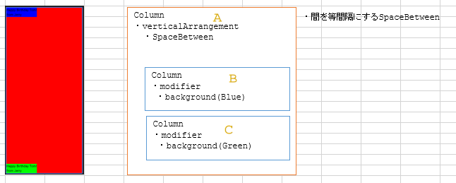
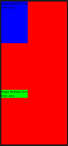
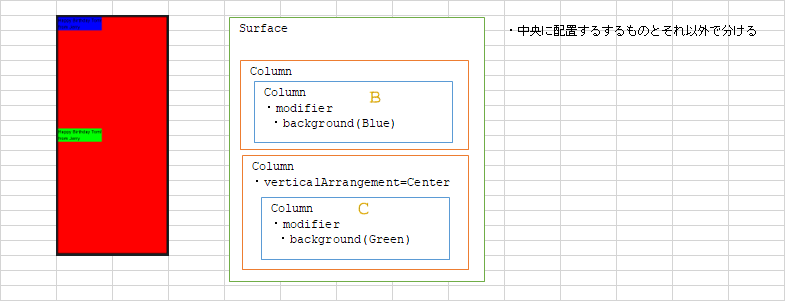
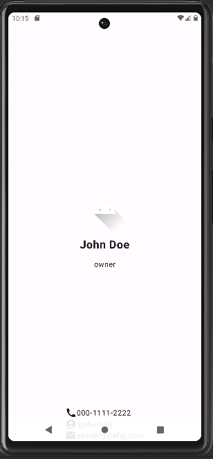

# android: Composableのレイアウト (2)

<i>2024/10/06</i>

[前回](20241004-and.md)は`Column`の中に配置した composable関数(呼び方はこれで良いのか？)の大きさを変更するレイアウトの仕方を見ていた。  
今回は位置を変更するようなレイアウトを見ていく。

使うコードは前回と同じくこれをベースにする。

```kotlin
@Preview(
    name = "sample",
    showBackground = true,
)
@Composable
fun SamplePreview() {
    @Composable
    fun innerCard(modifier: Modifier = Modifier) {
        Column(modifier = modifier) {
            Text(text = "Happy Birthday Tom!")
            Text(text = "from Jerry")
        }
    }
    HappyBirthdayTheme {
        Surface(
            modifier = Modifier.fillMaxSize(),
            color = Color.Red,
        ) {
            Column(
                verticalArrangement = Arrangement.SpaceBetween
            ) {
                innerCard(modifier = Modifier.background(Color.Blue))
                innerCard(modifier = Modifier.background(Color.Green))
            }
        }
    }
}
```

参考にするのはこの辺りか。

* [Compose レイアウトの基本](https://developer.android.com/develop/ui/compose/layouts/basics?hl=ja)
* [7. Align your body の行 - 配置](https://developer.android.com/codelabs/jetpack-compose-layouts?hl=ja#6)

### 上下に配置

↑のコードを動かすとこうなる。  
`SpaceBetween`は間が等間隔になるので、B と C の間に全部が割り振られることにより B が真上で C が真下に配置される。


### 上中に配置

これを上と真ん中に配置したいと思った。
見えない部品が 3番目にあればそうなるだろうと [Spacer](https://developer.android.com/reference/kotlin/androidx/compose/foundation/layout/package-summary#Spacer(androidx.compose.ui.Modifier))を置いてみた。



一見よさそうなのだが C が真ん中になっていない。  
例えば B の `modifier` に `.padding(bottom = 200.dp)` などと追加するとわかりやすい。



他の配置方法を [7. Align your body の行 - 配置](https://developer.android.com/codelabs/jetpack-compose-layouts?hl=ja#6)で見たが、3つとも大きさが同じなので判断しづらいがスペースの調整だけなので「真ん中」という概念はないだろう。

これはもう、真ん中は真ん中だけ、上下にしたいものは彼らだけと分けるのがよいか。  
`Center`や`Raw`を使うのは部品が重ならないようにするためなので、そういうのを使わなければよかろう。

```kotlin
Surface(
    color = Color.Red,
    modifier = Modifier.fillMaxSize(),
) {
    Column {
        innerCard(modifier = Modifier.background(Color.Blue).padding(bottom=200.dp))
    }
    Column(verticalArrangement = Arrangement.Center) {
        innerCard(modifier = Modifier.background(Color.Green))
    }
}
```



### 左右について

左右の場合は`Row`になるだけだ。

全体に配置したいなら`Column`や`Row`ではなく`Box`を使うとよかろう。  
画面の真ん中にしたい場合はたぶん`Box`でないと難しいと思う。

`Box`で位置を指定するのは`contentAlignment`になる。
`contentAlignment = Alignment.Center`だと全体の中央、`contentAlignment = Alignment.TopCenter`だと上側の中央になる。


## おわりに

* 与えられた枠の中でどう配置するか
* 単体の部品で配置できるルール
  * 真ん中(スペースを部品の両側に均等に入れる)
  * 端っこ(上下左右のどれか)
* 複数部品の場合は部品間のスペースの入れ方が変わる。たぶんこうなってる。
  * Equal Weight: スペースは入れず部品が伸びる。
  * Space Between: スペースを均等に入れる。端っこの部品の外側にはスペースを入れない。
  * Space Around: スペースを均等に入れる。部品の両側に入れるので、部品間のスペースは端っこの部品の外側の広さの倍になる。
  * Space Evenly: スペースを均等に入れる。端っこの部品の外側にもスペースを入れる。
  * End: 部品間にスペースを入れず、先頭の部品より前に入れる。全部の部品は後ろにずれる。
  * Center: : 部品間にスペースを入れず、先頭と末尾の部品の外側に均等のスペースを入れる。全部の部品は中央になる。
  * Start: 部品間にスペースを入れず、末尾の部品寄る後ろに入れる。全部の部品は前にずれる。

部品の配置と考えるより、スペースをどう入れるかという考え方の方がよいのだろうか。

## 次回予告

なんとなく分かったので Codelabs の続きを行う。  
名刺アプリ(の画面レイアウト)だ。

[プロジェクト:名刺アプリを作成する](https://developer.android.com/codelabs/basic-android-kotlin-compose-business-card?hl=ja&continue=https%3A%2F%2Fdeveloper.android.com%2Fcourses%2Fpathways%2Fandroid-basics-compose-unit-1-pathway-3%3Fhl%3Dja%23codelab-https%3A%2F%2Fdeveloper.android.com%2Fcodelabs%2Fbasic-android-kotlin-compose-business-card#0)

中央の「画像＋名前＋肩書き」と、真ん中下の「電話番号＋SNS＋Email」の2つに分け、それぞれを`Box`で囲んで`Center`と`BottomCenter`にするだけ！



あれー。  
プレビューではわからなかったが画面下のコントロールと重なってしまった。  
今の Android では表示しないようにしていることも多かろうが、表示されるときにそれが考慮されていないことになる。  
それに、画面の下側はスワイプとかできるのであまり下すれすれに配置したくないというのもある。

次回はそういうのをどうするか調べよう。
