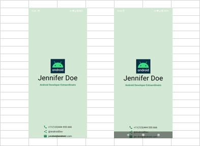

# android: Composableのレイアウト (3)

<i>2024/10/07</i>

Android の Compose UI でレイアウトの書き方について勉強している。  
複雑なことを覚えるつもりはないのだが、最低限のルールとよく使う書き方は覚え・・・られなくてもメモに残しておきたい。

* 10/04 [android: Composableのレイアウト (1)](/2024/10/20241004-and.html)
* 10/06 [android: Composableのレイアウト (2)](/2024/10/20241006-and.html)

## Modifierが難しい

Composer関数の最後は`Modifier`が付くそうだ。  
`Modifier`は`.xxx()`を連結して設定するタイプだ。
正式な名前は知らないが、最後に`.build()`を呼んで実施する書き方が多いが、設定するだけならそういうのはいらん。

```kotlin
class Foo(
    var name: String = "",
    var age: Int = 0,
) {
    fun name(name: String): Foo {
        this.name = name
        return this
    }
    fun age(age: Int): Foo {
        this.age = age
        return this
    }
}

var d = Foo()
d = d.name("Tom").age(123)
Log.d("MYTAG", "name=${d.name}, age=${d.age}")
```

ただこちらを見ていると、`padding()`と`size()`の順番によって挙動が違うのでスタックに積んでいるのかな？

* [Jetpack Compose のレイアウトまとめ1: 基本的な仕組み](https://zenn.dev/wm3/articles/f7393d910fa312#padding-%E3%81%AE%E5%91%BC%E3%81%B3%E5%87%BA%E3%81%97%E9%A0%86%E5%BA%8F%E3%82%92%E5%A4%89%E3%81%88%E3%81%A6%E3%81%BF%E3%82%8B)

スタックというよりは[ツリー](https://developer.android.com/develop/ui/compose/layouts/constraints-modifiers?hl=ja)なのか。  
というか、順番が関係しているとか考えて勉強してなかったな。。。  

## Modifierかmodifierか

それはそれとして、`Modifier`は必ず何かの値が与えられて呼び出されることになる。  
呼び出された Composer関数も中で別の Composer関数を呼び出すことがある。
そのときに `Modifier`に何を与えるかはしばしば迷う。

たとえば`.align()`を使うにしても `Modifier.align()` とするか `modifier.align()` とするかで意味が変わってくる。  
`modifier.`で設定する場合、なんというか CSS みたいに上位の設定を下位も引き継ぐことになる。
しかし、配置をどうしたいかという全体については設定したいけれども文字をどちらに寄せるかなどは`Text()`のように上側で決めたいこともあればそうでない場合もあろう。

今のところ、引数で渡された`Modifier`は直接のレイアウト(`Column`, `Row`, `Box`)に与えるだけで、その中で呼び出している部品に対しては使わないようにしている。
それで何とかなるのかは分からんが、あまり複雑なレイアウトでなければがんばれるんじゃないかな。

## 画面の一番下はちょっと空けたい

ようやく前回の宿題である。  
部品を画面の下に表示させたいのだが、システム側の制御表示とぶつかってしまうのでうまいこと回避したい。  
Codelabsの課題は[こちら](https://developer.android.com/codelabs/basic-android-kotlin-compose-business-card?hl=ja&continue=https%3A%2F%2Fdeveloper.android.com%2Fcourses%2Fpathways%2Fandroid-basics-compose-unit-1-pathway-3%3Fhl%3Dja%23codelab-https%3A%2F%2Fdeveloper.android.com%2Fcodelabs%2Fbasic-android-kotlin-compose-business-card#0)。　　
私が作ると、このように画面の一番下にぴったりひっついてしまう。
Androidのナビゲーションモードを 3ボタンナビゲーションにすると重なるし。



下に`padding`なり`Spacer()`なりを入れればよいだけではあるが、他にやり方はないのだろうか？

[composeのサンプル](https://github.com/android/compose-samples)があったが、画面の下にはタブのようなものを表示するエリアがあるものが多い。  
そうすると、そのタブ自体が空き領域を作る役割にもなっているようだ。  
タブがなくて一番下まで表示している[Compose Material Catalog](https://play.google.com/store/apps/details?id=androidx.compose.material.catalog)をインストールしてみたが、スクロールしていく画面なので全然気にならないし、一番下までスクロールするとちゃんと空白が空くようになっていた。

タブなどは画面の一番下から描画された方が見栄えが良いので、デフォルトで一番下が描画できるのは分かる。  
ただ一番下はいろいろ重なるからやり方があるんじゃないかと思ったのだ。

Android Studio に Gemini が付いているので質問してみた。

> composerで画面の下にナビゲーションバーと重ならないようにしたい。

日本語になってない。。。が何と書いて良いかもわからん。

> Jetpack Compose で画面の下にナビゲーションバーを表示し、 コンテンツと重ならないようにするには、 Scaffold コンポーザブルを使用し、bottomBar パラメータにナビゲーションバーを配置します。 
> Scaffold は、基本的なマテリアルデザインのレイアウト構造を提供するコンポーザブルです。 bottomBar パラメータにナビゲーションバーを配置することで、 コンテンツ領域は自動的にナビゲーションバーの上に配置され、 重なりを防ぐことができます。 

ナビゲーションバーは Android システムの方を指していたつもりだが回答の方はアプリのタブみたいなやつについて言及しているようだ。  
`Scaffold` を使えばうまいことやってくれるかもしれないので試してみよう。

## Scaffold

Android Studio で新規プロジェクトを作るときに Empty Activity を選ぶと Scaffold を使ったサンプルが出力される。  
Codelabs で今まで `Surface` での例しかなかったので書き換えていたのだが、そもそも `Surface` や `Scaffold` はなんなのか。

英単語【scaffold】は名詞で「足場、やぐら」のような意味。

[Scaffold](https://developer.android.com/develop/ui/compose/components/scaffold?hl=ja)

プラットフォームと書かれている。  
composable で表示する部品というよりは[マテリアルデザイン推奨のレイアウト](https://m2.material.io/design/layout/understanding-layout.html#composition)を作りやすくするための枠というところかしら。

あまり考えず `Surface(modifier = Modifier.fillMaxSize()) {...`としていた箇所を `Scaffold` に置き換えたが、レイアウトが変になった。
`Box` 2つを `contentAlignment` で中央と画面下に配置していたのだが、それが無効になったように見える。


いろいろパラメータを変更したり `Box` などを挟んだりしているが期待したとおりにならない。
これは今までのレイアウトどうこうとは違うことをしないと解決しない気がする。
