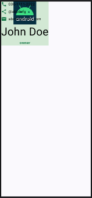
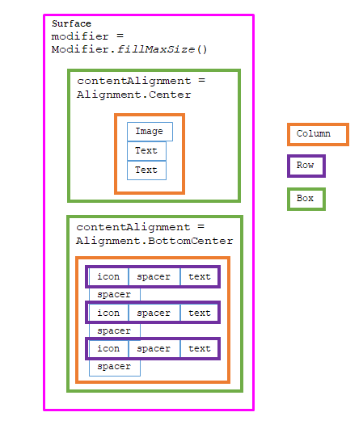
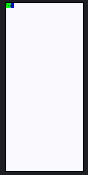
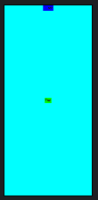
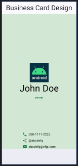

# android: Composableのレイアウト (4)

<i>2024/10/07</i>

* 10/04 [android: Composableのレイアウト (1)](/2024/10/20241004-and.html)
* 10/06 [android: Composableのレイアウト (2)](/2024/10/20241006-and.html)
* 10/07 [android: Composableのレイアウト (3)](/2024/10/20241007-and.html)


## Scaffold にするとレイアウトがうまくいかない

`Surface`で囲んでいたときはレイアウトができていたのだが `Scaffold` にするとうまくいかなくなった。



構造はこんな感じ。
ツリーで描いた方が上下のつながりがわかりやすいとは思うが、もういいや。



あれこれ試したのだが、どうも`Scaffold`の引数に`Modifier.fillMaxSize()`を与えても効果がないようなのだ。

```kotlin
@Preview(showBackground = true)
@Composable
fun FullPreview() {
    ScaffoldSampleTheme {
        Scaffold(modifier = Modifier.fillMaxSize()) { innerPadding ->
            Box(contentAlignment = Alignment.TopCenter) {
                Text(text = "Guten", modifier = Modifier.background(Color.Blue).padding(innerPadding))
            }
            Box(contentAlignment = Alignment.Center) {
                Text(text = "Tag", modifier = Modifier.background(Color.Green).padding(innerPadding))
            }
        }
    }
}
```



例えば 1枚`Surface(fillMaxSize())`を挟むとうまくいく。  
`modifier=Modifier.background()`での色つけはできないが`color=`で色が付けられた。

```kotlin
@Preview(showBackground = true)
@Composable
fun FullPreview2() {
    ScaffoldSampleTheme {
        Scaffold(modifier = Modifier.fillMaxSize()) { innerPadding ->
            Surface(modifier = Modifier.padding(innerPadding).fillMaxSize(), color = Color.Cyan) {
                Box(contentAlignment = Alignment.TopCenter) {
                    Text(text = "Guten", modifier = Modifier.background(Color.Blue).padding(innerPadding))
                }
                Box(contentAlignment = Alignment.Center) {
                    Text(text = "Tag", modifier = Modifier.background(Color.Green).padding(innerPadding))
                }
            }
        }
    }
}
```



`Scaffold`にすればうまくいくかと思ったが、見た目は`Surface`と変わらなかった。  
`TopAppBar`と`BottomAppBar`も適当に付けてみたが、それでも同じだ。
下バーの部分だけ持ち上がっているから、下バーを表示するアプリだったらこれでもよいのか？  
下バーがないときはないなりにスペースを入れてくれるというのを期待したのだが、そういうのではなさそう。



やっぱり空白は自力で入れるものなのかな？  
まあ、他のサンプルとか見ていけばわかるだろう。
