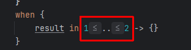
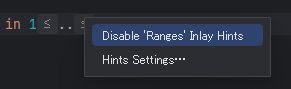

Android の勉強中である。

Android Studio(Koala Feature Drop | 2024.1.2) で Kotlin のコードを入力していると、ときどき(私の)意図していない表示上の展開が行われることがある。  
例えばこれは `result in 1..2 ->` と入力していたのだが。。。こんな感じで不等号が見た目上だけだが表示された。

inlay hints というものらしい。上に重ねる overlay ではなく内側だから inlay なのか。  
右クリックすると Disable にできる。

設定は "Settings > Editor > Inlay Hinsts" で行えるようだ。  
が、この設定画面を見ていっても右クリックで表示された "Ranges" という項目は出てこない。  
つまり元に戻せないのだ。

設定の全クリアとかすれば戻るのかもしれんが、何だかよくわからない。。

あ、なんか設定していたら戻った。  
やっぱりよくわからない。。。
