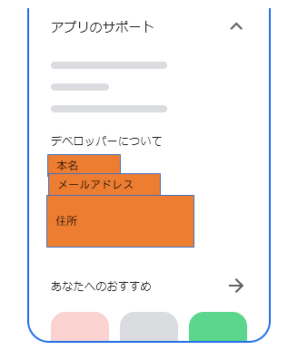
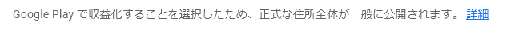

# Google Play Consoleの個人デベロッパーアカウントでも住所表示されるようだ

<i>2024/10/10</i>

ずいぶん昔に作った Google Play Console のデベロッパーアカウントだが、情報更新を求められた。

[Google Play Console デベロッパー アカウントの確認（2023 年 9 月より前に作成されたアカウントが対象）](https://support.google.com/googleplay/android-developer/answer/14177239)

会社の方は「組織」として更新したことがあるのだが「個人」はやったことがない。

会社の場合と違って個人だと入力は自分が持つ情報だけでほぼ済む。  
なので楽だったのだが最後に「Google Playストアにこの情報が表示されます」と出てきた。

入力だけじゃなくて表示もするの？？  
まあ・・・犯罪のようなアプリを公開されても困るし、全部の責任が取れないから仕方ない気もしてきた。

でも住所はちょっとなぁ。  
「Google Play で収益化することを選択したため、正式な住所全体が一般に公開されます」って書いてあるけど必須やったやん！！とは思う。

残念だが、アカウントは自動削除されるに任せよう。  
Apple と違って初回の登録費用だけでずっと使えていたことだし、今までありがとうくらいに思っておこう。
