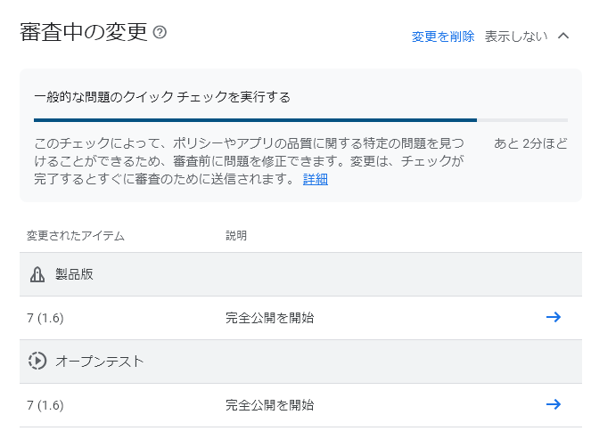

[前回](20241010-gpc.md)、Google Play Console デベロッパーアカウントが削除されそうなことを書いた。  
新しい基準を満たすように情報を更新しないと削除される可能性がある、という感じだろうから更新しなければ削除されるのだろう。
当時は 1ドルがまだ安かったし、あきらめよう。

それはそれとして、唯一公開しているアプリが API 33 のままになっていた。  
アカウント削除前の最後の仕事として API 34 にアップデートしよう。

[QRcode Read/Gen](https://play.google.com/store/apps/details?id=com.hiro99ma.qrgenread)

Google Play Console に AAB ファイルをアップロードしてクローズテスト、オープンテスト、製品版のアプリとして公開しようとすると審査が行われる(内部テスト版だけ行われずすぐ公開される)。  

審査に出すと、1次審査？のようなものが進む。  
これはなんとなくの時間も表示される。

それが終わると 2次審査？になる。  
内容によるかもしれないが、数日かかることもある。
会社のアプリだと 2, 3日かかったことがある。

審査が終わると、おそらく「Your update is live」という件名のメールが送られてくる。
内部アプリの場合はおそらく「Pre-launch report for (アプリ名) version (versionCode)」というメールだ。  
おそらく、が付いているのはメールが送られてくるタイミングが近かったからだ。

今回は大した変更では無かったからか 1時間もかからず終わったようだ。  
デベロッパーアカウントが削除されたときのため、GitHub の release に apk も置くようにした。

[v1.6](https://github.com/hirokuma/android-qrcode-genread/releases/tag/v1.6)
