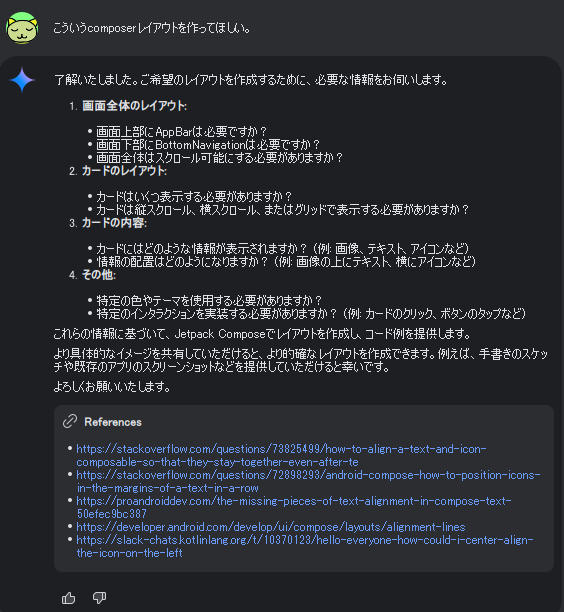
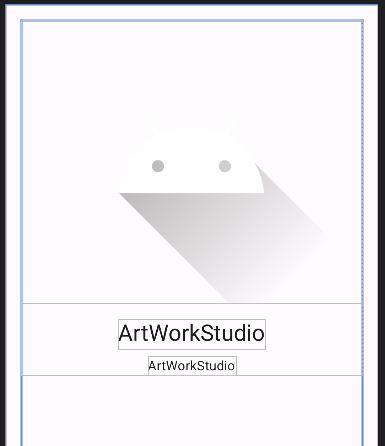

# android: 自動テスト

<i>2024/10/11</i>

今日も Android の勉強中だ。  
自動テストは興味ある分野である。

[自動テストを作成する](https://developer.android.com/codelabs/basic-android-kotlin-compose-write-automated-tests?hl=ja&continue=https%3A%2F%2Fdeveloper.android.com%2Fcourses%2Fpathways%2Fandroid-basics-compose-unit-2-pathway-3%3Fhl%3Dja%23codelab-https%3A%2F%2Fdeveloper.android.com%2Fcodelabs%2Fbasic-android-kotlin-compose-write-automated-tests#0)


## @VisibleForTesting

[4. ローカルテストを作成する](https://developer.android.com/codelabs/basic-android-kotlin-compose-write-automated-tests?hl=ja&continue=https%3A%2F%2Fdeveloper.android.com%2Fcourses%2Fpathways%2Fandroid-basics-compose-unit-2-pathway-3%3Fhl%3Dja%23codelab-https%3A%2F%2Fdeveloper.android.com%2Fcodelabs%2Fbasic-android-kotlin-compose-write-automated-tests#3)

> calculateTip() メソッドは現在 `private` であるため、テストからアクセスできません。`private` の指定を削除し、`internal` にします。

> これによりメソッドはパブリックになりますが、テスト目的でのみパブリックになっていることが他の開発者に示されます。

えー、テストのために通常の visibility も変更するの？？  
いや、ちゃんと調べねば。

[VisibleForTesting](https://developer.android.com/reference/androidx/annotation/VisibleForTesting)

> You can optionally specify what the visibility should have been if not for testing;
> If not specified, the intended visibility is assumed to be `private`.

よかった。。。  
テスト目的でのみ、というよりも、テストの場合だけ適用されるということね。

しかしこれはテスト用の visibility を `@VisibleForTesting()`指定する方がわかりやすいんじゃなかろうか。  
「あ、このメソッドはテストようにしておこう」と気付いて`@VisibleForTesting`だけ付けたら`private`になるけど、言語仕様としてデフォルトが`public`だからねぇ。  
それに名前からしても引数の方がテストの時に使用される visibility っぽいではないか。

他の[androidx.annotation](https://developer.android.com/reference/androidx/annotation/package-summary)を見てもそういうのはなさそうだから、言語仕様とかコンパイラの仕様とかで仕方ないのだろう。

## インストルメンテーションテスト

[5. インストルメンテーション テストを作成する](https://developer.android.com/codelabs/basic-android-kotlin-compose-write-automated-tests?hl=ja&continue=https%3A%2F%2Fdeveloper.android.com%2Fcourses%2Fpathways%2Fandroid-basics-compose-unit-2-pathway-3%3Fhl%3Dja%23codelab-https%3A%2F%2Fdeveloper.android.com%2Fcodelabs%2Fbasic-android-kotlin-compose-write-automated-tests#4)

実機なりエミュレータなりで動かしつつ、UI部品にコードで操作してテストする。

`composeTestRule.onNodeWithText("Bill Amount")`だと "Bill Amount" という文字列が入った部品を探してくれる。
複数ある場合はそういう API もあって配列でアクセスできるようだ。  
[ファインダー](https://developer.android.com/develop/ui/compose/testing/apis?hl=ja)というらしい。

それはよいのだが、`onNodeWithText()` は文字列なのでロケールによって表示されている文字列が違うことがありうる。  
試しに日本語にしてアプリにも日本語リソースを追加してテストしたらエラーになった。

`stringResource()`は Composable でしか使えず、テスト関数に `@Composable` を付けるとエラーになる。  
Composable 以外から ID で文字列を取得するか、テスト関数を `@Composable` でも使えるようにするかだと前者のような気がする。  
まあ、文字列で探し出せないことも多々ありそうだが、それはそのとき考えよう。

ちょっと無理やりな感じはするが、`setContext` の内側で表示する画面を呼び出しているので、そこで `LocalContext.current.resources` をもらってみる。  
テストを実行するのはアプリが起動した後なので `res` はきっと取得済みだろう。  
`Resources.getString(id)` で取得できる。

```kotlin
    @Test
    fun calculate_20_percent_tip() {
        var res: Resources? = null
        composeTestRule.setContent {
            TipTimeTheme {
                res = LocalContext.current.resources
                TipTimeLayout()
            }
        }
        composeTestRule.onNodeWithText(res!!.getString(R.string.bill_amount))
            .performTextInput("10")
        composeTestRule.onNodeWithText(res!!.getString(R.string.how_was_the_service))
            .performTextInput("20")
        val expectedTip = NumberFormat.getCurrencyInstance().format(2)
        composeTestRule.onNodeWithText(res!!.getString(R.string.tip_amount, expectedTip))
            .assertExists()
    }
```

安定した方法が見つかったら更新しよう。

だいたい [onNodeWithText()](https://developer.android.com/reference/kotlin/androidx/compose/ui/test/SemanticsNodeInteractionsProvider#(androidx.compose.ui.test.SemanticsNodeInteractionsProvider).onNodeWithText(kotlin.String,kotlin.Boolean,kotlin.Boolean,kotlin.Boolean)) で見つけているのは `TextField` の `label` の中に置いている `Text` だ。  
`label` 自体は `(@Composable () -> Unit)? = null` なので必ずしも `Text` というか文字列を持っているわけではない。  
そんだけ自由に探せるのだから、見えない ID をそれぞれに割り振ればもっと楽に検索できると思う。
[onNodeWithTag()](https://developer.android.com/reference/kotlin/androidx/compose/ui/test/SemanticsNodeInteractionsProvider#(androidx.compose.ui.test.SemanticsNodeInteractionsProvider).onNodeWithTag(kotlin.String,kotlin.Boolean)) は「タグ」というもので探せそうだけど UI部品にはタグなんて。。。  
[Modifier.testTag()](https://developer.android.com/reference/kotlin/androidx/compose/ui/Modifier#(androidx.compose.ui.Modifier).testTag(kotlin.String))でいけるのか？

UI部品に `Modifier.testTag("ほげほげ")` と設定して、` composeTestRule.onNodeWithTag("ほげほげ")` とすれば同じ効果が得られるようだ。  
これでいいやんと私なんかは思うのだが、"reactive programming" 的にどうなのと考えたりもするらしい。

[android - Best Practices for Using testTag in Jetpack Compose - Stack Overflow](https://stackoverflow.com/questions/78730330/best-practices-for-using-testtag-in-jetpack-compose)

難しいね！(考えを放棄)

stackoverflow で「"reactive programming"的に～」の回答では `contentDescription` がいいんじゃないのというサイトがあったという報告があった。  
そこはどうやって文字列を見ているかというと、やっぱりハードコーディングしていた。  
うーん、英語の人はロケールの切替をあまり気にしないのか、あるいはテスト環境だから固定のロケールでやればいいやんという考え方なのか。  
でも文字列リソースって比較的書き換えが多そうだから面倒だと思うのだ。

ただ、タグが必要なのはテストの時だけなので、それが実装に入り込んでいるのが嫌というのもわかる。
テスト用にビルドしたときだけ採用されるとかならよいのに。

[SemanticsNodeInteractionsProvider](https://developer.android.com/reference/kotlin/androidx/compose/ui/test/SemanticsNodeInteractionsProvider#public-functions_1)に載っている API で部品を探せるようだから、これのどれかを使ってがんばるしかなかろう。

* onAllNodes
* onNode
* onAllNodesWithContentDescription
* onAllNodesWithTag
* onAllNodesWithText
* onNodeWithContentDescription
* onNodeWithTag
* onNodeWithText
* onRoot

## おわりに

まだ [Compose を用いた Android アプリ開発の基礎](https://developer.android.com/courses/android-basics-compose/course?hl=ja) の最中で、ユニット2 がようやく終わりそうというところだ。

なんか非常に時間がかかっているし、あまり身についていない気もする。  
これはもう数をこなすのがよいのだろうが、そこまでやりたいかというとちょっと悩ましい。  
レイアウトを実装するのが特にめんどくさい。が、レイアウトがそれなりにできないとサンプルアプリも自由に作れないし。。。

それこそ Gemini とかで自動的に作ってくれないだろうか？



あ、できるんだ。

これに今やっている[課題](https://developer.android.com/codelabs/basic-android-kotlin-compose-art-space?hl=ja&continue=https%3A%2F%2Fdeveloper.android.com%2Fcourses%2Fpathways%2Fandroid-basics-compose-unit-2-pathway-3%3Fhl%3Dja%23codelab-https%3A%2F%2Fdeveloper.android.com%2Fcodelabs%2Fbasic-android-kotlin-compose-art-space#1)のレイアウト画像URLを貼り付けるとコードを作ってくれた。  
すごいね。

作ってもらったものに適当なデータを入れてみた。  
ボタンは作ってくれなかったが、おおよそのひな形は作ってくれた。



レイアウトで時間がかかるのが、`modifier`で指定するんだったか `Column`などのパラメータを使うんだったか、などの思い出せない系なので、ひな形である程度パラメータが入ってくれればまねをして拡張できるのだ(がんばれば)。  
Android Studio で Composer のレイアウトを GUI で作る機能がないのも AI に説明できさえすればひな形を作ることができるというところまで来たからなのだろうか。

まあ、Gemini がいつまで無料なのか知らんがありがたく使わせてもらおう。
