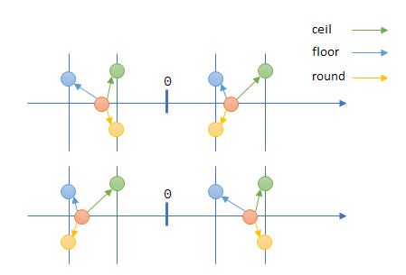
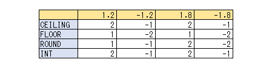

昔から、といっても私も詳しく知らないが、少なくとも C言語から `ceil` と `floor` だった。  
実は私はあまり使ったことが無い。
昔は浮動小数点演算を持ってないため小数を扱うとライブラリが演算するので遅かったから極力使わないようにしていたのだ。  
使うときも関数呼び出しにコストがかかるから `int` でキャストして切り捨てたり `+0.9` とかでほどほどに切り上げたりしてたような気がする。
固定小数点も使っていたような。。。

まあ、昔のことは忘れよう。  
Android のチュートリアルで「round up」が出てきて、そういえばどういう計算になるんだったか不安になったので確認した。

```kotlin
fun calc(value: Double) {
    println("value=$value")
    println("  ceil=${kotlin.math.ceil(value)}")
    println("  floor=${kotlin.math.floor(value)}")
    println("  round=${kotlin.math.round(value)}")
    println("  toInt=${value.toInt()}")
}

fun main() {
    calc(1.2)
    calc(-1.2)
}
```

[Kotlin PlayGround](https://pl.kotl.in/0yTs5WVLV)

図にするとこんな感じ。  
`round()`は整数値への近さが影響するが、それ以外は数値の大きい方か小さい方に移動するだけになる。
なお、`round()`で値が中央だった場合 C言語ではゼロから遠い方になるそうだ。つまり四捨五入でこれも kotlin と同じだ。



「四捨五入」は文字を見てわかるけど、"round" だとわからんね。
そもそも四捨五入の概念は世界共通なのだろうか？ 
麻雀だと五捨六入だったと思う。

`toInt()`はC言語での`int`キャストと同じで、絶対値にして小数点以下を切り捨てて符号を戻す、という動作だった。
ゼロの方向の整数にすると言えばよいか。

### Excelの場合

Excel もだいたい同じなのだが追加のパラメータが付けられたりする。  
また[INT()](https://support.microsoft.com/ja-jp/office/int-%E9%96%A2%E6%95%B0-a6c4af9e-356d-4369-ab6a-cb1fd9d343ef?ns=excel&version=16&syslcid=1041&uilcid=1041&appver=zxl160&helpid=xlmain11.chm60073&ui=ja-jp&rs=ja-jp&ad=jp)の挙動が`int`のキャストとは違った。
パラメータ無しの[CEILING()](https://support.microsoft.com/ja-jp/office/ceiling-math-%E9%96%A2%E6%95%B0-80f95d2f-b499-4eee-9f16-f795a8e306c8?ns=excel&version=16&syslcid=1041&uilcid=1041&appver=zxl160&helpid=xlmain11.chm60639&ui=ja-jp&rs=ja-jp&ad=jp)と同じになるのかな。



