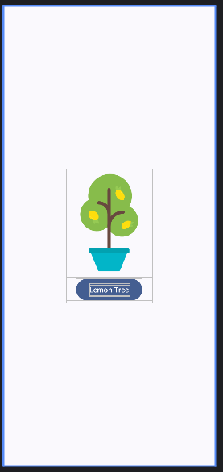
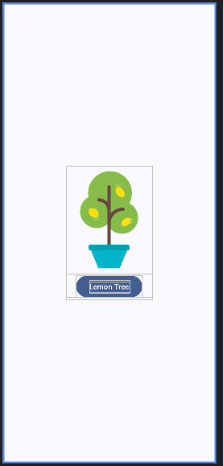
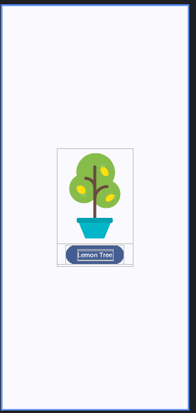

# android: 中央に表示する

<i>2024/10/14</i>

Android で画面レイアウトを作っていると、コンテンツを中央に寄せるというか揃えるというかしたいことがある。

Android Codelabs ではここで出てきた(他でも出ているが)。

[3. レイアウト インフラストラクチャを作成する](https://developer.android.com/codelabs/basic-android-kotlin-compose-build-a-dice-roller-app?continue=https%3A%2F%2Fdeveloper.android.com%2Fcourses%2Fpathways%2Fandroid-basics-compose-unit-2-pathway-2&hl=ja#2)

* `Modifier.fillMaxSize().wrapContentSize(Alignment.Center)`

実際に揃ったので何も考えていなかったが、よく考えると`Modifier.align()`というのもあるし`Column`には`verticalArrangement`や`horizontalAlignment`もある。  
どうするのがよいのだろう？

## Codelabsでの設定

この Codelabs ではどうなっているか。

* `Surface(fillMaxSize())`
  * `DiceRollerApp(Modifier.fillMaxSize().wrapContentSize(Alignment.Center))`
    * `DiceWithButtonAndImage(modifier)`
      * `Column(modifier, horizontalAlignment)`
        * `Image`
        * `Button`
          * `Text`

なので`Modifier.fillMaxSize().wrapContentSize(Alignment.Center)`は`Column`が設定することになる。  

コンテンツをそれぞれ上に積むような図にするとこうなるか。


### fillMaxSize() しないといけないのか

`fillMaxSize()`が`Surface`と`Column`に出てくるが、これは毎回いるのだろうか？  
試してみよう。

#### 両方付ける

Codelabs の例に似たような構造を作る。

```kotlin
@Preview(showBackground = true)
@Composable
fun MyPreview() {
    LemonadeTheme {
        Surface(modifier = Modifier.fillMaxSize()) {
            Column(
                modifier = Modifier.fillMaxSize().wrapContentSize(Alignment.Center),
                horizontalAlignment = Alignment.CenterHorizontally,
            ) {
                Image(
                    painter = painterResource(R.drawable.lemon_tree),
                    contentDescription = "lemon tree"
                )
                Button(onClick = {}) {
                    Text("Lemon Tree")
                }
            }
        }
    }
}
```

Android Studio の Previewで確認する。



#### Surface にだけ付ける

Surface にだけ `fillMaxSize()`を付け、`Column`からは外して`wrapContentSize()`だけにする。

```kotlin
@Preview(showBackground = true)
@Composable
fun MyPreview() {
    LemonadeTheme {
        Surface(modifier = Modifier.fillMaxSize()) {
            Column(
                modifier = Modifier.wrapContentSize(Alignment.Center),
                horizontalAlignment = Alignment.CenterHorizontally,
            ) {
                Image(
                    painter = painterResource(R.drawable.lemon_tree),
                    contentDescription = "lemon tree"
                )
                Button(onClick = {}) {
                    Text("Lemon Tree")
                }
            }
        }
    }
}
```

両方付けたときと違いはないように見える。



#### Column にだけ付ける

今度は逆に `Column`にだけ付ける。

```kotlin
@Preview(showBackground = true)
@Composable
fun MyPreview() {
    LemonadeTheme {
        Surface(modifier = Modifier) {
            Column(
                modifier = Modifier.fillMaxSize().wrapContentSize(Alignment.Center),
                horizontalAlignment = Alignment.CenterHorizontally,
            ) {
                Image(
                    painter = painterResource(R.drawable.lemon_tree),
                    contentDescription = "lemon tree"
                )
                Button(onClick = {}) {
                    Text("Lemon Tree")
                }
            }
        }
    }
}
```

こちらも違いはないように見える。



#### 全部外す

`Surface`からも`Column`からも外すと、プレビューで表示するサイズが分からないためコンテンツだけになる。

```kotlin
@Preview(showBackground = true)
@Composable
fun MyPreview() {
    LemonadeTheme {
        Surface(modifier = Modifier) {
            Column(
                modifier = Modifier.wrapContentSize(Alignment.Center),
                horizontalAlignment = Alignment.CenterHorizontally,
            ) {
                Image(
                    painter = painterResource(R.drawable.lemon_tree),
                    contentDescription = "lemon tree"
                )
                Button(onClick = {}) {
                    Text("Lemon Tree")
                }
            }
        }
    }
}
```

おそらく実機で表示すると左上に現れるのだろう。


### どうすればいいんだ！

[fillMaxSize](https://developer.android.com/reference/kotlin/androidx/compose/foundation/layout/package-summary#%28androidx.compose.ui.Modifier%29.fillMaxSize%28kotlin.Float%29)の説明がよくわからないのだ。  
実際にやっている計算を書いているのだろうけど、結果としてどうなるのかがわからない。  
[制約と修飾子の順序](https://developer.android.com/develop/ui/compose/layouts/constraints-modifiers?hl=ja)の「[レイアウトフェーズの制約](https://developer.android.com/develop/ui/compose/layouts/constraints-modifiers?hl=ja#constraints-layout)」辺りを理解しないと API名だけで判断していたら痛い目を見そうだ。

制約の理解は課題として残しておこう。

上の例だと関数無しにしたのでわかりづらいが、ある程度のまとまりで関数化していって、上の方はそれを呼び出して配置するのに専念するのだろう。  
今回だと、`Column`以下が 1つの関数になっていて上側はそれをどこに配置したいかで`Modifier`だけ指定するような感じだろうか。

見た目では同じように見えるけど、実装していって仕様変更すると苦しみそうな分野だ。  