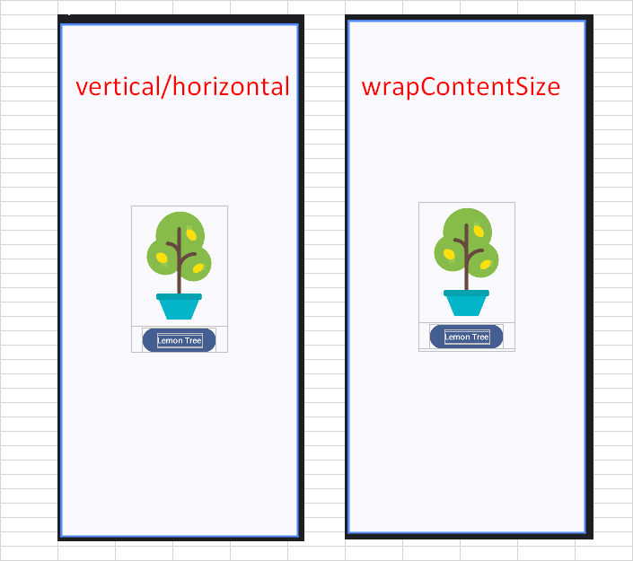
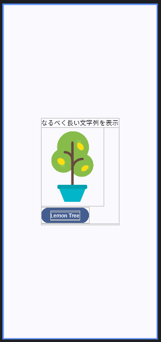
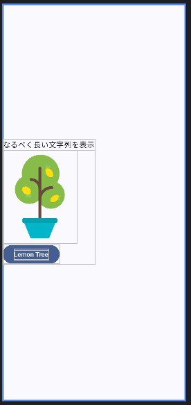
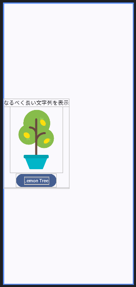

# android: 中央に表示する (2)

<i>2024/10/15</i>

[昨日](20241014-and.md)の記事を読み返し、中央に表示することについて述べていないことに気付く。。。

ともかく、画面の中央に表示したいのであれば下地になるどこかで`fillMaxSize()`して全部を使えるようにするのが準備として簡単だろう、というのが前回までだ。  
そしてようやく中央に表示する話ができる。

私が気になったのは、`wrapContentSize()`で中央寄せするのは普通なのか、ということ。  
Codelabs に書いてあったのでそういうものかと思っていたが、`Column`なら`verticalArrangement`と`horizontalAlignment`で同じことができる。

```kotlin
@Preview(showBackground = true)
@Composable
fun MyPreview() {
    LemonadeTheme {
        Surface(modifier = Modifier.fillMaxSize()) {
            Column(
                verticalArrangement = Arrangement.Center,
                horizontalAlignment = Alignment.CenterHorizontally,
            ) {
                Image(
                    painter = painterResource(R.drawable.lemon_tree),
                    contentDescription = "lemon tree"
                )
                Button(onClick = {}) {
                    Text("Lemon Tree")
                }
            }
        }
    }
}
```

プレビュー画像で確認する。  
左が今回、右が昨日の`wrapContentSize()`での場合だ。



だいたい同じだが、右の方は下にちょっとスペースが空いている。が、そのくらいだ。

そもそも、`wrapContentSize()`はコンテンツサイズに関する関数なのになぜ位置についても指定できるのだろうか？ 
`Modifier`なんだから`align()`も使えるだろうし。

`wrapContentSize()`でいくつか検索した。

* [Compose 修飾子  -  Jetpack Compose  -  Android Developers](https://developer.android.com/develop/ui/compose/modifiers?hl=ja#padding-and-size)
  * 親からの制約を`requiredSize()`で上書きする説明文に出てきた
  * レイアウトシステムがスペースの中央に子を配置しようとする動作を`wrapContentSize()`で上書きすることができる
* [ComposeのwrapContentSize. Composeの wrapContentSize… - by Kenji Abe - Medium](https://star-zero.medium.com/compose%E3%81%AEwrapcontentsize-a58f3da50991)
  * `wrapContentSize()`の説明
  * 引数`modifier`に`wrapContentSize()`を挟んで`size()`を設定するとそれぞれ反映されるということに驚きを覚えた。順番も大切だし、設定したら設定しただけ積み重なるので無駄にも注意だ。
* [Jetpack Compose のレイアウトまとめ2: alignment, weight, arrangement](https://zenn.dev/wm3/articles/7332788c626b39)
  * `Text`の縦方向は`wrapContentSize()`系か`Box`でしか中央に寄らないらしい

レイアウトシステムがスペースの中央に配置しようとする、というのが`wrapContentSize()`がデフォルトで中央寄せする挙動の元になっているのだろうか。  
`Column`はデフォルトで左上に配置しようとするからか、どうも中央に配置しようとする姿が思いつかないのだ。

### wrapContentSize だけ使う

昨日は `wrapContentSize()`を使ったが `horizontalAlignment`も併用していた。  
`wrapContentSize()`だけだとどうなるか。

```kotlin
@Preview(showBackground = true)
@Composable
fun MyPreview() {
    LemonadeTheme {
        Surface(modifier = Modifier.fillMaxSize()) {
            Column(
                modifier = Modifier.wrapContentSize(),
            ) {
                Text("なるべく長い文字列を表示")
                Image(
                    painter = painterResource(R.drawable.lemon_tree),
                    contentDescription = "lemon tree",
                )
                Button(onClick = {}) {
                    Text("Lemon Tree")
                }
            }
        }
    }
}
```

`Column`の外側だけが中央に寄せられ、中のコンテンツは左に寄っている。




### horizontalAlignment を指定しない場合

`wrapContentSize()`を使わず `verticalArrangement` だけ設定するとどうなるか。

```kotlin
@Preview(showBackground = true)
@Composable
fun MyPreview() {
    LemonadeTheme {
        Surface(modifier = Modifier.fillMaxSize()) {
            Column(
                    verticalArrangement = Arrangement.Center,
            ) {
                Text("なるべく長い文字列を表示")
                Image(
                    painter = painterResource(R.drawable.lemon_tree),
                    contentDescription = "lemon tree",
                )
                Button(onClick = {}) {
                    Text("Lemon Tree")
                }
            }
        }
    }
}
```

`Column`の外側だけが左に寄るのではなく、全部が左に寄ってしまった。  
中のコンテンツ位置については `wrapContentSize()` だけ使った場合と同じだ。



`Column`の中と外を別々に位置揃えしたいなら、間にもう1つ `Column` を挟んでコンテンツが水平方向にまとまった部品を作れば良い。  
例えばこうすると、全体は左寄せ、中身は中央寄せになる。

```kotlin
@Preview(showBackground = true)
@Composable
fun MyPreview() {
    LemonadeTheme {
        Surface(modifier = Modifier.fillMaxSize()) {
            Column(
                    verticalArrangement = Arrangement.Center,
            ) {
                Column(
                   horizontalAlignment = Alignment.CenterHorizontally,
                ) {
                    Text("なるべく長い文字列を表示")
                    Image(
                        painter = painterResource(R.drawable.lemon_tree),
                        contentDescription = "lemon tree",
                    )
                    Button(onClick = {}) {
                        Text("Lemon Tree")
                    }
                }
            }
        }
    }
}
```




### 結局どうなのよ

`Column`だけでしか見ていないが、こうだった。

* `Modifier.wrapContentSize()` は `Column` の垂直方向と水平方向に影響を及ぼすが、`Column`の中のコンテンツ位置については影響しないようだ
* `verticalArrangement` は 垂直方向に影響を及ぼす
* `horizontalAlignment` は `Column` の水平方向に影響を及ぼすし、中のコンテンツ位置にも影響がある

今のところ、どっちかじゃないとできないというものはない。  
`wrapContentSize()`だけ設定したのと同じ効果を得ようとしたら `Column` の外に `Column` を置いて水平方向だけ制御してもらうことになる、くらいか。

個人的には `wrapContentSize()` と言われてもピンとこないので、水平方向と垂直方向を操作しそうな `verticalArrangement` と `horizontalAlignment` を使うのがいいかと思っている。
が、その意見も実装し続けていたら変わりそうな気がする。

## おまけ

### 呼び出せない Modifier.align() ?

`Modifier.align()`は`Image`には使えたが`Column`では使えなさそうだ。  
同じ`Modifier`を返す関数なのになんでだ？

* [Jetpack ComposeでModifierの関数はどうして使えたり使えなかったりするのか - Mobile Factory Tech Blog](https://tech.mobilefactory.jp/entry/2021/12/24/000000)

なるほど、細かいところは読んでいないが直接の型チェック以外にスコープという要素があるのか。

* [Compose でのスコープの安全性](https://developer.android.com/develop/ui/compose/modifiers?hl=ja#scope-safety)
  * > Compose には、特定のコンポーザブルの子に適用される場合にのみ使用できる修飾子があります。Compose はカスタム スコープによって、これを可能にしています。

先ほど `Image` では `Modifier.align()`が使えたと書いたが、あれは`Column`の中に`Image`があったので使えたのだった。  
なので、先ほど `Column` では使えなかったと書いた箇所を `Column`で囲むと・・・ほら使えた。  
なるほどねー。
`import`するやつが間違っているのかと思って悩んでいたのだ。

こちらは`ColumnScope` の `Modifier.align()`。  
`interface`なのでコメントしかないが `horizontalAlignment` 系、つまり横方向しか動かせないことになる。  
`Column`なので縦の配置をそれぞれが自由に設定されても困るわな。

* [Column.kt: ColumnScope interface の Modifier.align()](https://cs.android.com/androidx/platform/frameworks/support/+/androidx-main:compose/foundation/foundation-layout/src/commonMain/kotlin/androidx/compose/foundation/layout/Column.kt;l=313-321;drc=ae5af28860ede79e73e30997a1c992ad8727ce1a)

### Surface ?

最初に見た[レイアウトのCodelabs](https://developer.android.com/codelabs/basic-android-kotlin-compose-text-composables?hl=ja&continue=https%3A%2F%2Fdeveloper.android.com%2Fcourses%2Fpathways%2Fandroid-basics-compose-unit-1-pathway-3%3Fhl%3Dja%23codelab-https%3A%2F%2Fdeveloper.android.com%2Fcodelabs%2Fbasic-android-kotlin-compose-text-composables#4)で `Surface` を一番下に置くようになっていたのでそう使っていたが、そもそも `Surface` は何者なのか。  
[リファレンスページ](https://developer.android.com/reference/kotlin/androidx/compose/material/package-summary#Surface(androidx.compose.ui.Modifier,androidx.compose.ui.graphics.Shape,androidx.compose.ui.graphics.Color,androidx.compose.ui.graphics.Color,androidx.compose.foundation.BorderStroke,androidx.compose.ui.unit.Dp,kotlin.Function0)) 

> Material surface is the central metaphor in material design. 
> (Google翻訳)マテリアルの表面はマテリアル デザインの中心的なメタファーです。

デザインのメタファー、とか言われてもよくわからん。  
"surface" もここでは小文字で出てきたので `Surface` とは違うだろう。  
「メタファー(metaphor)＝暗喩、隠喩、たとえ」なので、要素、みたいなものだろうか。

そこにあったリンクがマテリアルデザインの "Surfaces" へのリンクだった。  
そういうものがあるのね。

* [Surfaces - Material Design](https://m2.material.io/design/environment/surfaces.html#material-environment)

わかっていたけど、やはり私はデザインに興味を持っていないようだ。  
センスがあるとかなしとかもあるだろうが、そもそもやる気がないのだ。
「私が見づらいのをなんとかしたい」であって「みんなが見やすいようにしたい」ではないのだ。  
そういうのは他の人にお任せしたい。

ただ基本を分かっていないとデザインの人とお話しするのにお互い大変そうなので、多少はなんとかしたい気はする。
