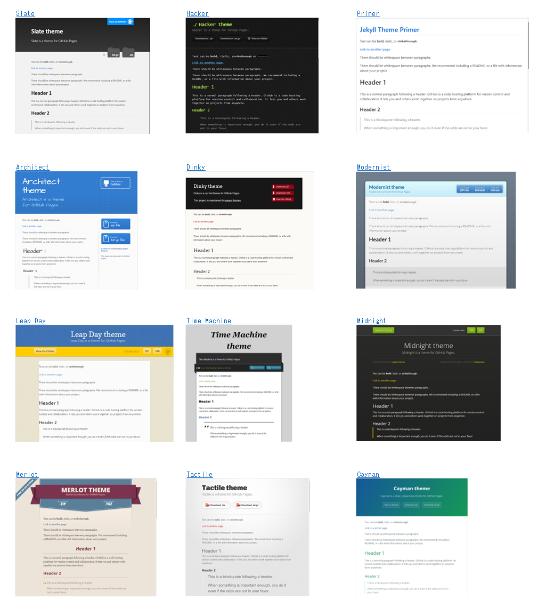
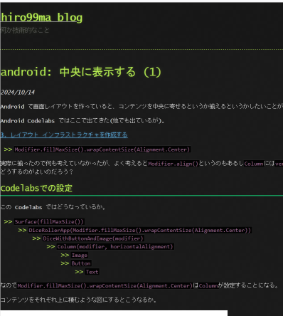
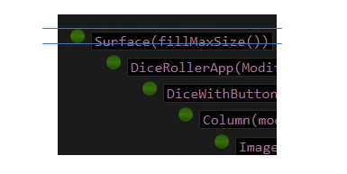

このブログは [GitHub Pages](https://docs.github.com/ja/pages) を使っている(使っていた)。  
裏で Linux が動いたりはしないので作ることができるのは静的なページだけであるが、ブログであればそれで十分である。
Netlify は Public リポジトリなら無料で使えたと思うので、ビルドするようなサイトだったらそちらの方が楽かもしれない。

普通に HTML ファイルを置いていく方法もあるが、MarkDown を HTML に変換する機能があるためそれを使っている。  
その際、何もしないと見た目がよろしくないのでテーマを設定できる。
以下のようにカスタマイズもできるのだが、面倒なのでデフォルトで使用できるいくつかあるテーマから [pages-themes/cayman](https://github.com/pages-themes/cayman) を選んでいる。

[Jekyll を使用して GitHub Pages サイトにテーマを追加する](https://docs.github.com/ja/pages/setting-up-a-github-pages-site-with-jekyll/adding-a-theme-to-your-github-pages-site-using-jekyll)

デフォルトのテーマは[ここ](https://github.com/orgs/pages-themes/repositories?type=all)に見えているリポジトリのどれか。

軽いカスタマイズであれば各テーマの README に書いてあるとおりにやるとできる。  
Caymanだと[ここ](https://github.com/pages-themes/cayman?tab=readme-ov-file#customizing)で、サイトのタイトルや ダウンロード表示の有無、Google Analytics の ID くらいであれば config ファイルを変更するだけでできる。
もう少し細かいカスタマイズだと CSS を変更したり基本レイアウトの HTML ファイルを持ってきて編集することもできる。

ここのサイトで変更しているのはこの辺りか。

* faviconを出す([default.html](https://github.com/hirokuma/hirokuma.github.io/blob/ad046ef38d63758a0489c12cd9f75edb5495542a/_layouts/default.html#L14-L15))
* Google Analyticsのタグ埋め込み(configで変更できるのをこれを書いていて知った。。。)
* フッタにホームに戻るリンクを追加([default.html](https://github.com/hirokuma/hirokuma.github.io/blob/ad046ef38d63758a0489c12cd9f75edb5495542a/_layouts/default.html#L40-L42))
* `H3`～`H6` は文字の前に深さを表す `|` を出す([CSS](https://github.com/hirokuma/hirokuma.github.io/blob/ad046ef38d63758a0489c12cd9f75edb5495542a/assets/css/style.scss))

----

Cayman でよいと思って採用していたのだが、文字と背景のコントラストがまあまあ低い。  
というか、文字が真っ黒でない。  
私がどうもコントラストがきっちり付いていないと目がきついようで、フォントでアンチエイリアシングがきついと目が文字を追わなくなるくらいである。  
なので MSゴシック系を愛用しているのだが、まあフォントのことは今回は良かろう。

### Hackerにしよう

というわけで、コントラストがしっかりしてそうな [hacker](https://pages-themes.github.io/hacker/) にしよう。  
`_config.yml`だけ書き換えると・・・なんか左にびたっと張り付いてしまった。

[Caymanのdefault.html](https://github.com/pages-themes/cayman/blob/56aa6db3b5088a555aa563e8bf071f3d18565d3b/_layouts/default.html)と[Hackerのdefault.html](https://github.com/pages-themes/hacker/blob/e3c8d1ad288894be216002a5bc29fc611aeab9ac/_layouts/default.html)に違いがあるためのようだ。  
まあ、それはそうか。  
ということで`default.html`を書き換え、なるべく`includes/head-custom.html`などに書いて次回の変更作業が楽になるようにする。

`<li><ol>`のリストが [＞＞](https://github.com/pages-themes/hacker/blob/e3c8d1ad288894be216002a5bc29fc611aeab9ac/assets/images/bullet.png) なのが気になったので[丸画像](https://raw.githubusercontent.com/hirokuma/hirokuma.github.io/808afd8172f9a98ddd97b4930057eee19aab6a91/assets/images/bullet.png)に置き換える。  
が、ちょっと上下がずれる。なぜだ。

