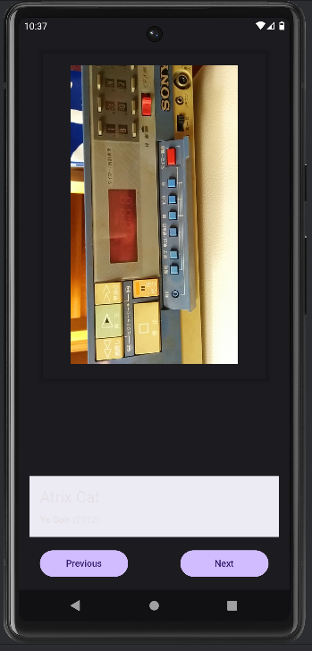
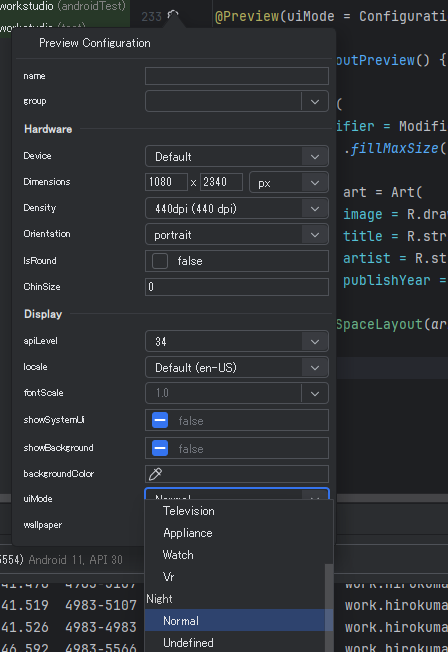

# android: darkモードに手軽に対応したい

<i>2024/10/16</i>

[前回](20241015-and2.md) の最後で、自作した Codelabs の課題をダークモードで表示させると全然ダメなことに気付いた。

敗因は簡単で、一部だけ `Color()` を使って固定の色を指定したからだ。  
課題のスクリーンショットがあったのでカラーピッカーで取得してそのまま使ったのだ。

カラーテーマを作って、それを反映させるのが通常のやり方らしい。

* [Material 3のカラーテーマについて整理してみる - 縁側プログラミング](https://engawapg.net/android/1667/m3-color-theme/)

[Material Theme Builder](https://material-foundation.github.io/material-theme-builder/)で作って Android 向けを Export。  
zip ファイルには `Color.kt`, `Theme.kt`, `Type.kt` が入っていた。

これを何も考えずにプロジェクトの同じファイルに上書きする・・・のはやめよう(やってしまった)。  
パッケージ名が `com.example.compose` になっていたりして、履歴管理していない状態だと名前を探し出すのが面倒だった(大した作業ではないのだが)。

色の選び方は、`androidx.compose.material3.MaterialTheme.colorScheme` を `import` して `colorScheme.primary` などとすればよさそうだ。  
`MaterialTheme.colorScheme` が `LocalColorScheme.current` を返すので、`AppTheme{}`で囲んでいる自作のテーマが使われるようだ。  

エミュレータで動かす前に Preview で確認したい場合は、Preview の設定を変更するとよさそうだ。

が、いちいち切り替えるのは面倒なので、こちらの `@Preview(uiMode=xxx)` をそれぞれ用意する方が楽そうだ。

* [マテリアル 3 を使用した Compose でのテーマ設定](https://developer.android.com/codelabs/jetpack-compose-theming?hl=ja#3)

### 反映されないのはダイナミックカラーの影響

プレビューでライトモードとダークモードはそれぞれ表示されるようになったが、デフォルトのベーステーマというやつでしか表示してくれない。  
エミュレータだと反映されているので `@Preview()` の書き方なのだと思うが、違いが分からん。。。

* [Jetpack Compose の @Preview を使いこなす #Android - Qiita](https://qiita.com/yuki-kamikita/items/9a51cab7c6e7aedc01ea#previewdynamiccolors%E3%81%8C%E5%8A%B9%E3%81%8B%E3%81%AA%E3%81%84)

こちらは API 34 だと反映されないということだったので、私のプレビューもいじってみた。  
どうも API 31 以上で反映されないようだ。なして？

Android 12(API 31) の実機(moto g30)で動かしてみたが、期待通りに表示された。  
Android 14(API 34) の実機(Pixel7a)で動かすと、こちらはこちらで違う色になった。
が、これは端末側で設定したテーマが反映される[ダイナミックカラー](https://developer.android.com/codelabs/jetpack-compose-theming?hl=ja#4)というやつだろう。  

Android 12 の方ではテーマを設定していなかったか、偶然設定した色と同じようなテーマ色になっていたかだろう。  
違う色を設定するとその色で表示された。

ダイナミックカラーが使用できるのは Android 12 以降。  
なので、`@Preview(apiLevel=30)`とすると組み込んだテーマの色がそのまま表示される。  
組み込んだテーマ色で見たいなら `AppTheme(dynamicColor = false) {}` とするのが確実だ。

### ダイナミックカラーを有効にしたままテーマを組み込む意味はあるのか

Android 12 より前の機種ではダイナミックカラーがないので、そのためだけになるのか？  
それ以降の機種ではダイナミックカラーは必ず設定された状態がデフォルトなのだろうか。
[定義値](https://source.android.com/docs/core/display/dynamic-color?hl=ja)があるところからすると、どれかが設定されるのだろうなあ。

しかし、ダイナミックカラーを有効にしたアプリというのもなかなか難しいかもしれん。  
あからさまに変な色になったりはしないのだろうが、なんとなく不安である。

### 色は全部指定しないといけないのか

`Button` のように背景色と表の色があるとわかっているものについては `onPrimary` と `primary` が反映されるようだ(色の見た目だけでしか判断してないが)。  
しかし `Column` の中に置いた `Text` はライトモードでは黒(に見える)、ダークモードでは白(に見える)で描画された。  
`Column`に`.background()`を指定しても変わらなかったので固定色のようだ。  
となると、全部の部品について色をまったく指定しないか、全部指定するかのどちらかになるのか？

* [Textコンポーザブルはいかにしてカラーを決定するか](https://zenn.dev/kyash/articles/267566e787f9e6)

`Surface(contentColor)`でそれより下の`Text()`の文字色になるようだ。  
"content" がそうなので、ただの `color` の方もやってくれそうな気がする。
