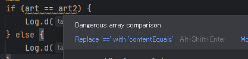

# kotlin にプリミティブ型はあるのか？

<i>2024/10/16</i>

Kotlin で扱う変数は全部オブジェクト型でプリミティブ型はない！と思っていたが、そうではないらしい。

配列を作ろうと思って `xxx[]` とか `[]xxx` とか書いてみたけど Android Studio でエラーになるので調べてみると `Array`クラスを使うそうだった。  
なので「ああプリミティブ型がないからそうなるのか」と納得していたのだが、Kotlin のドキュメントにはしばしば「primitive types」という言葉が出てくる。

* [Numbers representation on the JVM](https://kotlinlang.org/docs/numbers.html#numbers-representation-on-the-jvm)
  * > On the JVM platform, numbers are stored as primitive types: int, double, and so on. 
* [Arrays](https://kotlinlang.org/docs/arrays.html)
  * > If you use primitives in an object-type array, this has a performance impact because your primitives are boxed into objects.

Kotlin は JVM で動くので、JVM でのプリミティブ型をそう呼んでいるのだと思う。  
まあ、CPU にとっては文字型なんかもなくて数値しかないしね。

## Arrays

これだけで終わるのもなんなので、Kotlin での配列の扱いを書いておこう。

### 仕様

* [Arrays](https://kotlinlang.org/docs/arrays.html)

> An array is a data structure that holds a fixed number of values of the same type or its subtypes.

と書いてあるように、要素数が固定されるのが特徴だろう。  
元々 Java がそういう仕様だった気がする(自信ない)。

その代わり、コレクション型(`List`, `Set`, `Map`)に変換する方法が用意されている([Convert arrays to collections](https://kotlinlang.org/docs/arrays.html#convert-arrays-to-collections))。

### 作り方

配列の作り方は 2パターンある([Create arrays](https://kotlinlang.org/docs/arrays.html#create-arrays))。

* `arrayOf()`, `arrayOfNulls()`, `emptyArray()` を使う
* `Array` コンストラクタを使う
  * プリミティブ型については、たとえば `Boolean` → `BooleanArray` のような専用クラスが存在するのでそちらを使った方がよい([Primitive-type arrays](https://kotlinlang.org/docs/arrays.html#primitive-type-arrays))

C言語でもデータのまとまりをコピーするのに `for` 文で回すよりも `memcpy()` を使った方が実装として最適化されている可能性がある、みたいなものか。
専用命令を持つ CPU があったり、ライブラリでバス幅を考慮して回数が少なくなるようにしたり工夫されてたりするから使えるところは使った方が良いことが多いと思う。

多次元配列も作ることができるが、`Array` を含んだ `Array` という形になるだけである。  
2次元配列までは見かけるけど 3次元配列を見かけないのはメモリが大量にいるからだろうかね。

### 使い方

単独の要素には他の言語と同じように `[x]` でアクセスできる。

変数名の頭に `*` を付けると、全要素を展開したのと同じ効果が得られる([Pass variable number of arguments to a function](https://kotlinlang.org/docs/arrays.html#pass-variable-number-of-arguments-to-a-function))。  
Go言語の `...` みたいなものか。  
可変長引数に使う場合が多そうだ。

専用の比較メソッドを持つ([Compare arrays](https://kotlinlang.org/docs/arrays.html#compare-arrays))。  
`==` や `!=` はデータの比較ではなくオブジェクトが同じアドレスかどうかの比較だからね、ということだ。  
もし `equals()` で比較できるのだったら `==` でもよかったのかもしれん([Structural equality](https://kotlinlang.org/docs/equality.html#structural-equality))。  
`String` が `==` で比較できるのも [equals()](https://kotlinlang.org/api/latest/jvm/stdlib/kotlin/-string/equals.html) があるからのようだ。

他にも合計したりシャッフルしたりするメソッドがあるらしい。  
詳しくは `Array` クラスの説明を読もう。

* [Array - Kotlin Programming Language](https://kotlinlang.org/api/latest/jvm/stdlib/kotlin/-array/)

## おまけ

### ===

[Structural equality](https://kotlinlang.org/docs/equality.html#structural-equality) に `===` が出てきた。

```kotlin
a?.equals(b) ?: (b === null)
```

ページの一番上に書いてあった。

* [Equality](https://kotlinlang.org/docs/equality.html)
  * `==`: Structual equality
  * `===`: Referential equality

JavaScript だと `==` と書くと ESLint なんかが「`===` じゃないの？」と警告してくるくらいに `==` は使わないものだった。
使うのは null/undefined チェックのときくらいか。

試しに Android Studio で `Array()` の変数を `==` で比較すると警告された。



`===` だと出てこない。

`==` の代わりに `equals()` で書いてみると(これも警告になる)、 `Any.equals()` にジャンプできた。  
`Array` 自体は `equals()` を持っていないが、そういう場合は `Any` までたどるのかな。  
[Any.equals()](https://kotlinlang.org/api/latest/jvm/stdlib/kotlin/-any/equals.html#kotlin.Any$equals(kotlin.Any?)) のルールはいろいろ書いてあるが `Array` については同一オブジェクトでないと `false` になりそうだ。
