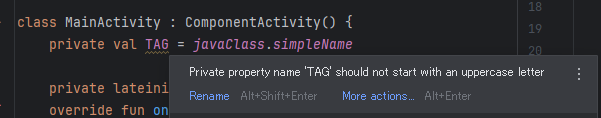
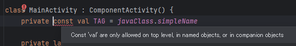
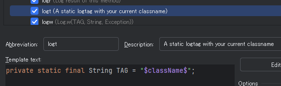

もともと BLE の Central 側を作りたくて Android の勉強をし始めたのだった。  
そろそろ何か動かせるんじゃないか、と思ったが非同期処理をやっていなかった。  
BLE を操作する API 自体が非同期になっているならわざわざ自分で非同期処理を書く箇所はないかもしれない。  
例えばデバイスのスキャンであれば、スキャンを依頼して結果だけコールバックされるようになっているとか。  
そうなっていれば、`Button` で `onClick` に処理を書くのと同じようにできるはず。

が、基本はやっておこう。

### 非同期処理はコルーチンで良いのか？

Android の非同期処理はいろいろ書き方があったと思うけど今はコルーチンだけ覚えておけば何とかなるのだろうか？という確認をする回です。  
「コルーチンではダメなんじゃないか？」という疑問ではないです。

* [Android での Kotlin コルーチン  -  Android Developers](https://developer.android.com/kotlin/coroutines?hl=ja)

### 昔話java.util.concurrent か Kotlin concurrency utilities

例えば、以前は [AsyncTask](https://developer.android.com/reference/android/os/AsyncTask) というクラスがあった。  
これは API 30 から deprecated になっている。
まだ使えるけどなくなっても知らんよ、というところか。  

> Use the standard [java.util.concurrent](https://developer.android.com/reference/java/util/concurrent/package-summary) or [Kotlin concurrency utilities](https://developer.android.com/topic/libraries/architecture/coroutines) instead. 

と案内してあるので、Kotlin を使うならコルーチンでいいんじゃなかろうか。

### コルーチン？

特に詳しいわけでも無いが、golang の go routine と同じようなものだと思う。  
並列処理をするのに、最初はプロセス、その次にスレッドが出てきたけど、さらに小さい単位としてコルーチンが出てきたという印象を持っている。

プロセスとスレッドは OS の機能に頼り切るが、コルーチンはプログラムの中にそういう機能を持っているからディスパッチが軽いし自由度が高い(と思っている)。  
プロセスだとメモリ空間が切り離されるけど、スレッドは切り離されない。
コルーチンはどちらかといえばスレッド寄りの考え方になるだろう。

### Kotlin のコルーチン

[主な機能](https://developer.android.com/kotlin/coroutines?hl=ja#features)が列挙してあるので書いておこう。

* 軽量
  * 「中断」という概念がある
    * `suspend`, `launch`, `runBlocking`, ...
  * ブロックというのは `join`的な
* メモリリークが少ない
  * 「構造化された同時実行」は "Structured concurrency" のことらしい
  * これだけだとよくわからん
* 組み込みの解約サポート
  * `.cancel()` という、コルーチンの実行を[キャンセルする機構](https://kotlinlang.org/docs/cancellation-and-timeouts.html)があるそうだ
* Jetpack の統合
  * Android で Jetpack を使うなら相性が良いということだろう

### 基本

[こちら](https://kotlinlang.org/docs/coroutines-basics.html#your-first-coroutine)を参考に[例](https://pl.kotl.in/yHR47kHAe)を作った。  
`launch{}` で囲まれた部分は 1 つのコルーチン。  
それを 2つ用意したらそれぞれ並列に動作するというサンプルだ。

```kotlin
package kotlinx.coroutines.guide.exampleBasic02

import kotlinx.coroutines.*

fun main() = runBlocking { // this: CoroutineScope
    launch { doWorld() }
    launch { doSome() }
    println("Hello")
}

suspend fun doWorld() {
    delay(1000L)
    println("World!")
}

// 200 msec ごとに 10 回ログ出力
// doWorld()が 1秒待って "World" を出力するので 5 回目付近でそのログが出る
suspend fun doSome() {
    for (i in 0..9) {
        println("some... $i")
        delay(200L)
    }
}
```

実行するとこういう結果になる。

```txt
Hello
some... 0
some... 1
some... 2
some... 3
some... 4
World!
some... 5
some... 6
some... 7
some... 8
some... 9
```

* [launch {}](https://kotlinlang.org/api/kotlinx.coroutines/kotlinx-coroutines-core/kotlinx.coroutines/launch.html) はコルーチンを作って立ち上げることができる
  * > Launches a new coroutine without blocking the current thread and returns a reference to the coroutine as a Job.
  * coroutine builder と呼ばれる
  * これ単体では呼び出せない。`runBlocking {}` などで囲んだ中で使うそうだ
* [runBlocking {}](https://kotlinlang.org/api/kotlinx.coroutines/kotlinx-coroutines-core/kotlinx.coroutines/run-blocking.html) も coroutine builder
  * > Runs a new coroutine and blocks the current thread until its completion.
  * スレッドをブロックするなら UI スレッドで使ったら行かんよな？ `onCreate()` から `runBlocking{}` を呼んでその中で無限ループしたらアプリは死なないものの画面のレンダリングもないままだった。
* `runBlocking { launch {...} }` ではなく `viewModelScopde.launch {...}` とすると UIスレッドで実行されるらしい
  * たぶんブロックせずに実行してくれるのだろう
  * `viewModelScope` は `ViewModel` の派生クラスの中でしか使えないようだ
  * `ViewModel` は[アプリアーキテクチャ](https://developer.android.com/topic/architecture/ui-layer/stateholders?hl=ja)で状態ホルダー(State Holder)に位置することができる class らしい
    * State Holder が `ViewModel` の派生である必要はない
* [main safety](https://developer.android.com/kotlin/coroutines?hl=ja#use-coroutines-for-main-safety)
  * `runBlocking` にせよ `viewModelScope.launch` にせよコルーチンに処理を移す
  * `viewModelScope.launch()`は処理するスレッドを指定できる
  * という話をしているので、これでもうメインセーフティになってるのだろうと思ったがそうでもない？

ちょろっと `Activity` にコルーチンを入れて試してみよう、というのが面倒そうだ。  
ただ Composable 関数からコルーチンを立ち上げることはできるようだった。

* [kotlin - how to launch a coroutine inside a composable in Android Jetpack Compose - Stack Overflow](https://stackoverflow.com/questions/67152795/how-to-launch-a-coroutine-inside-a-composable-in-android-jetpack-compose)

[rememberCoroutineScope](https://developer.android.com/reference/kotlin/androidx/compose/runtime/package-summary#remembercoroutinescope) は引数に直接 `Dispatchers.IO` などは与えられないが、`launch()` の引数に与えられるのでそれでよかろう。  
通常はバックグラウンドで時間がかかることをするのはデータにアクセスするような処理で、それはどこかで描画に使われるか、使われなくても他のデータアクセスに使われるかだろう。  
そうだったら素直に `ViewModel` の派生クラスを用意して State Holder を作った方がフレームワークの恩恵を受けやすいだろう。

簡単じゃないねー。

## おまけ

### 依存関係の追加は必要か？

Compose を使う前は `build.gradle` だったが、今やこのファイルも Kotlin 形式になったようだ。  
[依存関係情報](https://developer.android.com/kotlin/coroutines?hl=ja#dependency) を見て追加しようとしたが、Android Studio で作ったプロジェクトはこういう書き方になっていた。

```kotlin
dependencies {
  implementation(libs.androidx.core.ktx)
  ...
```

たぶん `gradle/libs.versions.toml` が変数を定義しているファイルだ。  

```toml
[libraries]
androidx-core-ktx = { group = "androidx.core", name = "core-ktx", version.ref = "coreKtx" }
...
```

どうやって追加したら良いかと考えていたが、Jetpack がコルーチン向けになっているのであればわざわざ追加しなくても使えるはず。

`suspend`, `launch` `runBlocking` を書いてみると `import kotlinx.coroutines.launch` などは使えた。  
しばらく様子を見よう。  
[GitHub kotlin](https://github.com/Kotlin/kotlinx.coroutines/blob/master/README.md#using-in-your-projects) の方にはもう少し詳しく書かれていたので、必要とあらばそちらを見るのもよさそう。

### TAG という名前

`Log.d()` の第1引数はタグだ。

```kotlin
    public static int d(@Nullable String tag, @NonNull String msg) {
        return println_native(LOG_ID_MAIN, DEBUG, tag, msg);
    }
```

class 内ではだいたい固定値として使うので Java のときは全部大文字の `TAG` で使っていた。  
Kotlin でもそうしているのだが、Android Studio が全部大文字の単語を使っていることに対して警告を出す。



Java がどういうルールだったか覚えていないが、基本的に小文字始まりのキャメルだったような気がする。  
ただ C/C++ でマクロが大文字だったことと、固定値は `const` 変数よりもマクロで書くことが多かったことから、Java でも固定値は全部大文字でいいか、と思っている。  
私が思ってもどうしようもないのだが。

`const` で固定値にするときは小文字`k`始まりにすることが多かった。  
どこからきたルールなのか知らないけど、使っていたフレームワークがそうだったので私もそういうものかと受け入れている。

まあ、それはよいとしてタグだ。  
`tag` としても問題はないのだけど、全部小文字で短いのも classスコープの変数としてどうなのかという気もする。  
かといって `logTag` みたいにするのもなんだかなあ、という気がしている。
使う箇所が `Log.X()` でしかないので `Log.i(logTag, ～)` と "log" が 2回出てくるのもくどい気がしてしまう。

それになにより「`Log` には `TAG`」という慣れがある。  
見慣れているので違っていれば気付きやすいし、他で使うことにちゅうちょするという抑止効果もある(たぶん)。

なんで、`TAG` でもういいんじゃないの、と私は思っている。

ちなみに私は class 変数として `TAG` を持たせてる。  
`companion object` にしてシングルトンにしたほうが無駄が少ないのかもしれんが、`val` だしコンパイル時にたぶん解決してくれるし、もういいんじゃないか。  
他の class に持っていくときもコピペで済むし。

```kotlin
private val TAG = javaClass.simpleName
```

製品アプリの場合、ログをファイルに保存してバグが起きたときに送ってもらうという使い方をしたいかもしれない。  
log4j は今も使われているのだろうか？  
検索すると [Timber](https://github.com/JakeWharton/timber) というライブラリが出てきたのでそのうち使ってみよう。

### val は const じゃないんだ

非同期処理を調べていたが、こうすればよいというのがわからないままだった。  
もうちょっと Codelabs で勉強しようと思い、順番を飛ばして興味があるところだけでもやっておこうと眺めていた。

* [アクティビティのライフサイクルのステージ](https://developer.android.com/codelabs/basic-android-kotlin-compose-activity-lifecycle?hl=ja&continue=https%3A%2F%2Fdeveloper.android.com%2Fcourses%2Fpathways%2Fandroid-basics-compose-unit-4-pathway-1%3Fhl%3Dja%23codelab-https%3A%2F%2Fdeveloper.android.com%2Fcodelabs%2Fbasic-android-kotlin-compose-activity-lifecycle#2)

> コンパイル時の定数としてマークするには、変数を宣言するときに const を使用します。コンパイル時の定数は、コンパイル時に判明する値です。

```kotlin
private const val TAG = "MainActivity"
```

これは `class` や `companion object` ではなく地の文(?)で定義されていた。  
Java は何でもかんでも `class` の中にあったと思うが Kotlin はそうではないのだな。  
(`main()` がそうじゃない時点でそうなのだと気付くべきだな。。。)

* [MainActivity.kt](https://github.com/google-developer-training/basic-android-kotlin-compose-training-dessert-clicker/blob/52cca17cf7977ede77c27ee50146ccf0e6a2e1ab/app/src/main/java/com/example/dessertclicker/MainActivity.kt#L76)

`val` は定数宣言だと思っていたけど `const` もあったんだ！  
[koglinlang.org](https://kotlinlang.org/)の検索だと見つけられないのだ。

`class` のメンバ変数を `const` にはできないそうだ。



`companion object` はシングルトンとして使えるという説明をよく見るが、それだったら `static` を付ければ良いのでは？  
そう思ったが `static` は Android Studio で色も変わらないところを見ると存在しないようだ。

まあ、`class` を定義したときにしか書かないので大した作業ではないから毎回書いてもいいかな(敗北)。  
それに Android Studio の Live Templates には「logt」というスニペットがある。  
これを使うと `class` の数行上くらいに `logt`(TABキー) とするだけで `TAG` の定義を作ってくれるので、これでいいか。



でも `Log.X(TAG, xxx)`と毎回書くのも面倒だし、ログを出力したい場合を考えるとやっぱりライブラリを使う方向が良い気がする。
