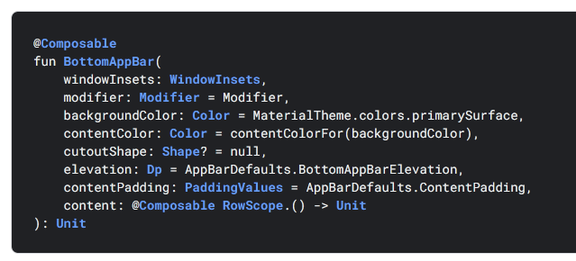
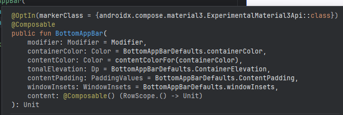
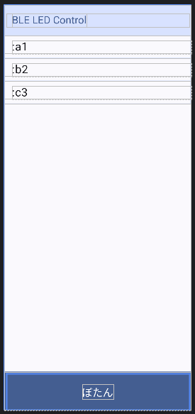

# android: onClick が使えるもの

<i>2024/10/18</i>

`Scaffold` で `topBar` と `bottomBar` を用意した。  
用意するときに `@OptIn(ExperimentalMaterial3Api::class)` を追加するよう促されたが、まだ M3 は[試験運用版 API](https://developer.android.com/develop/ui/compose/designsystems/material2-material3?hl=ja#experimental-apis)があるようだ。

しばしばアプリで見られるが、画面の一番下に大きいボタン的なものが配置されていることがある。  
あれをやってみようとした。

普通に `Button` を追加するだけだと小さいし、`fillMaxWidth()` などで広げても角丸な形状がそのまま現れる。  
形状を変えたりすれば良いのだろうが、そういえばクリックしたいだけであれば `Button` にこだわる必要もないと思い至った。

`Row` を追加して `onClick` を設定してみたが、そういうパラメータはないようだ。  
`Surface` では使えたのでそれでよしとした。

`onClick` が使えるものはどういうやつだろう？

## よく使うコンポーネント

全部調べるのも面倒なので、私がよく使うコンポーネントだけで見てみた。

* [androidx.compose.foundation.layout](https://developer.android.com/reference/kotlin/androidx/compose/foundation/layout/package-summary)
  * `Box`, `Column`, `Row` など
  * これらには `onClick` はなかった
* [androidx.compose.material](https://developer.android.com/reference/kotlin/androidx/compose/material/package-summary)
  * `Button`, `Text`, `Surface`, `Scaffold` など
  * これらには `onCLick` を持つものがしばしば見られた
* [androidx.compose.foundation](https://developer.android.com/reference/kotlin/androidx/compose/foundation/package-summary)
  * `Image` など
  * `CombinedClickableNode` だけが onClick を持っていた

ただ、`onClick` を持つものだけがクリックに対応できるというわけでもなさそうだった。  
`Modifier.clickable`、`Modifier.combinedClickable` があるからだ。

## Geminiさん

Gemini さんに質問すると、`BottomNavigation(modifier = Modifier.clickable {})` を使った例が出力された。  
試しにそのまま使うも `BottomNavigaion` が見つからない。。。

見つからないことも質問すると、`NavigationBar` の例を出してきた。  
[BottomNavigation](https://developer.android.com/reference/kotlin/androidx/compose/material/package-summary#BottomNavigation%28androidx.compose.foundation.layout.WindowInsets,androidx.compose.ui.Modifier,androidx.compose.ui.graphics.Color,androidx.compose.ui.graphics.Color,androidx.compose.ui.unit.Dp,kotlin.Function1%29) が存在しないわけではないのだが、見つからないなら仕方ない。  

とはいえ、Navigation はタブっぽい見た目のやつで、遷移するのが目的だと思う([こんなの](https://developer.android.com/develop/ui/compose/layouts/adaptive/build-adaptive-navigation?hl=ja))。  
であれば [BottomAppBar](https://developer.android.com/reference/kotlin/androidx/compose/material/package-summary#BottomAppBar(androidx.compose.foundation.layout.WindowInsets,androidx.compose.ui.Modifier,androidx.compose.ui.graphics.Color,androidx.compose.ui.graphics.Color,androidx.compose.ui.graphics.Shape,androidx.compose.ui.unit.Dp,androidx.compose.foundation.layout.PaddingValues,kotlin.Function1)) だけでよいのか。  
しかし、サイトの方にはこうなっているが、



実際は、というか M3 ではこうだ。



ここでようやく、`androidx.compose.material` と `androidx.compose.material3` がけっこう違うということに気付く。  
M2 だの M3 だのは見た目だけでなく API にも影響するのだ。  
こちらが M3 の `BottomAppBar`。

[BottomAppBar](https://developer.android.com/reference/kotlin/androidx/compose/material3/package-summary#BottomAppBar%28androidx.compose.ui.Modifier,androidx.compose.ui.graphics.Color,androidx.compose.ui.graphics.Color,androidx.compose.ui.unit.Dp,androidx.compose.foundation.layout.PaddingValues,androidx.compose.foundation.layout.WindowInsets,kotlin.Function1%29)

## 最終的にこうした

M3 で進めるのに異議があるわけではないのでこのまま使う。  
これが M4 になったらまたあれこれ変わるのだろうか、
Android Studio に任せたら "material3" を `import` したが "material" の方にしたら自動で M4 に対応してくれないだろうか、
など考えてしまったが、そこまで思い入れもないしよかろう。  
(数字が付かない ["material" パッケージは M2](https://developer.android.com/develop/ui/compose/designsystems/material3?hl=ja) だそうだ)

で、こんな感じにした。  
イベントは `BottomAppBar()` の `Modifier.clickable()` で受けている。
内側に `Surface` を置いてその `onClick` でも対応はできるのだが、無駄に重ねることはなかろう。

```kotlin
    Scaffold(
        bottomBar = {
            BottomAppBar(
                containerColor = colorScheme.primary,
                contentColor = colorScheme.onPrimary,
                modifier = Modifier.clickable(onClick = onClick),
            ) {
                Text(
                    text = "ぼたん",
                    style = MaterialTheme.typography.titleLarge,
                    modifier = Modifier
                        .fillMaxSize()
                        .wrapContentSize()
                )
            }
        }
    ) {
      ...
```

日本語フォントだとそうでもないが小文字アルファベットだと小さく見える気がする。  
かといって固定値を入れ込むのも心配なので、まあこれでいいや。


