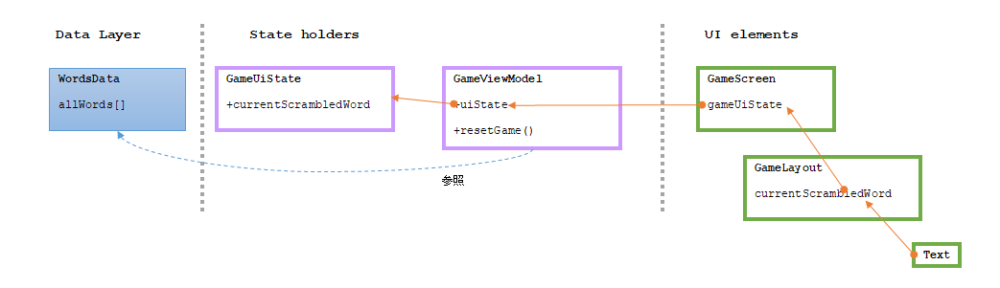

`ViewModel` に関する Codelabs があったのでやっている。

[Compose での ViewModel と状態](https://developer.android.com/codelabs/basic-android-kotlin-compose-viewmodel-and-state?hl=ja&continue=https%3A%2F%2Fdeveloper.android.com%2Fcourses%2Fpathways%2Fandroid-basics-compose-unit-4-pathway-1%253Fhl%3Dja%2523codelab-https%3A%2F%2Fdeveloper.android.com%2Fcodelabs%2Fbasic-android-kotlin-compose-viewmodel-and-state#0)

## ViewModel の追加

* [5. ViewModelを追加する](https://developer.android.com/codelabs/basic-android-kotlin-compose-viewmodel-and-state?hl=ja&continue=https%3A%2F%2Fdeveloper.android.com%2Fcourses%2Fpathways%2Fandroid-basics-compose-unit-4-pathway-1%3Fhl%3Dja%23codelab-https%3A%2F%2Fdeveloper.android.com%2Fcodelabs%2Fbasic-android-kotlin-compose-viewmodel-and-state#4)

おもしろいくらい、何を言っているかわからない。。。  
Codelabs のユニット 3 をスキップしてユニット 4 からやっているから見逃しているのか？

### StateFlow

> StateFlow は、現在の状態や新しい状態更新の情報を出力するデータ保持用の監視可能な Flow です。

* `Flow` って？
  * [StateFlow](https://kotlinlang.org/api/kotlinx.coroutines/kotlinx-coroutines-core/kotlinx.coroutines.flow/-state-flow/) という Kotlin の `interface` (Androidのじゃなく)
    * Kotlin の [Flow](https://kotlinlang.org/api/kotlinx.coroutines/kotlinx-coroutines-core/kotlinx.coroutines.flow/-flow/) というものがあり、その派生である `SharedFlow` のさらに派生
      * `Flow`: 値を順次に発行(emit)し、正常または例外で完了する非同期データ ストリーム
    * [Android での Kotlin Flow - Android Developers](https://developer.android.com/kotlin/flow?hl=ja)
      * データがストリームの際に Data sources --> Repositories --> State holders --> UI elements と流し込むのに使う？
      * 非同期(コルーチン)で `suspend` は 1回分のデータしか返せないのをストリームで返したいので使う？
        * リアルタイムでデータが更新されるようなものにも使えるそうだ
        * 更新されたことを知るのはコールバック？と思ったら、[コールバックをFlowに変換](https://developer.android.com/kotlin/flow?hl=ja#callback)ということもできるそうだ
* hot flow である
  * `SharedFlow` も hot flow だそうな
  * `Flow` 自体は cold らしい
  * 上流からの INPUT(upstream flow)に中間操作(intermediate operation)して下流(downstream flow)に流すのだが、中間操作をする設定だけしてその場では操作を行わない、という動作を cold flow というようだ
  * hot flow は `MutableStateFlow` か `MutableSharedFlow` によって作られる
* `Flow` には完了があるが `StateFlow` にはそれがない。
* `StateFlow` は後から変化しない。`MutableStateFlow` は変更できるやつ。
  * `MutableStateFlow`のプロパティを getter として使うときに `.asStateFlow()` で `StateFlow` にしたものを渡す

例えが合っているか分からないが、こういう風にメソッドが自分自身を返して最後に`.build()`で一気に構築するのが cold flow っぽい感じだろうか。

* [必須プロパティのセットを強要するBuilderパターン #初心者 - Qiita](https://qiita.com/riversun/items/b69aec00ac4664240c31)

hot は下流に流すときには既に加工済みになっているタイプ、例を出すなら・・・ChaCha20 みたいなストリーム暗号とか？

cold だとデータを使いたいときに一度完了させないといけないが、それだと途切れてしまって不便なので UI では hot flow の方が向いているという解釈で良いのかしら。  
hot flow は上流の値を放り込める Mutable なやつと、その read only 版がセットで存在する。  
Kotlin の一覧では [MutableSharedFlow](https://kotlinlang.org/api/kotlinx.coroutines/kotlinx-coroutines-core/kotlinx.coroutines.flow/-mutable-shared-flow/) と [MutableStateFlow](https://kotlinlang.org/api/kotlinx.coroutines/kotlinx-coroutines-core/kotlinx.coroutines.flow/-mutable-state-flow/) の 2つだけのようだ。  

* [StateFlow と SharedFlow - Kotlin - Android Developers](https://developer.android.com/kotlin/flow/stateflow-and-sharedflow?hl=ja)

ほとんど読んでいないが、下流が 1つなら `StateFlow`、複数なら `SharedFlow` という訳でもなさそうだ。  
`StateFlow` は `.shareIn()` で `SharedFlow` を返すようである。  
逆はなさそうなので、とりあえず `StateFlow` を使っておけばよいのだろうか。  
`StateFlow`は hot といいつつ [shareIn を使用したコールド Flow のホット化](https://developer.android.com/kotlin/flow/stateflow-and-sharedflow?hl=ja#sharein) だったり、機械翻訳だとちょっと怪しいのかもしれない。

細かいところはさっぱり分からんが、とりあえず使ってから考えよう。

### Backing Property

> バッキング プロパティを使用すると、そのオブジェクト自体ではなくゲッターから返すことができます。

* getter だけ公開しているプロパティのことだと思う
* 私がやるんだったら `getXxx()` というメソッドを追加するだろう
* [Backing properties - kotlin](https://kotlinlang.org/docs/properties.html#backing-properties)
  * "backing fields": `field` という名前の変数が自動的に使われているので "backing" なんだろうか？
    * "implicit backing field" と書いているからそういう意味ではないのか。。
  * JVM 的に private properties はデフォルトの getter/setter だと最適化してくれるそうだ
    * inline 展開みたいな話？
    * ここの例では getter が実装されているが、デフォルトじゃないからただの関数呼び出しになる？
  * kotlin document では `_table`(private) と `table`(backing property) があるが `table` の方にも `field` が確保されるのだろうか？
    * `val` だから setter は作られない
    * プロパティに初期値がない場合は `field` が作られないかも([Playground](https://pl.kotl.in/20vze3ClA)でコンパイルエラーになった)
    * 初期値があると `val` のままでも `field` を参照してエラーにならなかったから setter は関係ないか

ここでは `MutableStateFlow` の変数 `_uiState` を `uiState` という Backing property にしている(用語の使い方がよくわからん)。
getter として使う場合は read only にするため `.asStateFlow()` で `StateFlow` に変換している。

`GameUiState`クラスは `currentScrambledWord`(String型) だけをプロパティとして持っている。
`val` なので初期化したら変更できない。  
これを `Flow` として使うのでこうしたのだろうが、それなら `String` でもよかったんじゃないのと思った。  
これから拡張するのか、`class` の方があとから拡張できて便利とかだろうか。

## Compose UIの設計

[6. Compose UI を設計する](https://developer.android.com/codelabs/basic-android-kotlin-compose-viewmodel-and-state?hl=ja&continue=https%3A%2F%2Fdeveloper.android.com%2Fcourses%2Fpathways%2Fandroid-basics-compose-unit-4-pathway-1%253Fhl%3Dja%2523codelab-https%3A%2F%2Fdeveloper.android.com%2Fcodelabs%2Fbasic-android-kotlin-compose-viewmodel-and-state#5)

`ViewModel`の使い方がここで分かるはず。。。

* `GameViewModel.uiState`の`.collectAsState()`を`by`で委譲する([Delegation - Kotlin Documentation](https://kotlinlang.org/docs/delegation.html))
  * 委譲ってなんだ？
    * [Google Developers Japan: Kotlin のクラス委譲とプロパティ委譲サポート機能](https://developers-jp.googleblog.com/2020/11/delegating-delegates-to-kotlin.html)
    * Kotlin には `class` の委譲とプロパティの委譲がある。ここはプロパティの委譲になるのか？
      * `remember` とかはプロパティでもないのに使えたが、委譲ではない`by`がある？
        * [これ](https://github.com/google-developer-training/basic-android-kotlin-compose-training-tip-calculator/blob/29dddab0d5d911f1607bc5602249f89012f4d45e/app/src/main/java/com/example/tiptime/MainActivity.kt#L70)は`@Composable`な関数だからプロパティではないよね？
        * `by`は委譲しかなさそう([Soft keywords](https://kotlinlang.org/docs/keyword-reference.html#soft-keywords))
        * `@Composable`関数は実は`class`に置き換えられるのだ、と勝手に思っておこう。
    * 別`class`のインスタンスを外部からもらって、一部の処理はそのインスタンスを呼び出しているだけのように見える
    * [プログラマーを惑わせる３種類の委譲(委譲・Delegation／転送・Forwarding／.NET Delegates) #JavaScript - Qiita](https://qiita.com/jesus_isao/items/4b6b7846ccf5eb46b1bc)
      * 転送っていわれると、なんとなくわかる気がする。処理の横流しか。
      * C# の `delegate` は関係ないそうだ。あれは追加もできる関数ポインタという感じだったか(てきとう)。

元になる英単語は `allWords` に固定値で入っている(配列ではないが)。  
ゲームの課題として出す単語は `allWords` からランダムで 1つ選び、文字を並べ替えた文字列を `GameViewModel.currentWord` で保持している。  
`currentWord` を更新するのは `GameViewModel` のコンストラクタか `resetGame()` が呼ばれたとき。  
作った課題の文字列は`usedWords()`に追加するし、その文字列が入った`GameUiState`オブジェクトを作って `GameViewModel.uiState.value` に代入している。  
これがおそらく `MutableStateFlow` の上流からデータを流し込む操作になっているのだろう。  
下流をたどると、`GameScreen.gameUiState.currentScrambledWord` が `GameLayout` に渡り、そのまま `Text` に使われている。  
これで、`GameViewModel.uiState` を変更すると `Text` に設定されている文字列が自動的に置き換わるのだろう。

なんかすごいね。  
ボタンを押して次の課題に進むまで変わらないんだからそのとき更新すればいいんじゃないの、と私なんかは思うのだけど、まあこれはそういう課題だし。  
それよりも、こういうしくみがどうやって動作しているのかさっぱり理解できんのだ。

どこかで値が変わったことか代入されたことを監視しないと表示への反映までできないと思うのだ。  
`@Composable` は再コンポーズによってしかコンテンツが書き換えられないというルールだし、そういう機構があるのだろうけど、ずっと監視するのは大変だよなあとか、再コンポーズするような操作がぱらぱらと行われたら画面がちらつかないかなあとか、そういうことを心配してしまう。  
まあ、それでも困らないように作られているんだろうけどさ。

今回はスクランブルされた文字列 1つだけだが、他にも渡したければ `GameUiState` の中身を増やせば良い。  
違うタイミングで更新するようなデータであれば `data class` を追加して同じように `StateFlow` の経路を増やすことになるか。

こういう、構造的な作り方を自然と思いつくようにならないといかんのだろうが、ちょっと難しい。  
最初からアプリのテンプレートがそうなっていれば、そういえばそうだった、と思いつくかもしれない。  
[サンプル](https://developer.android.com/topic/architecture?hl=ja#samples)があるので、上手につきあっていきたいものだ。
