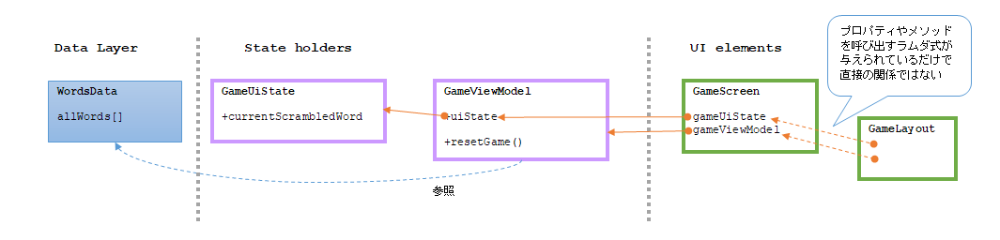

[前回](20241019-and.md)の Codelabs が終わっていないので続きをやろう。

## 前回

[6. Compose UI を設計する](https://developer.android.com/codelabs/basic-android-kotlin-compose-viewmodel-and-state?hl=ja&continue=https%3A%2F%2Fdeveloper.android.com%2Fcourses%2Fpathways%2Fandroid-basics-compose-unit-4-pathway-1%253Fhl%3Dja%2523codelab-https%3A%2F%2Fdeveloper.android.com%2Fcodelabs%2Fbasic-android-kotlin-compose-viewmodel-and-state#5)

TextField に入力した文字は `onValueChange` イベントが発生する。  
これは `GameLayout(onUserGuessChanged)`で渡されていて、内容は `{ gameViewModel.updateUserGuess(it) }` である。  
`updateUserGuess()` は `GameViewModel` のメソッドだ。  
このメソッドの中身は `userGuess = guessedWord` で、`userGuess` はプロパティだ。  

```kotlin
    var userGuess by mutableStateOf("")
        private set
```

`remember` はいらないんだっけ、と思ったが、あれは `@Composable` 関数の中に変数を定義するときだけだ。  
いままで出てきたのが `remember by { mutableStateOf() }` の形だけだったのでセットだと思い込んでいた。

わざわざ setter を使えなくしてメソッドを用意したのは、setter だとインライン展開みたいになって UI element の中で値を更新したことになるからだろうか？  
backing property みたいにがんばってメソッドを使わないようにしていたり、わざわざメソッドにしたりのさじ加減がよくわからん。  
たぶん、`class` 内でのアクセスは何でもできて処理も速くできるように、それ以外は getter だけ速く動くならよし、という感じじゃなかろうか。

ぐだぐだ言ってないで続きをやろう。

* [7. 推測した単語を照合して、スコアを更新する](https://developer.android.com/codelabs/basic-android-kotlin-compose-viewmodel-and-state?hl=ja&continue=https%3A%2F%2Fdeveloper.android.com%2Fcourses%2Fpathways%2Fandroid-basics-compose-unit-4-pathway-1%253Fhl%3Dja%2523codelab-https%3A%2F%2Fdeveloper.android.com%2Fcodelabs%2Fbasic-android-kotlin-compose-viewmodel-and-state#6)
  * `ViewModel`: 入力された文字列と課題の文字列を比較する関数追加
    * 不一致のとき `_uiState` で値が違うことを伝える
      * `GameUiState` に不一致かどうかの変数を追加
      * `_uiState.update {}` で Flow に更新を行う
        * 変更するのに `.value` と `.update` があるが検索するといろいろ出てくる
          * [.value](https://kotlinlang.org/api/kotlinx.coroutines/kotlinx-coroutines-core/kotlinx.coroutines.flow/-mutable-state-flow/value.html): プロパティ
            * スレッドセーフで外部による同期機構を使わなくても安全に更新してくれる、と書いてある
            * ただ、現在の値を使って更新すると「取得」と「反映」に分かれるため、そういう場合には`.update`がよい
          * [.update()](https://kotlinlang.org/api/kotlinx.coroutines/kotlinx-coroutines-core/kotlinx.coroutines.flow/update.html): メソッド
            * メソッドの処理を atomic に実行するので、`(T) -> T` の中での処理と反映までが atomic に処理される
        * `.copy()` して一部だけ書き換えなんてできるんだ
          * `.isGuessedWordWrong` は `val` なので書き換えできない
          * `var` にして直接プロパティを書き換えても挙動は同じだった
            * `.update()` のラムダ式の引数？を直接変更することに問題は無いのかもしれないが、`.copy()`するコストが高そうだったらその方がよいのだろうか？

`GameScreen` は `GameViewModel` を参照したりメソッドを呼び出したりするが、その逆はない。  
`GameLayout` は `GameScreen` 経由でそのデータを使っている感じで、`GameViewModel` と直接の関係は持たない。


