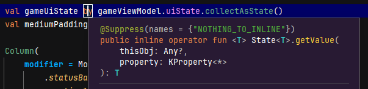

Kotlin には delegation と名前が付いている機能が 2つある。  
どちらもキーワードは [by](https://kotlinlang.org/docs/keyword-reference.html#soft-keywords) を使う。

* [クラス委譲](https://kotlinlang.org/docs/delegation.html)
* [プロパティ委譲](https://kotlinlang.org/docs/delegated-properties.html)

## クラス委譲

[このページ](https://kotlinlang.org/docs/delegation.html)には 3つのサンプルコードが載っている。  
Playground で動かせる。

### 1つめ

* `interface Base`
* `Base`を元にした `class BaseImpl`
* `Base`のインスタンスを委譲される `class Derived`

`Base.print()` の種類が複数あって、どれを使うのかはあらかじめ決めずにおきたい、
しかし引数で毎回指定するような感じでもない、
あらかじめ決めないので派生は使えない、
メソッド数が多いとか理由はいろいろあるだろうがいちいち呼び出す処理を書きたくない、
という感じだろうか。

delegate を使わないならこうか。  
でもこれならそもそも `Derived` を用意する必要はないのだがね。

```kotlin
interface Base {
    fun print()
}

class BaseImpl(val x: Int) : Base {
    override fun print() { print(x) }
}

class Derived(val b: Base) : Base {
    override fun print() { b.print() }
}

fun main() {
    val base = BaseImpl(10)
    val der = Derived(base)
    der.print()
}
```

こういうのって、サンプルコードだとありがたみが分からずに悩むのよね。

### 2つめ

これは一部のメソッドだけ自分で上書きできますよ、ということだろう。  
まあ、上書きしなくてよいならそのまま使えばよいだけだしね。

### 3つめ

これはプロパティについても上書きできますよ、ということだろう。  
上書きも `b.message` ではなく `message` を使うと、`derived.print()` の場合は `BaseImpl.messsage` が使われている。  
つまり上書きした時点で `message` は `Derived` 自身の実装になっているということだ。

## プロパティ委譲

`class` を委譲するのはなんとなくわかる。  
プロパティは委譲してどうなるんだろうか。

まずは Google Developers のブログを見る。

* [Google Developers Japan: Kotlin のクラス委譲とプロパティ委譲サポート機能](https://developers-jp.googleblog.com/2020/11/delegating-delegates-to-kotlin.html)

> プロパティ委譲では、デリゲートはプロパティの get 関数と set 関数の呼び出しを担当します。他のオブジェクトで getter/setter ロジックを再利用しなければならない場合、対応するフィールドだけでなく機能を簡単に拡張することができるので、この機能が非常に便利です。

[最初のサンプル](https://pl.kotl.in/pGorkOdcW) はプロパティ委譲を使わない場合だ。  
コンストラクタで与えた文字列はそのままプロパティの変数に代入されるが、setter を経由した場合は先頭が大文字に変換される。

[2番目のサンプル](https://pl.kotl.in/Y2DUq3B40) はプロパティ委譲にした場合だ(プライマリコンストラクタで与えた引数が捨てられていたので修正している)。  
サンプルコードだし、こんなことできますよということだろうとはいえ、難しい・・・。

委譲元?のプロパティにアクセスできるのはちょっと置いておいて・・・。  
いや、元の `class` にアクセスできないならそもそも委譲せずに普通の`class`でよいはずだ。  
やはり難しい。

私は理解をあきらめた。  
そういう機構があることと、プロパティ委譲用の`class`があることを分かっておけば大丈夫じゃないかね。

### プロパティじゃないのにプロパティ委譲？

昨日も書いたが、`@Composable`関数で状態を覚えておくのに`by remember`を使ったが、あれも委譲のはずだ。  
そしてクラス委譲じゃないならプロパティ委譲のはず。  
でも、あれはローカル変数じゃないのか？　プロパティじゃないんじゃないの？という疑問だ。

[Lazy properties](https://kotlinlang.org/docs/delegated-properties.html#lazy-properties)のサンプルコードにある `lazyValue` がもう既にプロパティじゃない。  
私の「プロパティ」の認識が間違っているのか？

* [Properties - Kotlin Documentation](https://kotlinlang.org/docs/properties.html)

> Properties in Kotlin classes can be declared either as mutable, using the var keyword, or as read-only, using the val keyword.

クラスって書いてあるよなあ。  
Java は何でもかんでも `class` になっていたから、Kotlin の何もないところに書いてもプロパティ扱いになるとかだろうか。  

これかな？

* [Compile-time constants](https://kotlinlang.org/docs/properties.html#compile-time-constants)

> It must be a top-level property, or a member of an object declaration or a companion object.

何もないところに定義した変数は top-level property というプロパティになるということと私は認識した。  
・・・あれ、ローカル変数の位置にあるのは top-level じゃないな。。。  
しかし Android Studio でカーソルを当てるとプロパティ委譲のやり方のように見える。



`getValue()`はまた何かあるのかもしれないが、こちらも踏み込むのは止めよう。
