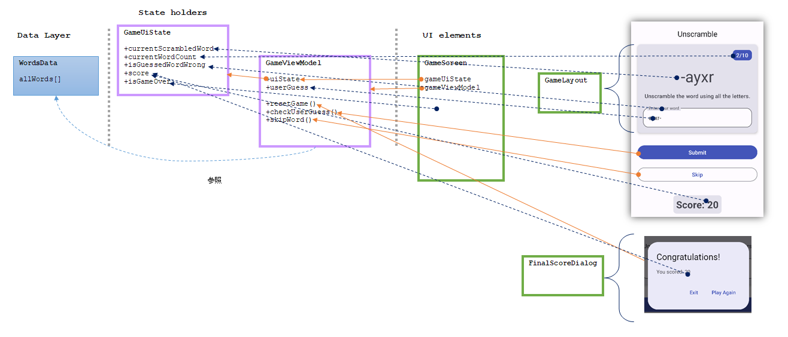

[前回](20241020-and.md)の Codelabs の続きを終わらせよう。。。終わらせた。

理解しようと思って図を作っていたのだが、さっぱりわからんね。



## ViewModelは破棄されない？

`GameViewModel` は UI elements の `GameScreen()` の引数になっている。  
引数だけど、実質プロパティみたいなものだろう。

デバイスを回転させて画面がそれに合わせて作り直されると再コンポーズではなく Activity の再作成になる。  
しかし ViewModel がデータを持っているので再作成されても維持できる、という触れ込みだ。  
実際そうだったのだが、`GameScreen` が破棄されるならそのタイミングで `GameViewModel` も破棄されないのだろうか？  
参照していたのは `GameScreen` だけだからガベッジコレクションで破棄して良いものと見なされそうだ。

> ViewModel オブジェクトは自動的に保持され

と書いてあるので、`ViewModel`からの派生であることが条件で保持されている？  
`ViewModel` の中で何か行われているのかもしれない。  
[そんな感じのこと](https://developer.android.com/reference/kotlin/androidx/lifecycle/ViewModel)が書かれているのでそうなんだろう。

## StateFlowでなくてもできる？

`GameViewModel` は参照されたり呼び出されたりするだけで UI elements を直接参照することはない。  
表示する内容は `GameViewModel.uiState` を介して `GameUiState` を参照するか、入力した文字については `GameViewModel.userGuess` を参照している。  
入力した文字を `StateFlow` にしないのは、更新タイミングが違うから `mutableStateOf` で別扱いにしたということだろうか。
それだったら `uiState` も `mutableStateOf` を使えば同じことができそうな。

やってみてぱっと見は良かったのだが、skip しても次の表示にならず、何か TextField に入力すると反映された。  
`uiState`への代入をいちいちやっているから描画タイミングが合わないのだろうか？  
あるいは `gameViewModel.userGuess` は `MutableState` だから変更したら反映されるけど `gameViewModel.uiState.currentScrambledWord` は単なるプロパティだから監視対象になっていないということだろうか。  
そちらの方があり得るな。

なので変更の際は `uiState.copy()` でコピーしつつプロパティを置き換えるやり方がそのまま使える。  
`MutableState`には`.update()`がないので直接代入する。

```kotlin
            uiState = uiState.copy(
                isGuessedWordWrong = true
            )
```

こうすると `uiState` 自身のアドレスが変更になるので State も変わったと判断されて描画されるのだろう。  
なのでこのチュートリアルで `MutableStateFlow` が使われたのはチュートリアルだからという理由な気がする。  
複数プロセスから同時に更新される可能性があるなら atomic な `update` ができる `MutableStateFlow` が安心なのかもしれない。  

* [なんとなく使いこなしてた気がしてた、StateFlowを理解する #Android - Qiita](https://qiita.com/takagimeow/items/2271c8a843b8caf92ebe)
* [android - mutableState VS mutableStateFlow? - Stack Overflow](https://stackoverflow.com/questions/70217780/mutablestate-vs-mutablestateflow)
* [MutableState or MutableStateFlow: A Perspective on what to use in Jetpack Compose - by Kerry Bisset - ProAndroidDev](https://proandroiddev.com/mutablestate-or-mutablestateflow-a-perspective-on-what-to-use-in-jetpack-compose-ccec0af7abbf)

3番目のリンクで、`MutableState` は `MutableStateFlow` のように読み取り専用にできない、と書いてあった。  
setter を private にすればいいんじゃないの？と思ったが、"truly read-only form" とあるので setter を見えなくしただけだと安心できないのかもしれない。

であれば、ひとかたまりのデータは `MutableStateFlow` で扱うのがよいか。  
キーボードからの入力のような一時的なものは `MutableState` で十分だろう。  
というか、そういうのは `remember` にして UI elements で持ってもよいと思った。

アプリをたくさん作っていけばもうちょっと判断が付くだろうか。。。

## 難しい...

ビジネスロジックは Repositories に置くということだったが、スクランブルされた文字列を `GameViewModel` が作っている。  
これは、この程度はビジネスロジックというほどでもないということか、あるいは課題の都合か。  

値の保持を Repositories 以下がやるとしても、今回の内容では `GameUiState.score` だけか、あるいはそれのハイスコアだけ保持する程度だろう。  
一時的に画面に表示しているだけならわざわざ Repositories で持たずとも State holders で十分だろう。

こう、設計を苦手としていると知っている範囲が少ないのに悩みますな。  
組み込み系のリソースが少ない環境でどうやって動かそう、というのの方が気が楽だ。
