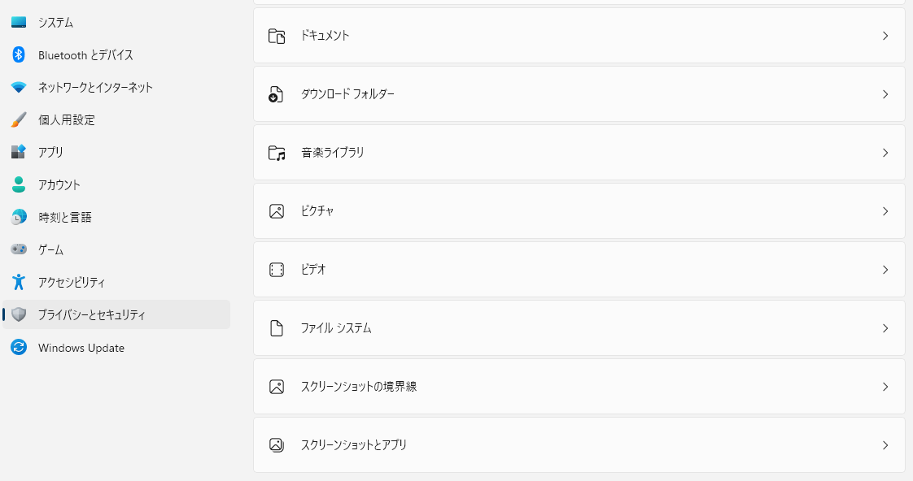
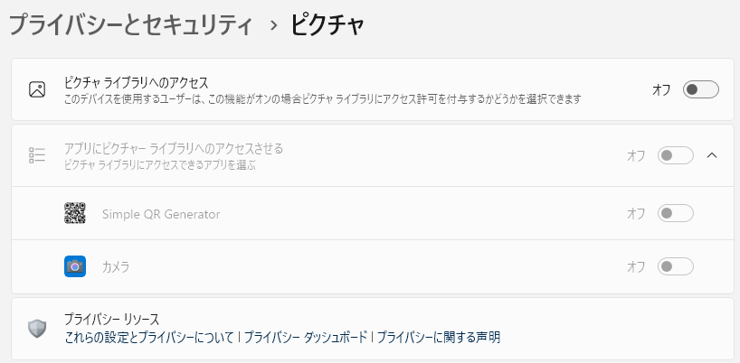
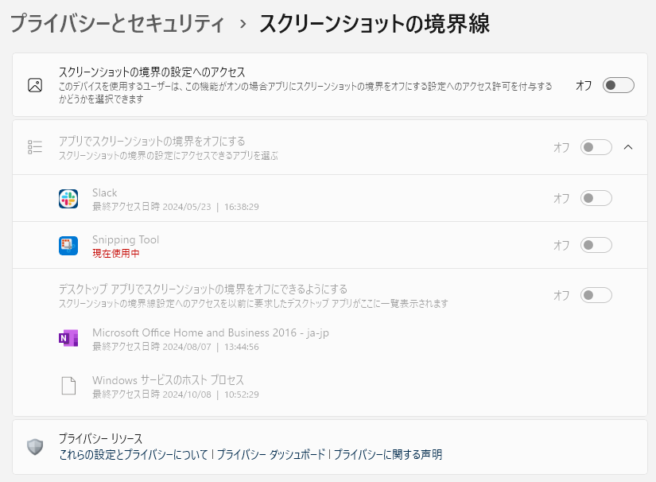

# win11: 設定「スクリーンショットの境界線」

<i>2024/10/23</i>

単なる愚痴だ。

----

Windows11 の設定アプリに「プライバシーとセキュリティ」というメニューがある。

項目は大分類として以下がある。

* セキュリティ
* Windowsのアクセス許可
* アプリのアクセス許可

Windows のアップデートがあると項目が増えていたりする(そしてだいたいアクセスが許可になっている)のでしばしば見に行かないといけない。  
今のところ、ユーザが不許可したものが許可になったりはしてないと思う。

それはともかく、設定項目の意味がよくわからないものが多い。  
最初からあった項目は名前からまあまあ意味が分かるのだが、後から追加されたものはよくわからんかったりする。

### ファイルシステム

普通に考えたら、アプリがファイルシステムにアクセスできなかったら何もできないだろう、と思う。  
が、そんなことはない。  
なんなんだ。。。

設定項目の下にあるリンクからもう少し詳しいことが書かれているページを開くことはできる。

* [Windowsのアクセスとプライバシー - Microsoft サポート](https://support.microsoft.com/ja-jp/windows/-windows%E3%81%AE%E3%82%A2%E3%82%AF%E3%82%BB%E3%82%B9%E3%81%A8%E3%83%97%E3%83%A9%E3%82%A4%E3%83%90%E3%82%B7%E3%83%BC-a7d90b20-b252-0e7b-6a29-a3a688e5c7be)

> ファイル システムへのアクセスをアプリに許可すると、管理を必要とする個人のコンテンツにアプリからアクセスできるようになる可能性があります。

ただ、こうも書いてある。

> 一覧には、ファイル システムにアクセスできるアプリを選択できるアプリが一覧に表示されません。 

アプリからアプリを立ち上げて、そのアプリが選択するという場合だろうか。  
にしても、設定を全体でオフにしていれば関係ないはず。  
それでも今までアプリの動作に困ったことがないので、何がアクセスできなくなっているのかよくわからない。

### ピクチャ

さすがに「ファイルシステム」は幅が広すぎてうまくいっていないだけかもしれない。  
それに、Windowsのアプリも「ストアアプリ」と「従来のアプリ」があって、この設定が従来のアプリにはあまり効いていない気がする。

しかし「ピクチャ」と限定していたら標準の画像フォルダにはアクセスできないんじゃないかと思う。  
思うだろう？

この PC には「[フォト](https://apps.microsoft.com/detail/9wzdncrfjbh4?hl=ja-jp&gl=JP)」という標準の画像ビューアがインストールされているのだが、それがここに出てきていない。  
そしてこの設定を禁止にしていてもフォトアプリは普通に画像フォルダから閲覧できる。

この一覧に出ている「カメラ」アプリだが、グレーアウトされているのでさすがにアクセスできないだろうと思っていた。  
しかし撮影すると画像フォルダに保存されていた。  
設定を変更してみたが、特に何か変わった感じもしない(設定を切り替えるとカメラアプリが終了したので、何かしらの反映はしていると思うが)。  

* [ピクチャ、ビデオ、ドキュメント ライブラリへのアクセスとプライバシー - Microsoft サポート](https://support.microsoft.com/ja-jp/windows/%E3%83%94%E3%82%AF%E3%83%81%E3%83%A3-%E3%83%93%E3%83%87%E3%82%AA-%E3%83%89%E3%82%AD%E3%83%A5%E3%83%A1%E3%83%B3%E3%83%88-%E3%83%A9%E3%82%A4%E3%83%96%E3%83%A9%E3%83%AA%E3%81%B8%E3%81%AE%E3%82%A2%E3%82%AF%E3%82%BB%E3%82%B9%E3%81%A8%E3%83%97%E3%83%A9%E3%82%A4%E3%83%90%E3%82%B7%E3%83%BC-634f95f8-1e80-ba02-b5d6-2d019b6a42e9)

どうも、アクセスを不許可にするとフォルダを作ってそこには保存するらしい。  
なんじゃそりゃ、とは思うが、そういう仕様らしい。

そういう理屈で行くと、他のセキュリティ設定も「必要なデータ(とMicrosoftが思っているもの)は送信しますがそれ以外は送信しません」とかやっていそうだ。

ともかく、そういうアクセスをされたくなかったら Windows の標準フォルダには極力ファイルを置かない方がよいと思う。

### スクリーンショットの境界線

そして今回のタイトルでもあるこれ。「スクリーンショットの境界線」。  
ネットで検索しても「プライバシーとセキュリティ」設定の方で出てこなかったので気になっているのだ。

設定ページからのリンク先にも載っていない。

* [Windowsで使用されるプライバシー設定を確認する - Microsoft サポート](https://support.microsoft.com/ja-jp/windows/windows%E3%81%A7%E4%BD%BF%E7%94%A8%E3%81%95%E3%82%8C%E3%82%8B%E3%83%97%E3%83%A9%E3%82%A4%E3%83%90%E3%82%B7%E3%83%BC%E8%A8%AD%E5%AE%9A%E3%82%92%E7%A2%BA%E8%AA%8D%E3%81%99%E3%82%8B-8b7f2cf4-c359-bf99-0f69-2123cc9ddfc1)

一番近そうなのはこれだろうか。  
たぶん Windows11 Pro などで使用できる「グループポリシー」の説明のようだが Microsoft のページではなさそうだ。

* [Windows アプリでスクリーンショットの境界を無効にする](https://admx.help/?Category=Windows_11_2022&Policy=Microsoft.Policies.AppPrivacy::LetAppsAccessGraphicsCaptureWithoutBorder&Language=ja-jp)

私は全部オフにしているものの特に設定された様子はない。

アプリの「Snipping Tool」設定にはそういう項目があるが関係なく ON/OFF できるし、ON にしていると実際に境界線が範囲の外側に確保される。  
よくわからないのが、ショートカット(Win+Shift+S)からスクリーンショットを撮影すると境界線設定の有無や線の太さは設定が反映されるが線の色は固定になるところだが、設定に関わらず境界線が映り込むだけで意味が分からんわな。

ローカルグループポリシーエディタで境界線を無効にしてみたが、それでも境界線は保持された。  
何なのだろうね、この項目は？
