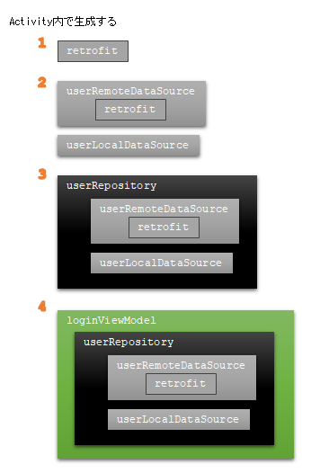
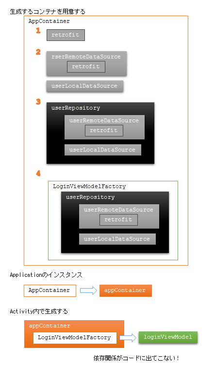
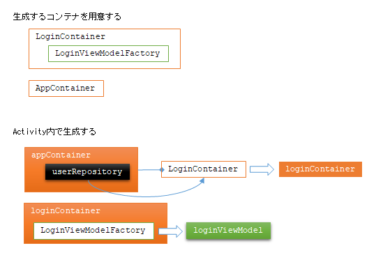
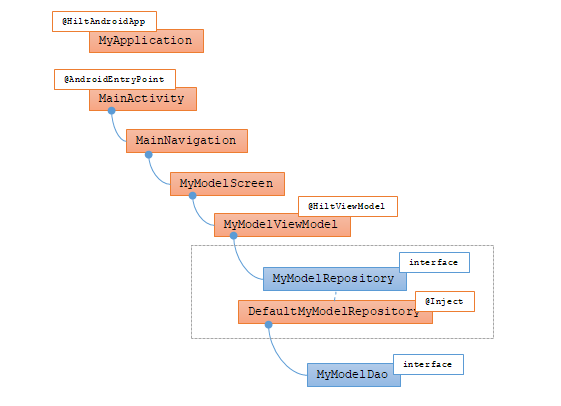

# android: DI をもう少し理解したい

<i>2024/10/24</i>

Dependency Injection、略して DI。  
`android.app.Activity` や `android.app.Application` が持つ `Context` を Data Layer くらいで使いたいけど引き渡すのがかったるい、というだけの話から遠くに来たものだ。。。

* [android: compose で system service はどこでもらうか](20241022-and.md)
* [android: compose で system service はどこでもらうか (2)](20241023-and.md)

私が知りたいことは DI じゃなかったんじゃないかという思いが強いのだが、
Hilt を使うと `Context` を下の方で受け取るのも楽そうだしテンプレートでも使うようになってるので、
あきらめて DI のことをもう少し調べて「DI 使うとパラメータが省略できて楽ですよね」みたいな
外れた意見を言わずに済むようにはしておきたい(後ろ向き)。

## 理解したい

記事を読んだだけで「理解した」などと言うつもりもないので、理解した気分になれるように斜め読みする。  
"ViewModel" と書いた場合は Android の ViewModel(composeだと`androidx.lifecycle.ViewModel`)を継承したクラスだと思っておくれ。

* [なぜDependency Injectionなのか？　～関心の分離と疎結合～](https://zenn.dev/nuits_jp/articles/2024-05-22-why-dependency-injection)
  * 依存する方・される方によって変更したときの影響が違う
    * 依存された方が変更されると、依存している方も変更しないといけないことが多い
    * 依存している方が変更されても、依存されている方には影響がない
  * Androidのアプリアーキテクチャに沿うなら、UI elements --> State holders --> Repositories --> Data sources という参照方向が決まっているので、そこに落とし込むことができれば設計についてはクリアしたことになるのかな
    * そして参照する方向が一方向なので、依存を注入する方向も自然と決まるということかしら
* [Android での依存関係インジェクション  -  Android Developers](https://developer.android.com/training/dependency-injection?hl=ja)
  * メリット
    * コードを再利用できる
    * リファクタリングが容易になる
    * テストが容易になる
* [手動による依存関係挿入  -  Android Developers](https://developer.android.com/training/dependency-injection/manual?hl=ja)
  * ViewModel 以下は UI elements というか Activity がインスタンスを用意する、という例
    * 
  * これを依存関係コンテナを使うよう置き換える
    * Hilt ではなく自分でコンテナクラス`AppContainer`を作っている
    * コンテナクラスではActivityで生成していたインスタンス生成を代わりに行っている
      * ViewModel は入っていないが Activity とセットだからか？
      * Repository 以外は `private` で作っている
    * コンテナクラス自体は 特定の Activity ではなく Application(`android.app`の)で作って公開して他の Activity からも参照できるようにしている
      * `AppContainer`はシングルトンではないが、Androidアプリでは Application のインスタンスは 1つしかない
        * それだったらシングルトンにしとけばいいんじゃないの、と思うがそういうものでもないのか。テストしづらくなる？
        * Application は Activity からなら取得できるけど、それ以外からは取得できないからどうするんだろう。
    * ViewModel のインスタンスがより多くの場所で必要な場合は Factory クラスを作る
      * より多くの場所で必要、とあるが ViewModel がそうなることがあるのだろうか？
      * Factory はインスタンスを生成する `create()` だけを持つ
      * 
    * そして `AppContainer` に Factory クラスを使って ViewModel のインスタンスを作るようにする
      * 
      * Activity が ViewModel を生成するところには依存関係のコードが入っていない
  * このコンテナ方式は Activity に全部書くよりもよいが、機能フローが増えると面倒
    * フロー？ フローコンテナ？
    * `LoginContainer`(たぶんフローコンテナ)
      * `AppContainer`がインスタンスを持って公開する(Repository と同じ扱い)
      * ログインのデータ`LoginUserData` は `LoginContainer` が生成する
      * `AppContainer` が持っていた ViewModel の Factory を `LoginContainer` に移動
    * 
  * 最後の方(`LoginContainer`あたり)はあんまりわからなかった
    * `AppContainer` に詰め込みすぎず、そこからやることごとに別のコンテナを作ろう、ということか？
    * `appContainer.loginContainer` の生成をログインデータ必要になるまで作らないというところがポイントかも？
* [Hilt を使用した依存関係挿入  -  Android Developers](https://developer.android.com/training/dependency-injection/hilt-android?hl=ja)
  * Hilt は Android 用の依存関係注入ライブラリ
    * プロジェクト内のすべての Android クラスにコンテナを提供する
  * セットアップ
    * 私は [architecture-templates - base](https://github.com/android/architecture-templates/tree/base) を参考にした
      * KAPT を使っているが、アルファ版ながら[ksp](https://dagger.dev/dev-guide/ksp.html) でも使えるそうだ([Android Developer](https://developer.android.com/build/migrate-to-ksp?hl=ja))
      * architecture-templates で Room が KSP、Hilt が KAPT だったのでどちらかに寄せたかったのと、最初は KAPT でやっていてビルドがうまく行かなかったのでイライラして変更してみたというところ
        * [commit - Hilt](https://github.com/hirokuma/android-ble-led-control/commit/1f6fcf90b3fea2fbf9a5d776543171af6b37429b)
        * ただ architecture-samples で「[Revert "Migrated Hilt dependencies from Kapt to KSP"](https://github.com/android/architecture-samples/pull/1000)」でKAPTに戻したりしているのでちょっと心配
      * navigation も組み込まないと小文字始まりの `viewModels` などが使えない
        * [commit - navigation](https://github.com/hirokuma/android-ble-led-control/commit/1686c71e1452386fc077e634c7b2ed45bd62aa55)
  * [Android クラスに依存関係を注入する](https://developer.android.com/training/dependency-injection/hilt-android?hl=ja#android-classes)
    * Hilt がサポートしている Androidクラス
      * `Application` (`@HiltAndroidapp`をつける)
      * `ViewModel` (`@HiltViewModel`をつける)
      * `Activity`
      * `Fragment`
      * `View`
      * `Service`
      * `BroadcastReceiver`
    * アノテーション
      * `@AndroidEntryPoint`
        * > プロジェクト内の Android クラスごとに個別の Hilt コンポーネントを生成します。
        * `Activity.onCreate()`がエンドポイントだから`Activity`につける？
        * どこかで Compose を使っている場合は `Activity` は 1つ、というのを読んだ気がする。
        * このアノテーションを付けたクラスに依存するクラスにもアノテーションを付ける必要がある。
          * `Activity` に依存するクラスはあるのか？
      * `@Inject`(javax.inject.Inject)
        * publicプロパティに付けると依存関係を取得できる
        * フィールドインジェクションというらしい
          * クラス自体に`@Inject`を付けておくと各パラメータには書かなくても良いのだろうか([こういうところ](https://github.com/android/architecture-templates/blob/c52e325d74b42379d41723a692f3b0e21fb86755/app/src/main/java/android/template/ui/mymodel/MyModelViewModel.kt#L36))
        * といっても、依存される方のクラス定義に仕掛けが必要
          * `class`定義でクラス名の後ろに`@Inject`を付ける
          * コンストラクタ引数にこのクラスが依存するクラスを書いておく
            * そちらも Hilt で解決できるようにしておく。パラメータ付き ViewModel のようなやり方もできるのか？
      * コンストラクタインジェクションが使えない場合でも対応方法はある([こちら](https://developer.android.com/training/dependency-injection/hilt-android?hl=ja#hilt-modules))
      * 事前に定義済みのアノテーションもある([こちら](https://developer.android.com/training/dependency-injection/hilt-android?hl=ja#predefined-qualifiers))
      * 基本的に、依存関係の注入は既存のインスタンスが使われるのでは無く新しくインスタンスを作るそうだ
        * `@ApplicationContext`なんかは別扱いなのかな？

## 感想

* 実装技術もあるが設計の話でもある。
  * Androidアプリに限っていえば、アプリアーキテクチャに沿っていれば設計を満たすのだと思う。
* Hilt は文章だけだとよくわからなかったので試しながらでよかろう。

architecture-templates の Hilt つながりを図にしてみようとしたがあきらめた。Repository まではある程度あってると思うのだがどうだろう。

