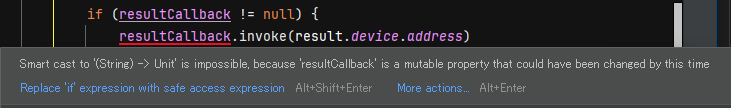

ViewModel を継承したクラスに `@HiltViewModel` を付けて実装しておくと、Activity の方では `hiltViewModel()` でうまいこと ViewModel を生成してくれる。  
では、BLE機器をスキャンする `BleScan`クラスを ViewModel で生成するならどうするとよいか。  
ただし `BleScan` はコンストラクタで `ApplicationContext` をパラメータとして受け取るものとする。

見よう見まねだ。

* [@Binds を使用してインターフェース インスタンスを注入する](https://developer.android.com/training/dependency-injection/hilt-android?hl=ja#inject-interfaces)
  * `@Binds` と `@Provides` が載っていたが、`@Provides` は自分で制御できないモジュールの例になっていたので `@Binds` にした
  * まず、`BleScan` クラスを `DefaultBleScan` という名前にしておく
    * 名前はなんでもよい。ここではサフィックスに`Impl`を付けているが、archtecture-templates だとプレフィクスに `Default` と付けていたのでそちらにあわせた。
  * `BleScan` インターフェースを作り、`DefaultBleScan` に継承させる
  * `@Module`と`@InstallIn()`を付けた`abstract class BleScanModule`を作る
    * `@Binds` の付いた `abstract fun bindBleScan(DefaultBleScan): BleScan`を作る

あとは ViewModel の方で `Context` を取る必要がなくなったので削除したくらいか。

* [commit - BleScan の Hilt対応](https://github.com/hirokuma/android-ble-led-control/commit/4300352d77ba6cba1fe2f9cc54d5f160a486aae9)

これだけの記述で、動く。  
不思議だ。。。  
Android Studio では↑で作ったクラスなどが未使用っぽく見えてしまうが、直接 Hilt/Dagger が参照しているわけではないので仕方ない。  

* [commit - BleScan の warning消し](https://github.com/hirokuma/android-ble-led-control/commit/4861ef92809da86b1c651505b3032539af9eed15)

ぜいたくを言えば、`BleScan` のファイルの中には BLE操作だけのコードだけにして、Hilt に関係するのは別のファイルにしたいという気持ちがある。  
そういう場合は、自分で所有していないクラスについても対応できる `@Provides`を使うとよさそうだ。

* [@Provides を使用してインスタンスを注入する](https://developer.android.com/training/dependency-injection/hilt-android?hl=ja#inject-provides)

`@Binds` がコンストラクタを紐付けるのに対して `@Provides` は生成する処理を紐付けるというところか。  
`@ApplicationContext` などもこちらの書けるので、本体側は普通の実装だけ書けば良い。  
コンストラクタを直接ではなく、一度生成するメソッドを呼び出すので `@Provides` の方がちょっとだけ効率が下がるのかな？  
下がるという程でもない気はする。そんなにバンバン生成するわけでもないだろうし。

* [commit - @Provides](https://github.com/hirokuma/android-ble-led-control/commit/e96c8e49c5e20111a92dfb249596fae9d61ce28a)

[archtecture-templates の di.DatabaseModule](https://github.com/android/architecture-templates/blob/c52e325d74b42379d41723a692f3b0e21fb86755/app/src/main/java/android/template/data/local/di/DatabaseModule.kt) もそうやっていた。  
こちらは複数メソッドがあるので、一つ上の `local.database` パッケージにあるクラスを 1箇所で対応するという書き方もできるのだろう。

## おまけ

### nullable な関数型の呼び出し

BLE機器をスキャンするとコールバックで機器情報が返ってくる。  
スキャン中は見つかり次第返ってくる(同じ機器が返ってくるのは RSSI が変わったからかもしれんが)ので、今回の `BleScan` でもスキャンした結果は上側に返そうと思う。  
そのとき、スキャン開始でコールバック関数を付けて呼び出してもらうとする。  
コールバック関数を引数に取る関数を [higher-order function](https://kotlinlang.org/docs/lambdas.html#higher-order-functions) と呼ぶ。  
関数型を戻す関数のことも higher-order function と呼ぶようだ。

OS が結果をコールバックするのはスキャン開始した関数の中ではなかったので、付けてもらったコールバック関数は `BleScan` で保存しておく。  

```kotlin
private var resultCallback: ((String) -> Unit)? = null
```

これを実行しようと素直に書くと、これはダメだった。

```kotlin
if (resultCallback != null) {
  resultCallback(result)
}
```

関数型の変数を呼び出すのには[invokeを使う](https://kotlinlang.org/docs/lambdas.html#invoking-a-function-type-instance)ものらしい。  
が、単に`f(x)`でもよいとも書いてある。  
`invoke` は関数ではなく演算子(operator function)らしい([11.1.3 Callables and invoke convention](https://kotlinlang.org/spec/overload-resolution.html#callables-and-invoke-convention))。  
いろいろ書いてあるが深追いしない。。。

```kotlin
resultCallback?.invoke(result)
```

Android Studio では修正候補がもう1つ出てきて、こちらが優先？だった。  
[Execute if not null](https://kotlinlang.org/docs/idioms.html#execute-if-not-null) というものらしい。

```kotlin
resultCallback?.let { it(result) }
```

どちらも `if` での null チェックは不要なようだ。  
でも、`if` 文で書いても大したことないと思う。  
わざわざ指摘するということはなんか理由があるのだろう。
コンテキストが違うので `if` 文でチェックしたときは null じゃなかったけど呼び出そうとしたら null になる可能性があるというところか。


