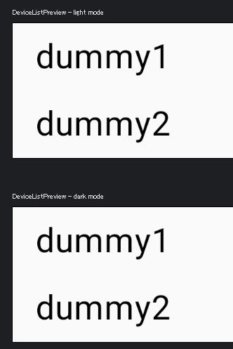
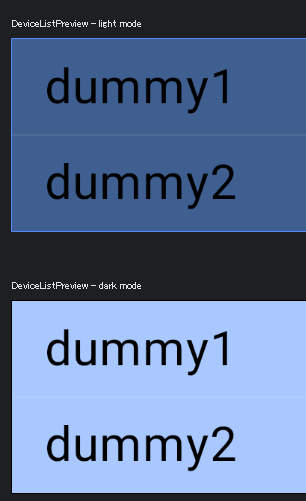
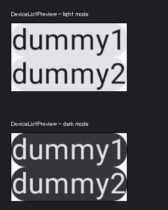
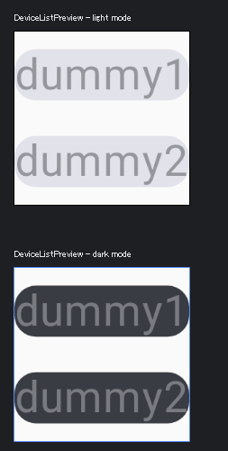
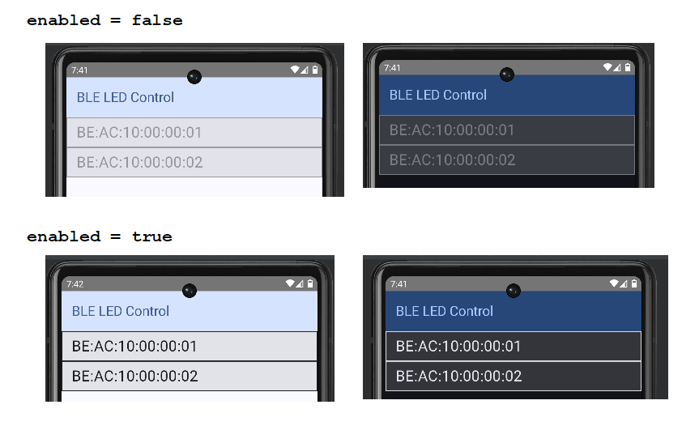
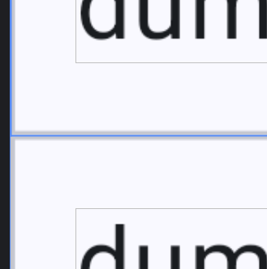
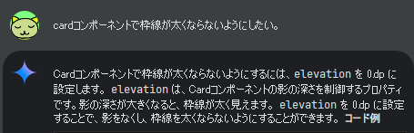

# android: リストで無効なアイテムの色

<i>2024/10/25</i>

Android で Compose を使っている。  
マテリアルデザイン 3、M3 でダイナミックカラーは使わないことにした。

テーマのカスタマイズはここなどで作ることができる。

* [Material Theme Builder](https://material-foundation.github.io/material-theme-builder/)

`on` が付かなければ背景色、付いていれば前景色。  
primary, secondary, tertiary, error が主な色。  
ものすごく大ざっぱに分類するとそういう感じだろう。

さて、私は BLE機器をスキャンした一覧をリスト表示しようとしている。  
将来的にはリストからタップした機器に対して Characteristic の操作をしたいが、それは後回しだ。  
まずはリストである。

## リストの配色

何も指定せず、`LazyColumn` の中に `Row { Text(アイテム) }` を指定するだけだとテーマが Light でも Dark でも同じ見た目になった。



既に誤算が生じている。  
自動的にデフォルトの色が反映される予定だったのだ。

`Row(Modifier.background(primary))` として `Row`にだけ背景色を付けてみる。



違う。。。  
文字色は指定していないから仕方ないとして、リストの各アイテムは primary にするようなものではない。  
`Row` ではなく [Card](https://developer.android.com/develop/ui/compose/components/card?hl=ja) を使っている例がしばしば出てくるのだが、

```kotlin
@Composable
fun Card(
    modifier: Modifier = Modifier,
    shape: Shape = CardDefaults.shape,
    colors: CardColors = CardDefaults.cardColors(),
    elevation: CardElevation = CardDefaults.cardElevation(),
    border: BorderStroke? = null,
    content: @Composable ColumnScope.() -> Unit
): Unit
```

[CardDefaults.cardColors()](https://developer.android.com/reference/kotlin/androidx/compose/material3/CardDefaults#cardColors(androidx.compose.ui.graphics.Color,androidx.compose.ui.graphics.Color,androidx.compose.ui.graphics.Color,androidx.compose.ui.graphics.Color)) はこうなっている。

```kotlin
@Composable
fun cardColors(
    containerColor: Color = Color.Unspecified,
    contentColor: Color = contentColorFor(containerColor),
    disabledContainerColor: Color = Color.Unspecified,
    disabledContentColor: Color = contentColor.copy(DisabledAlpha)
): CardColors
```

`Unspecified`ではよくわからん。  

まず、`Row`をやめて`Card`にしてみる。色の指定などはなし。



`onClick`をパラメータにすると`enabled`が使えるので `false`を指定できる。  
そうするとそれっぽくグレーになった。



ボタンのような角丸が気になるが、これは Preview の背景色が白いためだ。  
今回は色の設定が使えるかどうか見たかっただけなので `Card` のことは忘れる。

BLEのスキャン中は押せないようにしたいので `scanning: Boolean` で分けるようにした。

```kotlin
val contentColor: Color
val backgroundColor: Color
if (scanning) {
    contentColor = colors.disabledContentColor
    backgroundColor = colors.disabledContainerColor
} else {
    contentColor = colors.contentColor
    backgroundColor = colors.containerColor
}
Row(
    modifier = Modifier
        .height(48.dp)
        .background(color = backgroundColor)
        .border(width = 1.dp, color = contentColor)
        .clickable { Log.d("row", "click: $item") }
) {
    Spacer(Modifier.width(16.dp))
    Text(
        text = item,
        color = contentColor,
        modifier = Modifier
            .fillMaxWidth()
            .align(alignment = Alignment.CenterVertically),
        fontSize = 24.sp,
    )
}
```



やはり、`Card` だと `enabled` だけでできるのに、と思ってしまう。  
形状さえ四角になれば見た目の問題はなさそうだ。

```kotlin
Card(
    onClick = { Log.d("row", "click: $item") },
    enabled = !scanning,
    shape = RectangleShape,
    modifier = Modifier.height(64.dp)
) {
    Box(Modifier.fillMaxSize()) {
        Text(
            text = item,
            modifier = Modifier
                .padding(start = 16.dp)
                .align(alignment = Alignment.CenterStart),
            fontSize = 24.sp,
        )
    }
}
```


枠線は付けられるのだが、四角の内側に付いているのか 2アイテムの境界線は太くなっているように見える。



最近のアプリはリストに境界線があるんだっけ？と nRF Connect アプリを見てみたが、うっすら線が見える。  
見比べたが、私の`Card`は端っこではない枠線が太くなっている。nRF Connect はそうなっていない。



M3 では `OutlinedCard` だとデフォルトで枠線が表示されて制御できるということなど、いろいろ書かれている。  
とりあえず、枠線の色指定に悩みたくないので `OutlinedCard` に変更する。  
`elevation = CardDefaults.cardElevation()`を追加して全部`0.dp`にしたがダメだった。

枠線の拡大画像を見ると、それぞれの`Card`に枠が付いているだけなので個別の枠線でがんばってもダメだと思う。  
理屈はよくわからないが、枠線を非表示にして水平区切りである`HorizontalDivider`を使うと、太さは同じに見えるようになったと思う。

```kotlin
LazyColumn(
    modifier = modifier
) {
    items(addressList) { item ->
        OutlinedCard(
            onClick = { Log.d("row", "click: $item") },
            enabled = !scanning,
            border = BorderStroke(0.dp, color = Color.Transparent),
            shape = RectangleShape,
            modifier = Modifier.height(64.dp)
        ) {
            Box(Modifier.fillMaxSize()) {
                Text(
                    text = item,
                    modifier = Modifier
                        .padding(start = 16.dp)
                        .align(alignment = Alignment.CenterStart),
                    fontSize = 24.sp,
                )
            }
        }
        HorizontalDivider()
    }
}
```

`HorizontalDivider`はどこにでも横線を引くのかと思ったが、どうにもそうではないらしい。  
`Box`と同じ並びに置いても表示されなかったし、`Text`と同じ並びにすると一番下の線が表示されなかったし。  
一番下に区切るためのアイテムがいるのかと思ったが、それなら今のように`OutlinedCard`と同じ並びに置いていても表示されないはずだしな。

* [commit - ここまで](https://github.com/hirokuma/android-ble-led-control/commit/5341e464508007f741ae3bfde2d75972a9ff98dc)

まだ Repository を作っていないとかはあるが、そろそろ Android シリーズも終わりにしておかないと ncs の使い方を忘れてしまいそうだ(かなり忘れている)。
