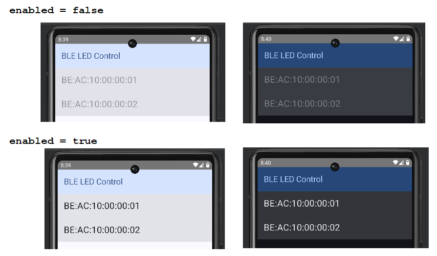

# android: エミュレータでstartScanの結果が返ってこない

<i>2024/10/28</i>

特に解決も何もないが、メモとして残しておく。

----

Android の記事を書く際、動作確認は Android Studio のエミュレータか実機を使っている。

* Pixel7a (Android 15)
* Pixel6 Pro (Android 14)
* moto g30 (Android 12)
* エミュレータ (Android 11 (API 30))

昨日気がついたのだが、エミュレータで API 33 や API 34 を使うと `bluetoothLeScanner.startScan()` のコールバックが何も戻ってこないのだ。  
API 30 はどうだったかというと、こういう感じのアドレスが 2つコールバックされている。



apk ファイルの [nRF Connect 4.28.1](https://github.com/NordicSemiconductor/Android-nRF-Connect/releases/tag/version_4.28.1) があるのでインストールしてみたが、そちらも同様だったのでエミューレータか環境のせいだろう。

次バージョンの Android Studio Ladybug もあるようだが、公式ダウンロードでデフォルトになってからで良いかな。

```text
Android Studio Koala Feature Drop | 2024.1.2
Build #AI-241.18034.62.2412.12266719, built on August 23, 2024
Runtime version: 17.0.11+0--11852314 amd64
VM: OpenJDK 64-Bit Server VM by JetBrains s.r.o.
Windows 11.0
GC: G1 Young Generation, G1 Old Generation
Memory: 3072M
Cores: 16
Registry:
  ide.experimental.ui=true
Non-Bundled Plugins:
  idea.plugin.protoeditor (241.15989.49)
```
