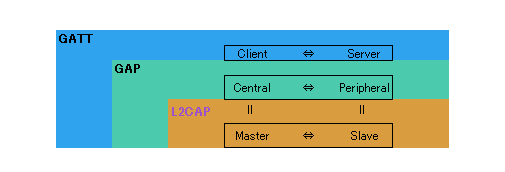
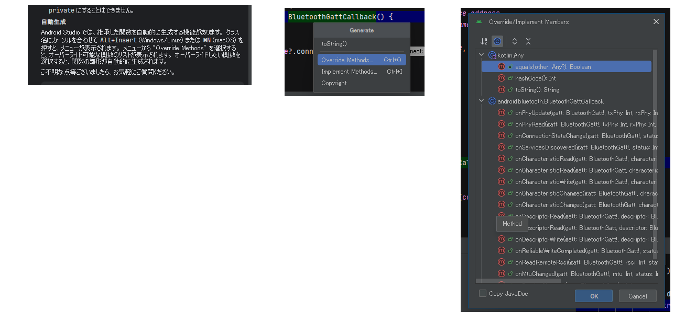
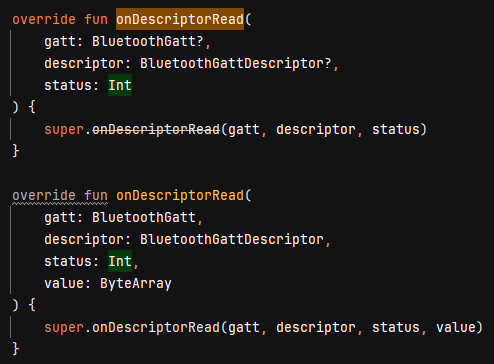

# android: BLE 操作

<i>2024/10/29</i>

Central として BLE機器を操作するには、Peripheral の Advertising を見つけて接続する必要がある。

## スキャン

* [BLE デバイスを探す  -  Connectivity  -  Android Developers](https://developer.android.com/develop/connectivity/bluetooth/ble/find-ble-devices?hl=ja)

サンプルコードが載っていて、だいたいそのまま動かすことができる。  
`startScan()` して `SCAN_PERIOD` 経過したら停止するのだが Kotlin のコルーチンではなく `handler.postDelayed()` が使われていた。  
ViewModel だと [Android での Kotlin コルーチン](https://developer.android.com/kotlin/coroutines?hl=ja) にいろいろ書いてあって `viewModelScope.launch{}` などでうまいことできそうだが、Data Layer 以下はどうか。  

[APIを公開する](https://developer.android.com/topic/architecture/data-layer?hl=ja#expose-apis)では、`suspend` 関数にしておく(ViewModel で `launch` するのだろう)か、時間経過でデータが変更されるなら `Flow` を使うよう書かれている。  
私は `startScan()`をそのまま使って、停止時には外側から `stopScan()` を呼ぶようにしているが、
これを「一定時間かかるがその間にスキャンした結果を返すメソッド」と考え直せば `suspend` 関数にすることができる。

あるいはこちらに従って `Flow` を使うタイプにするかだ。

* [コールバックベースの API を Flow に変換する](https://developer.android.com/kotlin/flow?hl=ja#callback)

悩ましいが、BLE機器の場合はスキャンに多少時間が必要なのと、長時間スキャンさせたい場合もあるので定期的に結果を戻してほしいと考えると `Flow` にするのが良かろう。  
今は Repository もコールバックで返すようにしているので ViewModel がコールバックで受けとった後に UiState を更新している。

`Flow` での書き換えはそのうちやるかもしれないが、今は止めておく。

スキャンして検出したデバイスはコールバックで通知される。  
私の実装だと[ここ](https://github.com/hirokuma/android-ble-led-control/blob/39a0d053ebef6d6c5453bfab27a2e3b71b145ec3/app/src/main/java/work/hirokuma/bleledcontrol/data/ble/BleScan.kt#L72-L92)である。
BLE 機器は状況がしばしば変わるので、同じデバイスが何度も通知されることになる。  
そこをどうするかはやりたいこと次第だろう。  
サンプルコードでは 10秒スキャンして終わらせていたが、接続するためのスキャンであればそのくらいじゃないの、という感じだろうか。  
スキャンし直すとき、もしスキャン済みのデバイスのリストがあるなら当てにならないのでクリアした方がよいと思う。

検出したデバイスは [ScanResult](https://developer.android.com/reference/android/bluetooth/le/ScanResult) にデータが載っている。  
どれがいるかは人それぞれだろうが、今回は RSSI(`getRssi()`)、アドレス(`getDevice().getAddress()`)、名前(`getScanRecord().getDeviceName()`) を持つようにした([コード](https://github.com/hirokuma/android-ble-led-control/blob/39a0d053ebef6d6c5453bfab27a2e3b71b145ec3/app/src/main/java/work/hirokuma/bleledcontrol/data/ble/BleScan.kt#L83-L88))。  
"名前"は [ScanRecord](https://developer.android.com/reference/android/bluetooth/le/ScanRecord) に入っているが、他にも ManufacturerSpecificData など Advertising しているデータが載っているようなのでまるごと保持するようにした。  
が、接続するのに[BluetoothDevice](https://developer.android.com/reference/android/bluetooth/BluetoothDevice#connectGatt(android.content.Context,%20boolean,%20android.bluetooth.BluetoothGattCallback))の方が必要になったため [コードを修正](https://github.com/hirokuma/android-ble-led-control/blob/043388fb5e53b2171a682447ba23aa025c8db376/app/src/main/java/work/hirokuma/bleledcontrol/data/ble/BleScan.kt#L73-L79) して保持するようにした。  

`startScan()`はパラメータを取る呼び出し方もあるので場合によって使うとよいだろう。

## 接続

* [GATT サーバーへの接続  -  Connectivity  -  Android Developers](https://developer.android.com/develop/connectivity/bluetooth/ble/connect-gatt-server?hl=ja)
  * デバイスのGATTサーバーへの接続
  * バインドされたサービスの設定
  * BluetoothAdapterの設定
  * デバイスに接続
  * GATTコールバックの宣言
  * GATTサービスへの接続

デバイスから情報を取り出したりデバイスに制御要求したりするので Peripheral の方がサーバーになる。



[BluetoothDevice.connectGatt()](https://developer.android.com/reference/android/bluetooth/BluetoothDevice#connectGatt(android.content.Context,%20boolean,%20android.bluetooth.BluetoothGattCallback)) で接続するのだが引数の [BluetoothGattCallback](https://developer.android.com/reference/android/bluetooth/BluetoothGattCallback) が面倒そうだ。  
[ScanCallback](https://developer.android.com/reference/android/bluetooth/le/ScanCallback#public-methods_1) は 3つしかないがこちらは数が多い。  
数が多い・・・。  
Geminiさんに相談したら、クラス名にカーソルを置いて Alt + Insert でできるらしい！



同じメソッドが 2つある場合、API33 から追加されてそれまでの API が deprecated になっている。
追加されたのは ATT の読み込みが関係する API だけかな。

* `onCharacteristicChanged`
* `onCharacteristicRead`
* `onDescriptorRead`

```java
// added in API18
// deprecated in API33
public void onDescriptorRead (BluetoothGatt gatt, 
                BluetoothGattDescriptor descriptor, 
                int status)
```

```java
// added in API33
public void onDescriptorRead (BluetoothGatt gatt, 
                BluetoothGattDescriptor descriptor, 
                int status, 
                byte[] value)
```

コールバックになる場合、API 33 だと deprecated になった方は呼ばれないのだろうか？  
Android Studio だとこう見えていて、両方実装がある分には問題はないようだ。



ということは、API 33 未満と API 33 以上で呼ばれるコールバック関数が違う？  
あるいは API 33 未満の関数だけ実装しておけばよいのか？  
ATT と通信できるところまでやらないと確認できないので後回しだ。

Android Developer のページを見ているが、[バインドされたサービスを設定する](https://developer.android.com/develop/connectivity/bluetooth/ble/connect-gatt-server?hl=ja#setup-bound-service) 以降は Service(Androidの方)だの`Binder`だのなんだの出てくる。  
アプリがバックグラウンドに回って終わってしまうことを考えると Service にした方がよいとは思うが、Service でないとできないことというのもないと思うのでスルーしよう。

## Characteristic へのアクセス

コールバック `onConnectionStateChange()` が `BluetoothProfile.STATE_CONNECTED` で呼び出されたら接続完了になる。

* [BLE データの転送  -  Connectivity  -  Android Developers](https://developer.android.com/develop/connectivity/bluetooth/ble/transfer-ble-data?hl=ja)

以降は`connectGatt()`の戻り値を使う。

### サービス検出

`BluetoothGatt.discoverServices()`でサービスの検出を開始する。  
完了は `onServicesDiscovered()`が呼び出される。
どういうときに失敗するのか分からないが`status`のチェックもした方が無難か？ 
あるいは `BluetoothGatt.getServices()` の戻り値がおかしくなるのか。  
コールバックの引数が`BluetoothGatt?`なので null チェックはするだろうし、そこで`status`を一緒に見ておけば良いか。

サービスの検出が終わったので、Service と Characteristic の UUID をログに出すようにしてみた。

* [commit - characteristic UUID](https://github.com/hirokuma/android-ble-led-control/blob/1c3b1ee34a3a8464e845aafde1f6dcdf0802455a/app/src/main/java/work/hirokuma/bleledcontrol/data/ble/BleScan.kt#L125-L130)

[LBS(Nordic LED Button service)](https://docs.nordicsemi.com/bundle/ncs-latest/page/nrf/libraries/bluetooth_services/services/lbs.html)を載せた Peripheral だとこんな感じだ。

```log
onServicesDiscovered: status=0
service: 00001801-0000-1000-8000-00805f9b34fb
  characteristic: 00002a05-0000-1000-8000-00805f9b34fb
  characteristic: 00002b29-0000-1000-8000-00805f9b34fb
  characteristic: 00002b2a-0000-1000-8000-00805f9b34fb
service: 00001800-0000-1000-8000-00805f9b34fb
  characteristic: 00002a00-0000-1000-8000-00805f9b34fb
  characteristic: 00002a01-0000-1000-8000-00805f9b34fb
  characteristic: 00002a04-0000-1000-8000-00805f9b34fb
service: 00001523-1212-efde-1523-785feabcd123
  characteristic: 00001524-1212-efde-1523-785feabcd123
  characteristic: 00001525-1212-efde-1523-785feabcd123
```

今回は LBS にアクセスするアプリと決めているので、`BluetoothGatt.getService(UUID)`が !null で、
そのインスタンスに `BluetoothGattService.getCharacteristic(UUID)` するというやり方で良い。  
UUID は[NordicのBlinkyアプリ](https://github.com/NordicSemiconductor/Android-nRF-Blinky/blob/506cabe8884364cd4302cc490664ec020c42728b/blinky/spec/src/main/java/no/nordicsemi/android/blinky/spec/BlinkySpec.kt#L10)からもらってこよう。

Android 12(API 31) で実行した場合は deprecated の `onCharacteristicRead`が呼び出された。  
Android 15(API 35) で実行した場合は deprecated もそうでない方も呼び出された。  
deprecated な方では `BluetoothGattCharacteristic.getValue()` で値を取得するが、API 33 以降はコールバック関数の引数で `value` をもらっているのでそのまま使うとよい。  
とにかく、API 33 より前に対応するなら deprecated の方だけ実装するのがよいのか。

コールバックについては Read 関係だけだったが、書込みの方も API が追加されていた。  
こちらは OS バージョンで切り分けるしかないと思う。  
[こういう感じ](https://github.com/hirokuma/android-ble-led-control/blob/585b4e910d2d394704d0785cb3b8e2f09cf49868/app/src/main/java/work/hirokuma/bleledcontrol/data/ble/BleScan.kt#L246-L253)か。

* [commit - read button state and blink LED](https://github.com/hirokuma/android-ble-led-control/tree/585b4e910d2d394704d0785cb3b8e2f09cf49868)
