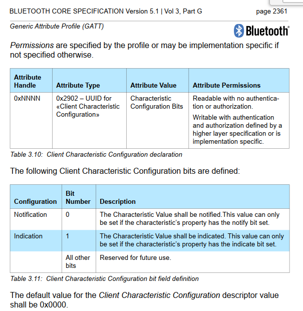
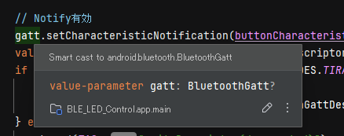

# android: BLE 操作 (2)

<i>2024/10/30</i>

[昨日](20241029-and.md)の続き。

## Notifyの有効化

Central から Peripheral にデータを問い合わせるのではなく、Peripheral からデータを通知してくれるしくみが Notify や Indicate である。  
通知してくれるといっても勝手にやってくれるわけではない。

* [GATT 通知を受け取る](https://developer.android.com/develop/connectivity/bluetooth/ble/transfer-ble-data?hl=ja#notification)

説明はあるが、どうにも必要な部分がよくわからない。  

こちらの方が分かりよかった。  
なんといっても実コードがあるのがありがたい。

* [The Ultimate Guide to Android Bluetooth Low Energy - Punch Through](https://punchthrough.com/android-ble-guide/)

CCCD の Attribute Type は `0x2902` だけど、実際にアクセスするときは Base UUID での 128bit UUID [00002902-0000-1000-8000-00805F9B34FB](https://github.com/PunchThrough/ble-starter-android/blob/31c85936d55d77b83bc40bb58f450d50cebedb70/app/src/main/java/com/punchthrough/blestarterappandroid/ble/BleExtensions.kt#L30) になるんだ、などということがわかる。

いままで "notify" と "indicate" という機能名だと思っていたが、Core v5.1, Vol.3, Part G, "4.10 Characteristic Value Notification" や "4.11 Characteristic Value Indications" という名前からすると、通知機能は "notification" と "indication" という呼び名で良いのかな？  
("Notification" なのに "Indications" だったり表現が統一されていないところはしばしばある。)  

### 同時にアクセスしないようにする

notification を有効にする前、Button の状態を read するようにしていた。  
なので read したあとに notification を有効にするコードを書いていたのだが、そうすると notification が有効にならなかった。  
read をコメントアウトすると動作したので、そういうことだろう。

* [code - enable notification](https://github.com/hirokuma/android-ble-led-control/blob/fa6f240b53d6808d6997bf5587864e6de85b7e44/app/src/main/java/work/hirokuma/bleledcontrol/data/ble/LbsControl.kt#L148-L161)

### notification を UI に渡す

ボタン押下による Notification はコールバックで受け取る。  
なので [コールバックベースの API を Flow に変換する](https://developer.android.com/kotlin/flow?hl=ja#callback) で Flow に変換することを考えていた。  
しかし、これはメソッドの中にコールバック関数がまるまる入ることになるので `BluetoothGattCallback` の一部だけを扱うには向かないように思う。

ViewModel の値を UI が勝手に更新するのは `StateFlow` を使っているので、ここでも使うことにした。

* [commit - button state](https://github.com/hirokuma/android-ble-led-control/commit/9e4a769ac9ccc498c5a3c74c16dbaad831350aeb)

結構時間がかかった。  
というのも、`MutableStateFlow()` の引数に使用できるのがオブジェクトのコンストラクタのみだと思っていたからだ。  
`Boolean()` は書けないし、かといって専用の`data class`を作っても上位層に引き渡すのが面倒になるだけだし。  
やけになって`BooleanArray`で1個分のオブジェクトを作って動かしたのだった。  
そのあとで[StateFlowの説明](https://kotlinlang.org/api/kotlinx.coroutines/kotlinx-coroutines-core/kotlinx.coroutines.flow/-state-flow/)を見てプリミティブな値でも使えることが分かったので書き直したのだった。

しかし Data sources が自前のインスタンスを返す場合はどうするのだろうね？  
Repository まではそのまま渡してよいと思うが、そこから ViewModel に渡すときに Data source しか持っていない型だと ViewModel が Data source に依存してしまうから Repository で自前で同じような型を作って値を移す？  
かといって ViewModel でデータ型を作っても、それはそれで Data source が ViewModel に依存したことになるだろうし。  
Data Layer が持つ型、という扱いにしてしまえば問題ないのかしら。

## おわりに

長かった Android BLE アプリは今回で終わりにする。  
そのうちまとめたいとは思うが、私としては[PunchThroughさんの記事](https://punchthrough.com/android-ble-guide/)が新しくてよいと思う。  
PunchThrough さんというと iOSアプリというイメージがあったが、すごく古い印象なのだろう。

次はいつになるかわからないが、ncs で作った自作の BLEサービスを動かしたいものだ。

## おまけ

### `?.let{}` でのアクセス

BLE のサンプルコードでしばしば出てくる、nullable なインスタンスにアクセスするときの `?.let{}`。  
それ以外にもいろいろやり方はある。

* [Null safety - Kotlin Documentation](https://kotlinlang.org/docs/null-safety.html#nullable-types-and-non-nullable-types)

どの方法がよいだの、これは止めておきましょうだのという記載はなさそうだ。  
ただ `if`文でチェックしてから使用した場合、smart cast しているという表示が出てくる。

警告というわけでもなく、単にこれ以降は `?` が付かない変数にキャストしたのと同じ扱いになりますよという通知なのだろう。
