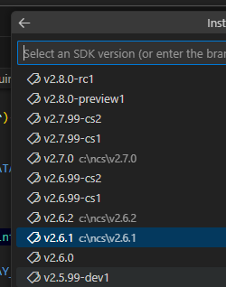

1ヶ月ぶりに nRF Connect SDK の世界に戻ってきた。  
まずは開発環境の確認からである。

* [nRF Connect SDK v2.6.2 Release Notes](https://docs.nordicsemi.com/bundle/ncs-latest/page/nrf/releases_and_maturity/releases/release-notes-2.6.2.html)
  * Wi-Fi スタックの更新([詳細](https://docs.nordicsemi.com/bundle/ncs-latest/page/nrf/releases_and_maturity/releases/release-notes-2.6.2.html#ncs-release-notes-262-changelog))

BLE だけ扱うのであればアップデートする必要はない。  
Toolchain も v2.6.2 として用意されているがハッシュ値が v2.6.1 と同じなので追加でインストールになるものは無い。

```json
    "toolchains": [
      {
        "identifier": {
          "bundle_id": "cf2149caf2"
        },
        "ncs_versions": [
          "v2.6.1",
          "v2.6.2"
        ]
      }
```

----

今日時点で RC版ではないリリースノートが出ているのは v2.6.2 と v2.7.0。  
マイナーバージョンが上がる v2.7系は変更点が多いため、まだ私は v2.6.1 を使っていた。

異なるバージョンの SDK をインストールすると、標準ではない開発ボードの設定を移し替えないといけないことがある。  
アプリが使用するボード定義ファイルは別ディレクトリに置いておくことができるのだが、MCUboot で使用する定義ファイルはコピーしないといけなかった。  
このリポジトリでは `ssci086585_nrf5340.conf` がそのファイルになる。

* [commit - raytac-base](https://github.com/hirokuma/ncs-custom-board/tree/1bb1131f67296a47e47762ee81978598632d9dfd)

SDK のバージョンが変わるとこういったディレクトリ構造が変わることがある。  
これは各バージョンの `<ncs>/zephyr/boards/` だが、v2.6系と v2.7系で全然違うことが分かるだろう。

* [v2.6.1/sdk-zephyr/boards/](https://github.com/nrfconnect/sdk-zephyr/tree/v3.5.99-ncs1-1/boards)
* [v2.6.2/sdk-zephyr/boards/](https://github.com/nrfconnect/sdk-zephyr/tree/4040aa0bf581206dd68beb0758b39096342ee7e0/boards)
* [v2.7.0/sdk-zephyr/boards/](https://github.com/nrfconnect/sdk-zephyr/tree/100befc70c74f7ec83dd8ac3171ee18eeddb4dbd/boards)

そういうこともあり、あまりバージョンを上げるのには積極的ではないのだ。

インストール可能な nRF Connect SDK の一覧に v2.8 も見えてきている。  
といっても v2.7.0 のリリースが 2024年7月だったと思うので、まだ先だろう。


