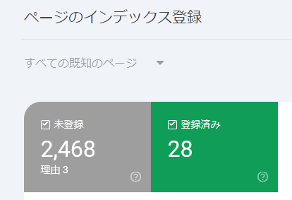
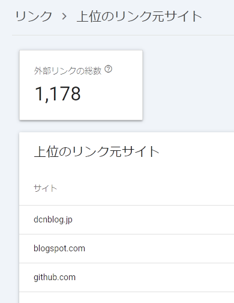

# web: GitHub Pagesの管理(2024/11月)

_2024/11/05_

月初なのでこのページの管理をする。

* 過去の管理
  * [2024/08/28](https://blog.hirokuma.work/2024/08/20240828-ghp.html)
  * [2024/04/06](https://blog.hirokuma.work/2024/04/20240406-githubio.html)

## Google Search Console

認識されていなかった。。。  
以前設定したときにサイト確認は済ませていたのだが、いろいろいじっているうちに消してしまったのだろうか。

* [commit](https://github.com/hirokuma/hirokuma.github.io/commit/e05945c54abfd4f274f2cea8f1d39e7bca9c75d9)

GitHub Pages だと public リポジトリに置くのでこういう設定が全部見えるのだが大丈夫だろうか？  
まあ、Google Search Console が読めるということは他の人も読めるということなのでよいのか。

インデックス登録数はあいかわらずひどいものだ。  
登録済み件数は 10月29日まで 80件あったのに 30日には 28件まで減ってしまった。  
"blog.hirokuma.work" というドメインの宛先を Google Blogger から GitHub Pages に割り当て直した影響で、
以前登録済みだったページが 404 になって減ったのと、GitHub Pages の方は登録が進んでいないのとでこうなっているのだろうか。



ブログの引っ越しで中身を移転しないときはドメインを変更してはいけないというだけのことなのに、
今さらどうにもできない。  
手痛い教訓だ。

### 古いサイトへのリダイレクト

対処するなら、過去サイトと同じ URL は重複しなさそうなので過去ページへ飛ばすためのページを作るくらいだろう。  
URL のリストを作ることができればスクリプトで自動生成できるとは思うが、その URLのリストを得るというところがよくわからない。  

ChatGPT さんに聞いてみると、sitemap.xml があれば取れるそうだ。  
GitHub Docs の [外部リダイレクトを構成する](https://docs.github.com/ja/contributing/writing-for-github-docs/configuring-redirects#configuring-external-redirects) は GitHub Pages ではダメそうだった。
GitHub Pages には[外部へリダイレクトするプラグイン](https://github.com/jekyll/jekyll-redirect-from)がある(その代わり`.htaccess`のようなものはないらしい)。  
プラグインの名前は "redirect-from" だが機能として [Redirect To](https://github.com/jekyll/jekyll-redirect-from?tab=readme-ov-file#redirect-to) もある。  
それはわかるのだが、書き方が分からない。。。  
面倒になったので HTML でリダイレクトする書き方も ChatGPT さんに聞いたら教えてくれたので、もうそれでよいや。

```js
const fs = require('fs');
const prefix = 'https://hiro99ma.blogspot.com/';
const fileNames = ['sitemap1.xml', 'sitemap2.xml', 'sitemap3.xml', 'sitemap4.xml'];
for (const fileName of fileNames) {
  const siteMap = fs.readFileSync(fileName, 'utf-8');
  const reg = /https:.*html/g;
  const result = siteMap.match(reg);

  for (const url of result) {
    const urlName = url.replace(prefix, '');
    const path = urlName.split('/'); // 0:year, 1:month, 2:file name
    try {
        fs.mkdirSync(`${path[0]}/${path[1]}`, { recursive: true });
    } catch (e) {
        // ignore
    }

    const outFile = fs.createWriteStream(urlName);
    outFile.write(
`<!DOCTYPE html>
<html lang="ja">
<head>
  <meta charset="UTF-8">
  <meta http-equiv="refresh" content="0; url=${url}">
  <title>Redirecting to old site...</title>
</head>
<body>
  <p>リダイレクト中です。自動的に移動しない場合は、<a href="${url}">こちら</a>をクリックしてください。</p>
</body>
</html>
`
    );
    outFile.close();
  }
}
```

* テスト
  * [https://hiro99ma.blogspot.com/2014/08/nfchcendef.html](https://hiro99ma.blogspot.com/2014/08/nfchcendef.html) - オリジナル
  * [https://blog.hirokuma.work/2014/08/nfchcendef.html](https://blog.hirokuma.work/2014/08/nfchcendef.html) - 現在のサイトから古いページに飛ぶ

よさそうなので、これでしばらく様子を見よう。  
さっさとやっておけば良かった。。。

### sitemap.xml

GitHub Pages でも sitemap.xml は作成され更新されている。  
なのだが、Console では sitemap.xml が読み込めていない。

`robots.txt`に設定はあるので問題はないだろう。  
リポジトリにはないので自動生成されているようだ。

```txt
Sitemap: https://blog.hirokuma.work/sitemap.xml
```

反映に時間がかかるという情報も見受けられたが、さすがに 3ヶ月はかからないだろう。  
フォーマットが違うのであればそういうエラーになるだろうし、よくわからない。  
同じ症状の人がいるので理由はありそうなのだが。

[このissue](https://github.com/jekyll/jekyll-sitemap/issues/302)が近いのか。

* `_config.yml` に `url` がない
  * ない場合、作成された `sitemap.xml` に URL が付いていない
* Google Search Console でドメインプロパティではなく URLプロパティにしてみる
* sitemap.xml のインデックス登録
  * issueの人は登録されていたようだが、私は登録されていなかった
  * インデックス登録をリクエストした(2024/11/05)

### 上位のリンク元

「リンク」というページを見るとこうなっていた。  
リンク元ということは、うちのサイトがこのサイトからリンクされている、ということなのかな？  
私がそこでブログを開いているわけでもないし、なんとも不思議なものだ。



## Google Analytics

設定をヘッダにコードを埋め込んでいたのを `_config.yml` を使うことにしたのだが、これもまた失敗していた。  
`G-`がなかったのがダメだったようだ。

* [commit](https://github.com/hirokuma/hirokuma.github.io/commit/56313247b61c1ae574efffcf96c04f386675ddce)

これで埋め込まれたのがこちら。

```html
  <script>
    (function(i,s,o,g,r,a,m){i['GoogleAnalyticsObject']=r;i[r]=i[r]||function(){
    (i[r].q=i[r].q||[]).push(arguments)},i[r].l=1*new Date();a=s.createElement(o),
            m=s.getElementsByTagName(o)[0];a.async=1;a.src=g;m.parentNode.insertBefore(a,m)
        })(window,document,'script','//www.google-analytics.com/analytics.js','ga');
    ga('create', 'G-552KB5LZK4', 'auto');
    ga('send', 'pageview');
  </script>
```

Google Analytics に載っているタグはこちら。

```html
<!-- Google tag (gtag.js) -->
<script async src="https://www.googletagmanager.com/gtag/js?id=G-552KB5LZK4"></script>
<script>
  window.dataLayer = window.dataLayer || [];
  function gtag(){dataLayer.push(arguments);}
  gtag('js', new Date());

  gtag('config', 'G-552KB5LZK4');
</script>
```

どちらがよいのかなどは全然分からない。  
Tag Assistant でサイトに接続できなかったので差し替えてみた。

* [commit](https://github.com/hirokuma/hirokuma.github.io/commit/a5637f63ae14338eeefbf5dec780b48fdaf9355e)

が、これは Tag Assistant に効果が無かった。  
ブラウザを Firefox から Chrome に変更したら接続できたので、単にブラウザの違いによるもののようだった。  
元に戻すのが面倒なので、Analytics のタグを埋め込んだままにする。

### タグ

Analytics はほとんど使ったことが無い上、うちのサイトは訪問者がほとんどいないので状況がよくわからない。  
接続テストが成功したので、また来月確認しよう。
