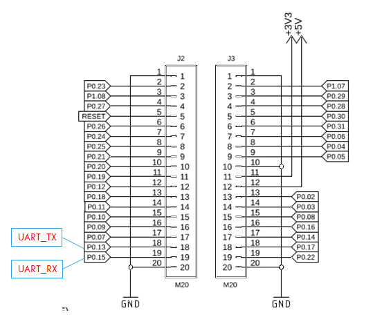

nRF5340 で DevAcademy の課題をやっていて面倒なことがあった。  
日記のどこかにも書いたが PC と USBシリアルで UART 接続してログを見ているのだが、
UART 接続していると勝手に nRF5340 に電源が入ってしまうのだ。

Flash を焼けばリセットするから良いのだが、この開発ボード自体にはリセットボタンがないので
単にプログラムを最初から走らせたいときは電源とUART接続の両方をオフにしないといけないのだ。  
Windows の場合、USBシリアルに電源が入ってからシリアルポートとして認識するまでに時差がある。  
このちょっとの時間がうっとうしいのだ。  
長い時間 USBシリアルをオフにしていると TeraTerm が再接続してくれなくなるし。

ログ出力なので UART_TX は外せないが UART_RX は今のところ使っていない。  
ブレッドボード上にジャンパー線でつないでいるだけなので外して P0.15 をオープンにすると USBシリアルを ONにしても nRF5340 に電源は入らなかった。  
ということは、UART RX に HI 入力があると nRF5340 に電源が入ってしまうということだろう。

ただ、普通はそんなことは考えられない。  
UART_RX は受信ポートになるはずだから、それがいちいち ON/OFF で電源が入切されるようでは困るではないか。  

確認のため UART_RX を無効にして GPIO にでもしてみようか、というところで nRF Connect for VSCode でプロジェクトに置いたオーバーレイファイルを読み込んでくれないことに気付いた。  
ビルドはしているのだが Visual Editor で見えていないようで、オーバーレイファイルで追加していた UART 設定が GUI に出てこない。  
VSCode の Extension が昨日更新されていたので、そのせいか、それ以前から発生していたのか。  
少なくともオーバーレイファイルを追加したときには見えていたと思うのだよなぁ。

そういうのを調べているうちに一日終わってしまった。。
