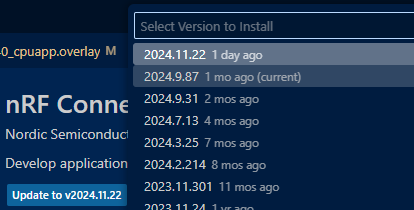
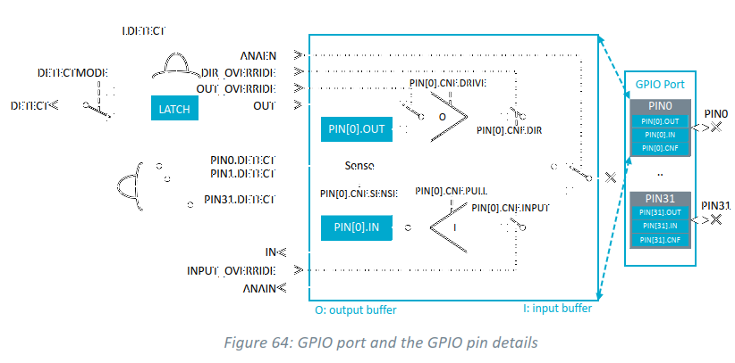
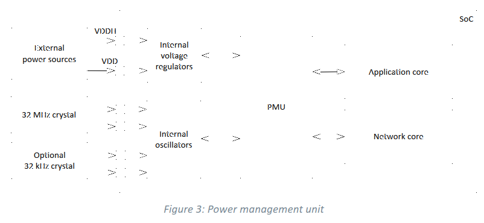

# ncs: UART RXにHI入力があると電源がONになる (2)

_2024/11/08_

## まずは関係ない話から

[昨日](20241107-ncs.md)の「nRF Connect for VSCode でプロジェクトに置いたオーバーレイファイルを読み込んでくれない」は、これを書いている時点での[Extension](https://marketplace.visualstudio.com/items?itemName=nordic-semiconductor.nrf-connect) v2024.11.22 に問題があるようだ。  
1つ前のバージョンに下げるとオーバーレイを認識した。

SDK は変更していないので、ビルドの方にはたぶん問題が無くて Extension だけの問題だろう。  
アップデートされるのを期待して、しばらくは Extension を前のバージョンにして使う。
Visual Editor の方もバージョンを戻した。

## 本題

さて、前回は UART_RX を相手側の TX から切断したら電源が入る現象がなくなったという話だった。  
次は GPIO の INPUT にしたらどうなるか確認しようとして Devicetree の変更を仕様としてオーバーレイがうまく見えないということに気付いたのだった。  
またオーバーレイのやり方についてもまとめページがほしくなったので[Devicetreeの情報](/nrf/devicetree/index.html)を追加していた。

そしてようやく UART_RX を GPIO の INPUT にして相手の TX を挿したところ、やはり電源が ONになる。  
やけになって全然関係ない P0.27 に 3.3V を挿してみるとやっぱり電源が入る。  
なんなんだー。

### GPIO

ここでようやく nRF5340 の仕様書を確認する。  
nRF5340_PS_v1.5.pdf の GPIO ページを見るとこうなっていた。

最初に `ANAEN` が出てくるのだが、このファイルで検索してもここしか出てこない。  
たぶん "analog enable" の意味で、下側にスイッチしていると analog input になるはず。  
まあ、ここでは GPIO 設定もしたので ANAEN=0 と思って良かろう。

次の段が `PIN[x].CNF.DIR` と `PIN[x].CNF.INPUT`。  
どちらかではなく両方 ON にできるのか？ 
`CNF.DIR` の 説明では input か output のどちらかになるように書いてあるので切り替わるタイプだろう。  
`CNF.INPUT` は input が有効かどうかではなく、input のバッファと切断するかどうかの意味だ。

`CNF` レジスタの初期値は、`INPUT=1`(inputバッファと切断) 以外は `0` である。  
つまり何も設定しなければ GPIO INPUT になっている。

まあ、そもそも GPIO で電源がどうのこうの似なること自体おかしいよな。  
Power management unit の図を見ても電源に関わるピンは `VDDH` と `VDD` しか書かれていない。  
一応テスターでピン間の抵抗を測ってみたが、ショートしているような感じはない([開発ボード](https://www.switch-science.com/products/8658?_pos=3&_sid=0c8c07a88&_ss=r)。

この開発ボードの電源は USB からのみだと思うのだよ。回路に疎いけど。  
テスターで当たってみたのも `VIN`ピンや`3V3`ピンとの間を見てみただけで 直接`VDD`などを見たわけではない。  
`3V3`は`VDD`と直結しているはずなので、そこが大丈夫なら大丈夫だと思うのよ。  
他に考えるとしたら、USB から 3.3V を作るところとのショートとかだけど、それだともっとひどいことになってると思うのよねぇ。

よし、あきらめた！  
わからんものはわからん。  
あー、でも外部スイッチでアクティブローにすると問題がありそうだ。。。
が、それも開発ボードから電源を取ってしまえばよいのか。  
気にはなるのでハードウェアの人が現れたら聞いてみよう。それまでは忘れよう。
