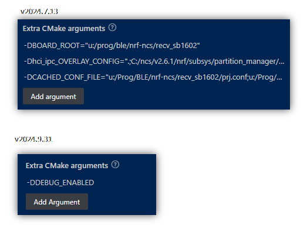
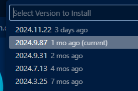
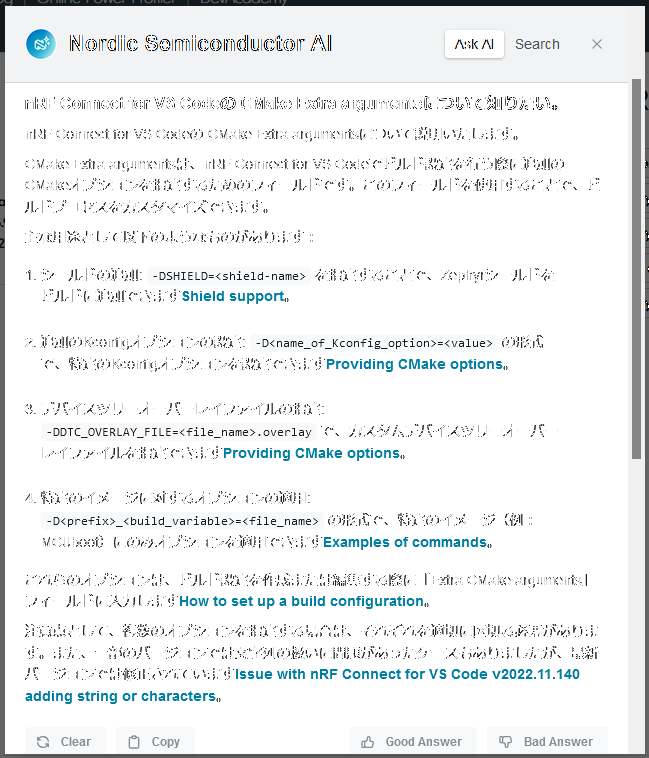

# ncs: CMake Extra arguments には何でも設定できるのか？

_2024/11/10_

ncs のサービスは簡易的なテンプレートを作ったが `main.c` なども作っておきたい。  
そう思って作業しているところだが、Build Configuration で煮詰まっている。

やりたいのは、デバッグを有効にしているとログレベルを変更して`LOG_LEVEL_DBG`にしておく、そうでないときは`LOG_LEVEL_INF`にする、というだけである。  
`Kconfig` に設定するタイプと Build Configuration で CMake に設定するタイプを用意しておきたい。  
前者はうまくいったのだが、後者がどうにも反映されていないようなのだ。

設定項目は Build Configuration の "CMake Extra arguments"。  
簡易ヘルプを見ると `-Dマクロ` で設定できそうだ。  
以前もそうやっていたように思うのだが、設定しても反映されていないし、ビルドログを見てもマクロ名が見えないので反映されていないと思う。

nRF Connect for VS Code のバージョンを遡っていったところ、
"CMake Extra arguments" の見え方が違うことに気付いた。

そうそう、昔は全部 `-D` で見えていたのだが、今は設定したものしか出てこない。  
まあ、それは仕様変更によるものかもしれないが、それならばバージョンを下げたときでも `-DDEBUG_ENABLED` は見えてないといけないと思う。

しかし、こうも思うのだ。  
確か昔の Build Configuration はビルド前に設定した内容しか保存してくれなかったような気がする(弱い)、と。  
いや、そもそも CMake Extra arguments は反映してくれていたんだっけ？  
覚えていない。。。

----

昔の nRF Connect for VS Code を振り返っても仕方ないので、バージョンを戻す。  
今の最新 [v2024.11.22](https://docs.nordicsemi.com/bundle/nrf-connect-vscode/page/release_notes/connect/2024.11.22.html) は Devicetree の ovelay ファイルを認識してくれなかったので 1 つ前にしている。  
1つ前といってもリリースノートにある[v2024.9.31](https://docs.nordicsemi.com/bundle/nrf-connect-vscode/page/release_notes/connect/2024.9.31.html) ではなく v2024.9.87 というものだ。

CMake Extra arguments に記載した内容は `build/.vscode-nrf-connect.json` の `"cmakeArgs"` に入っている。  
ただこのファイルはビルド後に作られるようだ。  
なので、これは設定の保存だけのような気がする。

こういうときは Nordic Ask AI に聞いてみよう。

もしかしたらだが CMake Extra arguments で使用できる `-D` のマクロは表に載っている値しか許容していないのではなかろうか。

* [Providing CMake options](https://docs.nordicsemi.com/bundle/ncs-latest/page/nrf/app_dev/config_and_build/cmake/index.html#providing_cmake_options)

抜き出してみよう。

* `-D<name_of_Kconfig_option>=<value>`
* `-DCONF_FILE=<file_name>.conf`
* `-DCONF_FILE=prj_<build_type_name>.conf`
* `-DSB_CONF_FILE=<file_name>.conf`
* `-DEXTRA_CONF_FILE=<file_name>.conf`
* `-DDTC_OVERLAY_FILE=<file_name>.overlay`
* `-DEXTRA_DTC_OVERLAY_FILE=<file_name>.overlay`
* `-DSHIELD=<shield> (-D<image_name>_SHIELD for images)`
* `-DFILE_SUFFIX=<configuration_suffix> (-D<image_name>_FILE_SUFFIX for images)`
* `-S <name_of_snippet> (applies the snippet to all images)`
* `-DSNIPPET=<name_of_snippet> (-D<image_name>_SNIPPET=<name_of_snippet> for images)`
* `-DPM_STATIC_YML_FILE=pm_static_<suffix>.yml`

マクロ名が付いていないのは先頭だけだが、これも `CONFIG_` 始まりと同じ意味だろう。  
まだよくわからないが [ビルドまとめ](/nrf/build.html) にメモを残した。
