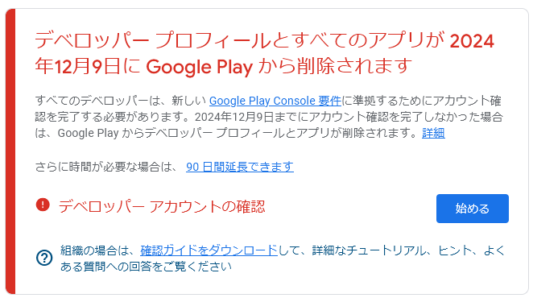

# android: Google Play Consoleの更新について

_2024/11/11_

忘れた頃にやってくる。。。  
いや、忘れないようにやってくるのだけだが、何かというと Google Play Consoleの情報更新である。

ただ更新するだけだったら良かったのだが住所表示されるようになるようなのだ。  

* 10/10 [Google Play Consoleの個人デベロッパーアカウントでも住所表示されるようだ](/2024/10/20241010-gpc.html)

私は時期が遅かったのだが、早い人はもう対処し終わっているようだった。  
「Google Play Console 住所」で検索するといろいろ出てくる。  
まっとうな(?)対処で載っていたのは、個人事業主になってバーチャルオフィスなるものを契約して住所をそちらに移すという方法だった。  
「住所貸し」というと胡散臭いイメージがあったが、身に降りかかってくると納得できるサービスだった。  
ただ、それが Google Play Console への申請のためだけというのが心情的に割り切れないところだ。

収益化しなければ表示されない、と書いてあるサイトもあったのだけどどうなんだろう？  
試しにやってみたい気もするが、もし住所などが表示されたら目も当てられない。  
氏名だけは表示されると書いてあったので、もしそうなら個人事業主で屋号を登録すれば回避できるのか。

* [Google Playストアでアプリ開発者の氏名、住所が公開されることになります #Android - Qiita](https://qiita.com/NonamedDeveloper/items/23c4bbe3c7d4f9bc2204)

というわけで、私は収益を得ているわけでもないし apk ファイルを置くだけにしようと思っている。  
同じような感じで来年からは apk ファイルを配布するタイプが増えるかもしれない。  
そうなると apk ファイルは静的にチェックするくらいしかなくなる。  
来年からはそういうサービスが増えるね、きっと(私の当たらない予想)！

私にできるのは、GitHub でコードと一緒に公開して、心配ならコード見て自分でビルドしてね、というくらいか。  
コードと apk ファイルが不一致な可能性を否定するのは難しい。  
GitHub Actions で自動アップロードするようにしておけば多少はましか。  
それでも、自動アップロードしたのか私が手動でアップロードしたのかは見分けが付かない気がする。

apk ファイル自体は zip フォーマットなので拡張子を `zip` に変更すれば展開できる。  
だからといって、自分で apk ファイルを展開して classファイルを逆アセンブルして何か分かるんか、という気持ちはある。  
ProGuard とかしていても文字列はごまかせないだろうから、`strings` で文字列を出してみて怪しいサイトに接続していないか見てみるとか？  
`strings` だけだと出力が多すぎるので `grep` で "http://" と "https://" に絞るか？  
いや、スキーマは別途設定するようなやり方もありそうだし、当てにならない。

などなど、Google Play Console を使わないというだけでいろいろ面倒になる。  
いっそのこと、アプリを非公開にして、内部テストのみ使用するようにしてしまおうか。  
とも思ったが、やっぱり面倒だな。
