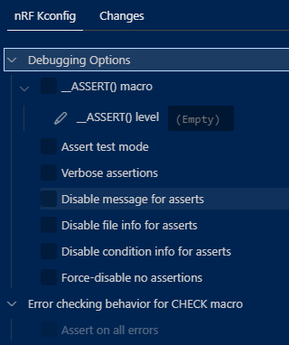

# ncs: 致命エラーの取り扱い

_2024/11/11_

ncs は Zephyr OS を使っているが、組み込みアプリであることに変わりは無い。  
Linux などであれば実行してエラーになるとコンソールに戻ったり、OS のエラーログに保存できたり、なんやかや補助が期待できる。  
が、組み込みだとエラー時の挙動もコーディングが必要だろう。  
どうしようもなかったらリセットするだろうけど、リセットを繰り返すようだったらどうするかも考えるだろう。  
リセットするレベルじゃなくて設定が足りていないとかかもしれないし、ハードウェアに異常があるのかもしれない。

ただ開発中はまだそこまでやってられなくて、取りあえずエラーになったことがあからさまにわかるだけでよかったりする。  
私だと LED を高速点滅させることが多い。  
GPIO の操作くらいはできていることが多いからね。

で、そういう関数を作ったとして、呼び出すのにわざわざ`#include`を書いていくのがめんどくさい。  
Liux とかだと異常終了を意図的に起こすこともできるので、Zephyr でそういう手段が用意されていないだろうか。

## abort()

まずは `abort()` だろう。  
名前からしても中断させる気に満ちあふれている。  
gcc の [Aborting a Program (The GNU C Library)](https://www.gnu.org/software/libc/manual/html_node/Aborting-a-Program.html) でも `abort()` が載っているし。

`SIGABRT`シグナルを起こす、というのが UNIX 系での挙動になっているが、Zephyr にはたぶんそういう機能は無かろう。  
そもそもシグナルが POSIX だけだろうから、Windows でも違う動作になると思う。

ではどうなっているか。

* [abort()](https://docs.zephyrproject.org/apidoc/latest/stdlib_8h.html#a4bef6384a1777699c6eba3125e690419)

C11 には `_Noreturn` という識別子があるが、Zephyr では `FUNC_NORETURN` というマクロを使うようだ。

```c
FUNC_NORETURN void abort(void)
```

そして説明が無い。。。  

## Fatal Errors

Zephyr に Fatal Errors の項目があった。

* [Fatal Errors — Zephyr Project Documentation](https://docs.zephyrproject.org/latest/kernel/services/other/fatal.html)
  * ソフトウェアのエラー
    * `CONFIG_ASSERT` を ON にして `CONFIG_ASSERT_LEVEL` にレベル値を設定する
    * `__ASSERT_ON` にレベル値を設定する
  * 例外
  * Fatal Error Handling
  * API Reference



エラーの原因はハードウェアかもしれないが、ともかくソフトウェアで識別できるエラーという意味だろう。  
レベルは `1` か `2` で、これは ASSERT を有効にしていることに対してコンパイラの警告を出すか出さないかの違いのようだ(`2`だと出さない)。  

* [__assert.h](https://github.com/nrfconnect/sdk-zephyr/blob/v3.5.99-ncs1-1/include/zephyr/sys/__assert.h#L130-L132)

`prj.conf` に `CONFIG_ASSERT=y` を追加。  
`main.c`に `__ASSERT(0, "Something Happen!!");` として無理やりエラー状態にしてみるとログが出力された。

```log
ASSERTION FAIL [0] @ CMAKE_SOURCE_DIR/src/main.c:46
        Something Happen!!
```

`void assert_post_action(const char *file, unsigned int line)` を実装することでメッセージ出力後に呼び出す処理も実装できる。  
LED 点滅なので初期化後に `__ASSERT()`するようにしたところ、ちゃんと点滅した。  
気付きやすいのだが実にうっとうしいので、LED 高速点滅はあまりよくなかったかもしれない。

## おわりに

ASSERT 系は本番運用では使わないようにするなら、今回の機能はデバッグ専用になる。  
そう割り切れば、`LOG_ERR()`と`__ASSERT(0)`をセットにしてしまいたいところだが `__ASSERT()` は固定文字列しか取らないのでそうもいかない。  
面倒だが使い分けがいるな。
