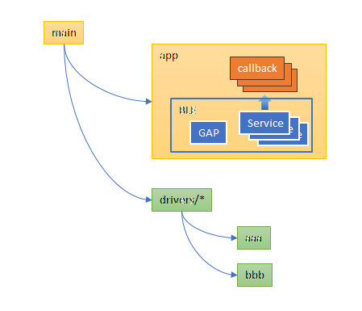
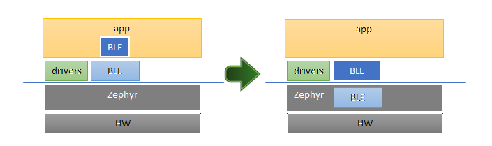

# ncs: アプリでのBLEの比重

_2024/11/12_

なんだかよくわからないタイトルになってしまった。

いま ncs の勉強をしていることもあり、サンプルアプリの作りが BLE 中心になっている。  
しかし、普通はそうではない。  
BLE は通信路に過ぎず、その両端で行う事柄の方が大切なはずだ。  
まあ、私の場合は BLE で何かしたいというのが先にあるからあながち間違いではないのだが。

突然なにを言い出したのかというと、`main()` に全部書きすぎになってしまっているという反省をしているのだ。  
複雑なことをしないと事足りるので、もうちょっと考えたプログラムも作ろうと思う。

第1弾で作ってみた。

* [hirokuma/ncs-recv-sb1602 at f5c71282a29c4c6a39fb9f359a76079d4cc2399a](https://github.com/hirokuma/ncs-recv-sb1602/tree/f5c71282a29c4c6a39fb9f359a76079d4cc2399a)

SB1602B という I2C 接続の LCD に出力するだけの Peripheral アプリである。  
(Central は作ってないな。。。 Android の復習がてら作るか。)  
この LCD はバックライトが無いので暗いところだと見づらいが、実験にはちょうどよい。

* [I2C低電圧キャラクタ液晶モジュール(16x2行) - SB1602B - Strawberry](https://strawberry-linux.com/catalog/items?code=27001)

## CMakeLists.txt の分割

ソフトウェアの中に階層を作るならディレクトリに分けた方が扱いやすい。  
それにデバイスドライバは他のアプリで使い回すこともあるだろうから、
ディレクトリごとコピーして持って行ける方が簡単だ。

CMake はまだ慣れていないが、こんな感じで使っている。  
`CFLAGS` で制御するよりは `Kconfig` でやってしまいたいのでなるべくシンプルに。

* `target_sources`: コンパイルするファイルを列挙
  * 第1引数: `app`
    * 試していないがたぶん固定だろう
  * 第2引数: `PRIVATE`でよいようだ。
    * ライブラリになるようなので、外部から参照するところは ncs が提供して見えなくなってるのかな？
  * 第3引数: ファイルの列挙
* `add_subdirectory`: `CMakeLists.txt`を含んだ別のディレクトリの取り込み
* `target_include_directories`: gcc の `-I` みたいなもの

vscode のビルドログにはコンパイルオプションなどは出力されないので細かいところは分からない。

## Kconfig の分割

ディレクトリが分かれたので `Kconfig` も分けることにした。  
プロジェクトでしか使わないのでまとめて 1 ファイルにした方がわかりやすい気もするのだが、
GUI の `Kconfig` エディタもあるし、探しやすければよかろうと思うことにした。  
ほとんどログレベルの設定で、SB1602B についてはコントラストの設定があるという程度である。

ファイルの分け方は `CMakeLists.txt` と同じようにした。  
一番上で全部やった方がわかりやすい気もするし、ちょっと悩ましい。

## `main()`に何をさせるか

サンプルアプリでは、デバイスの初期化、BLEとサービスの初期設定、Advertising の開始までやっていることが多い。  
Advertising を開始すれば、あとは接続して Characteristic へアクセスがあればそれぞれのコールバックで処理をする。

今回は初期化までを `main()` で行い、それ以降はアプリで行ってもらう形にした。  
"GAP" は Advertising と接続の処理周りという意味である。

と、書きながら BLE Service の場所を変えた方がよい気がしてきた。  
下の図の左側のイメージでやっていたのだが、よく考えると BLE の API はほぼ Zephyr と同じ位置だ。  
BLE Service のコールバック処理はアプリだろうけど Service 自体はドライバと同じ位置のように思えてきたのだ。  
GAP 関係の処理もそこにまとめて、アプリ側の BLE操作をまとめたディレクトリを作る。

* [hirokuma/ncs-recv-sb1602 at 75c2ab1c83caac86e10b6e3ce204953e693a057d](https://github.com/hirokuma/ncs-recv-sb1602/tree/75c2ab1c83caac86e10b6e3ce204953e693a057d)

ついでに BLE 接続/切断もコールバックで通知するように変更した。  
BLE の状態はこれら(Core v5.1, Vol.6, Part B, "1.1 Link Layer states")なので、Advertising しているかどうかと Connection かどうかは見た目でわかりたいかもしれない。  
Advertising はスマホ相手だと切断もしばしばするのだし、ペアリングしていない状態だとかペアリングしていない状態での Advertising とかを目立たせれば良かろう。  
Central が必ず必要な機器であれば Connection も特に知らせる必要はないだろう(デバッグ以外では)。

これで多少は BLE を重視しすぎないようなつくりになっただろうか。  
ペアリングも追加して、もう少し実用的に見えるような構成にしたい。
