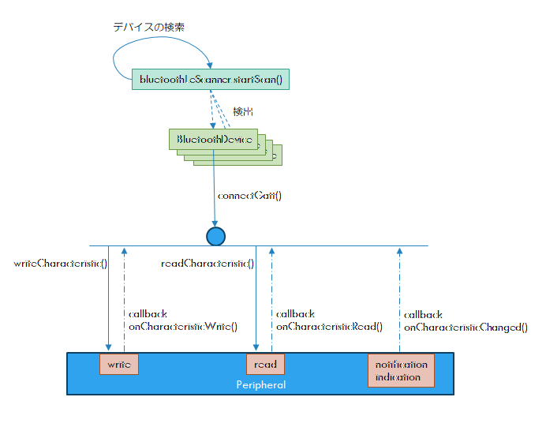

Android の BLE はおおよそこんな感じだろう。

大きい軸は `ScanCallback` と `BluetoothGattCallback` というところ。  
スキャンして `BluetoothDevice` を見つけ、接続したいデバイスに `connectGatt()` する。  
あとは `BluetoothGattCallback` に何かの結果が返ってくる。

コールバックで呼び出される関数が、Read系だと Deprecated のものとそうでないものの 2種類ある。  

* API 32 以前の OS : deprecated の方だけ呼ばれる
* API 33 以降の OS : 両方呼ばれる

違いは `value` を自分で取得する(deprecated)か引数で渡されるかだけなので `minSdk` が 32 以下であれば deprecated の方だけ実装しておけばよさそう。  
`minSdk` が 33 以降になったら実装し直せばいいや、くらいでもよい気がしてきた。

## BLE Service のみのclass

BLE接続後のやりとりをする `BluetoothGattCallback` は一箇所にまとめて、
そこから各 BLE Service の実装を呼び出すようにしよう。

BLEサービスのみの処理を行う class を作り、ViewModel にそれらのインスタンスを Service UUID をキーにした `Map` に持たせ、
コールバックされた Characteristic から Service の UUID を取得して検索したインスタンスに渡す。

とやったけど、Read や Notification / Indication する Characteristic を `StateFlow` で更新するようにしたかったら、それぞれに専用の `StateFlow` ができると思う。
そうなると ViewModel を 1つにして汎用的にしたかったとしても結局 UI に値を通知する経路を追加しなくてはならん。  
まあ、Service のインスタンスを追加する時点で汎用的にはならないのだが。。。

「汎用的」にこだわるなら、もうパラメータを文字列にしてしまって ViewModel が文字列からがんばって検索して返す、くらいしか思いつかない。  
Service や Characteristic の確認なら UUID で指定する形でもよいかもしれない。  
ただ、そういうのは面倒だから、もう UI に Service のインスタンスを直接渡して操作させようかな。  
`stringResource()`とかも使わず、もうベタベタに書いてしまう感じで。

最初に設計して、その通り実装するのが一番楽なんだろうけど、
知識がない言語だったりシステムだったりすると設計もできないんよねー、と思いましたとさ。

今日はここまで。

* [commit](https://github.com/hirokuma/hk-architecture-templates/commit/b433339a5e50f4072c0aee348551bf09bef0ee2f)
