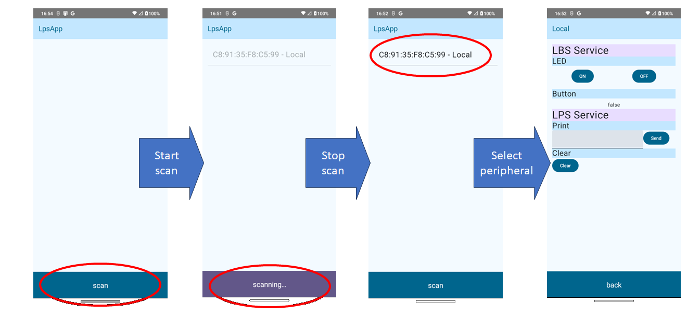

# android: ひとまずBLEテンプレートは完了とする

_2024/11/17_

作っていた Android の BLE Serviceテストアプリのテンプレートだが、ひとまず完了とする。  
いろいろ足りていないのだが、Peripheral のテストをしたかったのでね。

```
$ git clone https://github.com/hirokuma/hk-architecture-templates.git android
$ cd android
$  git checkout refs/tags/agp-8-ble
$ ./customizer.sh work.hirokuma.lpsapp LpsApp
```

`customizer.sh` の実行で `.git/` などが削除されるので `clone` 時にブランチを作ったりしなくてよい。

よく考えるとアプリアーキテクチャの Data sources として使えるようにするべきだった。  
UI Layer の方しか調べてないので今の形が Data sources に向いているのかよくわからない。。。  
画面も、`Column` に追加していく形にしているが画面からあふれてもスクロールしないんじゃなかろうか。  
そういう課題がいろいろと残っている。

### サンプル実装

Service が 2つくらいないと分かりづらいと思ったので LCD に表示させる LPS service に LED/Button の LBS service を載せた Peripheral を作っている。

* [central/android](https://github.com/hirokuma/ncs-recv-sb1602/tree/22aadb21eed0cd119aa2bbcf257c6a1d255c9739/central/android)



スキャンを止めないと Peripheral を選択できないというのがちょっとわかりづらい気はするが、まあよかろう。
