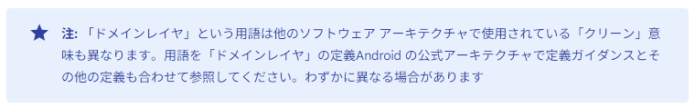

# android: Data Sources をそれっぽくしたい

_2024/11/18_

BLEアプリのテンプレートを作ってみたものの、[アプリアーキテクチャ](https://developer.android.com/topic/architecture?hl=ja) が期待する Data Sources というものをわかっていないので落ち着かない。  
Data Sources のガイドラインなどあれば眺めておきたいところである。

## Data Layer

Data Layer は Repositories と Data Sources から構成されている。  
矢面に立つのは Repositories で、Data Sources は Repositories からしかアクセスされない。  
私のイメージでは Data Sources がデバイスドライバ層で Repositories がミドルウェア層のような感じだ。  
まあ、Repositories がビジネスロジックを持つようなので範囲がもうちょっと広いが。

* [データレイヤ  -  Android Developers](https://developer.android.com/topic/architecture/data-layer?hl=ja)

その上に[ドメインレイヤ](https://developer.android.com/topic/architecture/domain-layer?hl=ja)というのもあるが、有名らしいクリーンアーキテクチャの定義とはちょっと違うかもしれないので注意しておくれと書いてあった。  
私も名前くらいしか知らないので違いについては何とも言えないが、そういっているならそうなんだろう。

日本語の文章はちょっと変だが、これは自動翻訳だから仕方ない。  
手動で日本語訳されていると文章は読みやすいのだが本家(たぶん英語)の更新に取り残されるので、それなら自動翻訳の方がありがたい。  
しかし Google 翻訳だと自然な文章になるので Cloud Translation API はちょっと違うのだろうな。

いかん、話が逸れた。  
そしてドメインレイヤはテストアプリでは不要だから今回は対象外だ。  
検索していたら、違いについて書いてくれている人がいた。  

* [Google推奨アーキテクチャとClean Architectureの違い #Android - Qiita](https://qiita.com/Nagumo-7960/items/2d810a2aafaadcd81bbf)

そうなんよねー、アプリでそんなに複雑な構成にしたいことがあんまりないと思うのよねぇ。  
ガイドの方も「Data Sources が 1つしかないなら Repositories で持つのもあり」とか書いてあったし、自由にすればよいと思う。  
あくまで「推奨」に過ぎないので、推奨を形作るところまではいろいろ議論があっただろうけど、読むだけの人は「ふーん、そういうのもあるのね」でよいのだろう。

## Data Sources

> 各データソース クラスは、ファイル、ネットワーク ソース、ローカル データベースなど、1 つのデータソースのみを処理する役割を担う必要があります。データソース クラスは、データ オペレーションのためにアプリとシステムの橋渡しをします。

単独のデータソースを処理する、というのはどの程度の単独さなのだろうか。  
ここに載っているサンプルコードではこうなっている。

* ExampleRemoteDataSource // network
* ExampleLocalDataSource  // database

データベースはテーブルが複数あっても 1 つということだろう。  
命名規則としては汎用的にするため "Local" / "Remote" のようにしたり、扱うデータを名称にしたりして具体的な名前を出さないようにする。

"Local" とした場合は `Room` や `SQLite` みたいなもの全般を扱うのだろうか。  
役割として使い分けたいなら "Local" ではなく "NewsData" とか "UserData" とかにするのか。  
Repositories の方も要件さえ満たしてくれれば細かい使い分けをしたいわけでもないだろうし "Local" でまとめてよい気がしてきた。  
じゃあ "Local" と "Remote" はなんで分けるかというと、やっぱりアクセスのめんどくささとか依存度が全然違うからかな？

これをまねするとなると.....

* データベース、のようなところはある程度具体的でもよさそう
  * DataStore みたいにぼかすのもあり
  * BLE だったらそう書いてしまう？
* Local か Remote か
  * BLE は Remote だろうが、BLE と明示するならわざわざ書かなくてよい
* そもそも BLE Service はそれ自体が独自で置き換えるものではないと思う
  * LBS Service を別のものにしたかったら、それは新たに Service を実装し直すだろう
  * でも、温度を取得するのが BLE のセンサーだったりネットで天気予報サイトからの取得だったりするかも？
  * いやいや、それをやるなら Repositories の方でやるべきよね
* BLE だけ切り離しておかないと実装する人が大変よね
  * BLE Central を扱う Data Sources として独立させるのがよかろうか

私の中で、BLE の機能は変に分散させない方がよいということになったので 1つの Data Source の class にしてしまおう。  
巻き取るなら Repositories の階層で行うことにする。

### API

* [APIを公開する](https://developer.android.com/topic/architecture/data-layer?hl=ja#expose-apis)
  * ワンショットオペレーション
  * 時間経過に伴うデータ変更の通知

BLE でやることは Write, Read, Notify/Indicate くらい。  
Read は値をコールバックでもらうし、Write は w/o Response でないなら書込み結果は同じくコールバックでの通知だ。  
これが別々のコールバック関数で戻るならそれぞれ好きにやれば良いのだが、GATT 接続時のコールバック関数に全部戻ってくる。  
引数に Characteristic があるので見分けることはできる。  
これらはたぶん「ワンショットオペレーション」になるのだろう。  
`suspend`関数にせよ、といっているので・・・あれ、どうしたらいいんだ？  
やり方は分からないが、そうしないといけないということだ。  
可能なら、TypeScript の `async`-`await` みたいに見た目同期にした方がよいのだろうか？  

* [Kotlin の Coroutine で suspend 関数を理解する #Android - Qiita](https://qiita.com/duke105/items/b5be074c79c6bed4d560)

Notify/Indicate はデータ変更の通知になるので `flow` にせんといかんだろう。  
しかし `BluetoothGattCallback` を直接渡すと Read や Write の結果を受けられないので、一度受け取って別の`flow`で返すような形になるのか。  

* [コールバックベースの API を Flow に変換する](https://developer.android.com/kotlin/flow?hl=ja#callback)

あああ、スキャンもやらんといかんのだった。  
ちょうどよい記事があった。参考にさせてもらおう。

* [BLEデバイスのスキャンをkotlin coroutineのcallbackFlowでやる #Android - Qiita](https://qiita.com/cnaos/items/c5e40ea7d1ec85a03791)

## おわりに

やり方はわからないが方向性は決まった。  
あとは実装しながら修正していこう。

## おまけ1

クリーンアーキテクチャって組み込みソフトウェアみたいな分野だとちょっと使えないよなあ、と思ったので検索すると "Clean Embedded Architecture" というのが出てきた。

* [Chapter 29 Clean Embedded Architecture - Clean Architecture: A Craftsman's Guide to Software Structure and Design \[Book\]](https://www.oreilly.com/library/view/clean-architecture-a/9780134494272/ch29.xhtml)

普通のことが書いてあった。  
いつもあの同心円の図を見るから全体的にそういう話をしているのかと思ったけど、そうでもないのね。

と最初しか読んでなかったけど結構ページが多い。  
いや、そもそもネットで検索して出てきた PDF(↑とは別) はなんなのだ？  
本が売られているけどブログに書いていたという話もあったので、そこから持ってきたのだろうか。  
まあ、そこまで高いわけでもないので買ってよいのだけど、他にも読んでない本が多数あるので気が引ける。。。

## おまけ2

[stopScan()](https://developer.android.com/reference/android/bluetooth/le/BluetoothLeScanner#stopScan(android.bluetooth.le.ScanCallback)) の引数になんでcallback がいるんだよ！
と思って空の`ScanCallback`インスタンスを設定したのだが止めることができなかった。  
あれをキーにしてスキャンを止めているのだな。

つまり、複数のアプリから同時にスキャンすることもできるということか。
