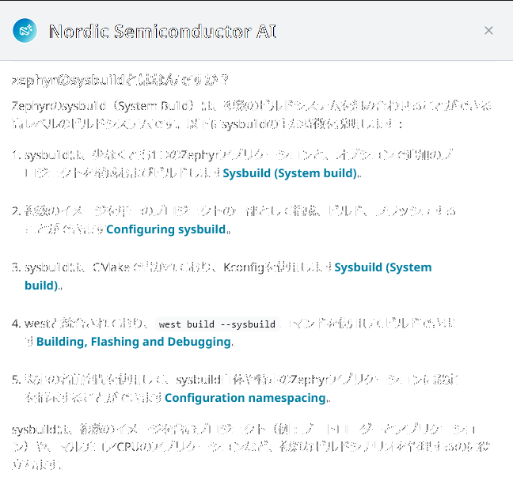
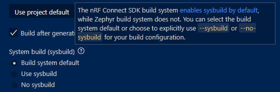
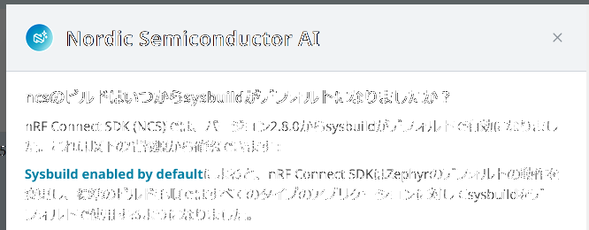
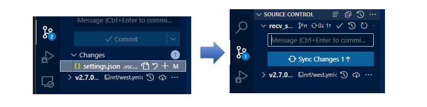
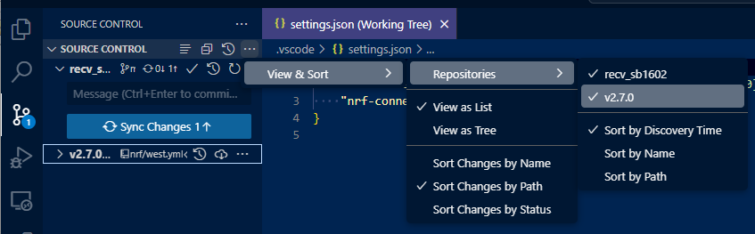

ncs v2.8.0 が最近リリースされた。  
今年から扱い始めた ncs だが、私はずっと v2.6.1 を使ってきた。  
そろそろアップデートして良い時期だろう(特に根拠はない)。  

## Migration Guide to v2.7

v2.6.0 から v2.7.0 への移植ガイドがあるので参考にする。

* [Migration guide for nRF Connect SDK v2.7.0](https://docs.nordicsemi.com/bundle/ncs-latest/page/nrf/releases_and_maturity/migration/migration_guide_2.7.html)
  * 必須の変更
    * `dfu_application.zip を使っている場合
    * 特定のライブラリを使っている場合
      * MQTT, FEM, Modem
        * FEM は BLE controller にもあるようだが、かなりローレベル？
  * 推奨の変更
    * build types
      * `CONF_FILE` が deprecated になって `FILE_SUFFIX` になった(Zephyr)
    * child image を使っている場合
      * sysbuild を継承したので [Multi-image builds using child and parent images](https://docs.nordicsemi.com/bundle/ncs-latest/page/nrf/app_dev/config_and_build/multi_image.html) は deprecated になった?
      * [Multi-image builds on the nRF5340 DK using child and parent images](https://docs.nordicsemi.com/bundle/ncs-latest/page/nrf/app_dev/device_guides/nrf53/multi_image_nrf5340.html) も deprecated である
      * 後で調べよう
    * Matter
    * LwM2M carrier library

この中で今のところ機能的に使っているものは無いので、移植作業というほどのものは不要そうだ。  
気になるのは sysbuild くらいか。

## Migration Guide to v2.8

v2.7.0 への移植は記載がそこまで多くなかったが、v2.8.0 は多い。

* [Migration guide for nRF Connect SDK v2.8.0](https://docs.nordicsemi.com/bundle/ncs-latest/page/nrf/releases_and_maturity/migration/migration_guide_2.8.html)
  * `nrfutil` のアップデートなどもここに載るのか
    * Pyhonスクリプトが sdk-zephyr の中にあった
  * SEGGER J-Link もバージョンが決められているの？？
    * `7.94i` だそうだ。Windows 版は USBドライバのインストールまでわざわざ書かれている。
    * 特にこだわりは無いが、他で別バージョンを使っている場合はどうしているのだろう。
  * Zephyr の BLE も使えるようになった？　前からできてやり方が変わっただけ？

v2.6.1 から v2.7.0 に上げようと思っていたが、今なら v2.8.0 まで上げた方が後々楽かもしれない。  
deprecated なところを勉強してしまうのが嫌なのだ。

が、v2.6.0 で書いた Peripheral を v2.7.0 にしてもビルドできたのだが v2.8.0 はビルド失敗になった。  
Kconfig にいくつか warning が出たためらしい。  
やれやれ、これは後日解決しよう。

## sysbuild

そもそも sysbuild とはなんだろう。  
[sysbuild](https://docs.nordicsemi.com/bundle/ncs-latest/page/nrf/app_dev/config_and_build/config_and_build_system.html#sysbuild) を読むと、
他のビルドシステムも混ぜて行うことができると書いている。  
例として MCUboot とアプリを一緒にビルドできるとある。
これは MCUboot を有効にしたら v2.6 でもできていたと思うが、どちらでビルドされていたのだろうか。  

まずは Nordic AI に聞いてみる。

### デフォルトのビルドシステム

これは nRF Connect for VSCode 2024.11.75 で ncs v2.7.0 を選んでいるときのヘルプ。  
Zephyr ビルドシステムではそうではないが ncs では sysbuild がデフォルトで有効になっている？

Nordic AI に聞いてみると、Zephyr で sysbuild が デフォルトになったのは v2.8.0 からとのこと。  
for VSCode のヘルプは最新ncs の状況で書かれているのだろうか。

これが関係する commit。  
checkout している sdk-zephyr のタグは [ncs v2.6.1 が v3.5.99-ncs1-1](https://github.com/nrfconnect/sdk-nrf/blob/v2.6.1/west.yml#L64)、[v2.7.0 が v3.6.99-ncs2](https://github.com/nrfconnect/sdk-nrf/blob/v2.7.0/west.yml#L66)、[v2.8.0 が v3.7.99-ncs1](https://github.com/nrfconnect/sdk-nrf/blob/v2.8.0/west.yml#L72)。  
この commit がマージされたのが `v3.7.99-ncs1-snapshot1` なので、ncs v2.8.0 から sysbuild がデフォルトになったといってよかろう。

* [commit:scripts: west: build: Use sysbuild by default if in NCS dir](https://github.com/nrfconnect/sdk-zephyr/commit/8d0cc16c73c1ce587669be498069a59dfae7b81e)

しかし、これはスクリプトのデフォルトがそうなっただけなので nRF Connect for VS Code が勝手にフラグを付けているかもしれない。。  
最終的にはコンソール出力を見るしかないが、v2.7.0 で何も指定しなかった場合は sysbuild についてもオプションを付けることはなかった。  
v2.7.0 では deprecated になっただけでまだ Multi-Image build になっていると思ってて良いのだろうか。

multi-image build から sysbuild への移植は別途ページがあった。  
sysbuild の Kconfig 設定は `SB_CONFIG_` がプレフィクスに付くようだ。  
付いていなければ sysbuild されていないと思っておいて良いのかな。

* [Migrating from multi-image builds to sysbuild](https://docs.nordicsemi.com/bundle/ncs-latest/page/nrf/releases_and_maturity/migration/migration_sysbuild.html)

### Add Build Configuration

v2.6.1 のときとほとんど変わらない。

"Board target" のラジオボタンがちょっと違うくらい。  
これは Zephyr がサポートする開発ボード設定ファイルの置き方が CPU ごとからメーカーごとに変わったことによるのだろう。  
おかげで Nordic のボードだけ表示できるようになった、と。

## おまけ

### その1

アプリの git 対象に変更がないのに vscode のバッジにカウントが出てくることがある。  
v2.6 のときは MCUboot の開発ボード用設定を直接 ncs の下にコピーしていたので仕方ない。

今回 v2.7.0 を選択したときも↑のようになっていて、`west update` とかいろいろ試したのだがダメ。  
覚えていないが v2.7.0 でも MCUboot の設定ファイルをコピーしていたのだろうか？ 
でも git では差分が出てこなかったし `west status` でも出てこなかった。

これは ncs v2.7.0 をインストールしたディレクトリをまるまる削除して新たにインストールしたら直った。  
何かの際に再発しそうな気がするが、よくわからん。

### その2

ncs のリポジトリを表示しないようにすることはできる。  
プロジェクト単位でしか設定できないのが残念だが、プロジェクトとして覚えてくれるようなので多少は楽か。

表示しないだけでバッジにカウントは出てくるのだ。
