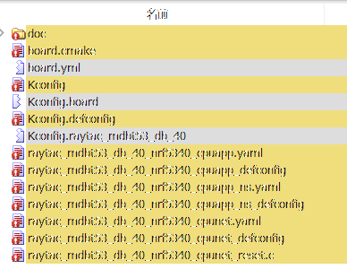
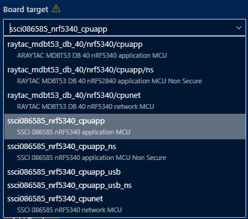
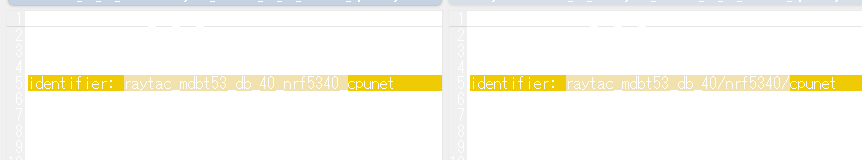
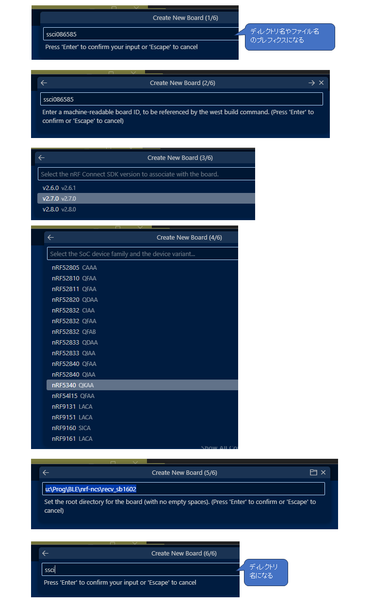
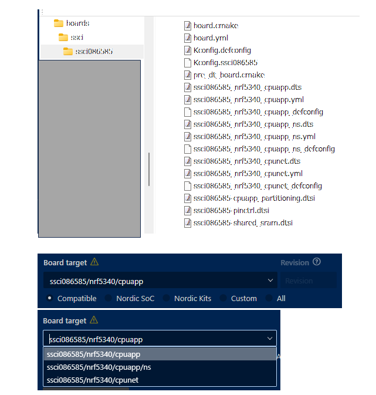

## v2.6.1 から v2.7.0 へ

ncs v2.6.1 から v2.7.0 へのアップグレードは ncs バージョンとツールチェーンのバージョンを変更するだけで済んだ。  
機能的にも大したことをしていないおかげだとは思うが、まあそこはよかろう。

* [commit](https://github.com/hirokuma/ncs-recv-sb1602/commit/bf60c11da4f31c4bee34cae716909884e4413b41)

ただビルドログを見ると warning が出ている。

### ボード定義ファイル

私が使っている開発用ボードは nRF5340 が載ったこちらである。  
Raytac さんの MDBT53-1M が使われている。  
ボード名を "MDBT53" にすると本家とわからなくなるかもしれないので商品コードから "SSCI086585" と呼んでいる。

* [nRF5340 MDBT53-1Mモジュールピッチ変換基板 — スイッチサイエンス](https://www.switch-science.com/products/8658?_pos=3&_sid=0c8c07a88&_ss=r)

```log
---------------------------------------------------------------------
--- WARNING: Functionality to describe SoCs in HWMv1 is           ---
--- deprecated and should be replaced with HWMv2, including       ---
--- boards. HWMv1 SoCs support remains only to ease the migration ---
--- of out-of-tree SoCs and associated boards. It will not be     ---
--- possible to build using HWMv1 SoCs at all in future releases. ---
---------------------------------------------------------------------
```

これはプロジェクトのコードというよりも `BOARD_ROOT` に置くボード定義ファイルの話だ。  
今までは `boards/arm/ボード名/` のような構成だったのが `boards/ベンダー名/ボード名/` のようなフォルダ構成になったのだが、
それだけでなく中身も少々変わっていた。  
DTSファイルは変わっていなさそうだった。

* [Board Porting Guide — Zephyr Project Documentation](https://docs.zephyrproject.org/latest/hardware/porting/board_porting.html)

これを書いている時点ではまだ DevAcademy Intermediate Lesson 3 は更新されていないようだ。  
Fundamentals は更新されていたので、やってる最中なんだろう。  
お手本がほしいので、今使っている開発ボードの元にした定義ファイルの差分を WinMerge で見ながらやっている。



グレーな行は片方にしかないファイルである。  
`Kconfig.board` がなくなって `board.yml` と `Kconfig.名前` が増えている。  
見ながらやっているのだが、Add Board Configuration で出てくるリストでの見え方が変わらない。  
上側にある方が参考にしている Raytac さんのボードで、こちらはスラッシュで区切られている。



YAML ファイルにこういう差分があったので `identifier` をスラッシュで区切れば済むかと思ったのだが変わらないのだよなあ。



nRF Connect for VS Code に "Create a new board" があったので試す。

<a href="20241121a-4.png"></a>

こちらはちゃんとスラッシュになっている。



まねして自作ボード定義ファイルを変更していく。  
生成された方の YAML ファイルは拡張子が `.yml` で自作の方は `.yaml` なのだが、`.yaml` に統一すると生成した方もスラッシュではなくアンダーバーになってしまった。。  
`board.yml` を変更するまではスラッシュだったので、何かルールがありそうだ。  
拡張子が `.yaml` か `.yml` で違うというよりは、同じ定義と見なされたとか？ 
いや、それなら拡張子の変更ではないよなあ。

あ、`BOARD_ROOT` に置いている方の `board.yaml` を `board.yml` にするとスラッシュになった！  
よくわからん。

その後、ビルドしても失敗してあれこれ調べた。  
数時間かかって `Kconfig` のデフォルト値を書き間違えていることに気付く。。。  
`"ssci/ssci086585/nrf5340/cpuapp"` などと最初にベンダー名を書いていたのだが、最初はボード名からなのでベンダー名をボード名と識別して「見つからない」とエラーになっていたのだった。  
パス名のつもりで書いていたのか、まったく気付かなかった。

そのおかげであれこれ見ていたのだが、Raytac のボード定義ファイルと nRF5340DK の定義ファイルは細かいところが違っていた。  
主に CMake 関係のファイルかな。

* [noric/nRF5340DK](https://github.com/nrfconnect/sdk-zephyr/tree/v3.6.99-ncs2/boards/nordic/nrf5340dk)
* [raytac/mdbt53](https://github.com/nrfconnect/sdk-zephyr/tree/v3.6.99-ncs2/boards/raytac/mdbt53_db_40)

nRF5340DK の方は[ここ](https://github.com/nrfconnect/sdk-zephyr/blob/v3.6.99-ncs2/boards/nordic/nrf5340dk/CMakeLists.txt#L9-L12)とか[ここ](https://github.com/nrfconnect/sdk-zephyr/blob/v3.6.99-ncs2/boards/nordic/nrf5340dk/board.cmake#L3-L5)とか[ここ](https://github.com/nrfconnect/sdk-zephyr/blob/v3.6.99-ncs2/boards/nordic/nrf5340dk/board.cmake#L11-L13)とかで TFM の何かをしているので Raytac にもあってよいかと思うのだ。  
[CONFIG_BUILD_WITH_TFM](https://docs.nordicsemi.com/bundle/ncs-2.7.0/page/kconfig/index.html#CONFIG_BUILD_WITH_TFM) や [CONFIG_TFM_FLASH_MERGED_BINARY](https://docs.nordicsemi.com/bundle/ncs-2.7.0/page/kconfig/index.html#CONFIG_TFM_FLASH_MERGED_BINARY) などを見ているようだ。  
説明は[ここ](https://github.com/nrfconnect/sdk-zephyr/blob/v3.6.99-ncs2/boards/nordic/nrf5340dk/doc/index.rst#building-securenon-secure-zephyr-applications-with-arm-reg-trustzone-reg)か。  
TF-M 自体を忘れているが、セキュアな実行環境があるからこそそこで動いていないアプリは Non-Secure(NS) として区別するんだったっけ。  
[DevAcademy](https://academy.nordicsemi.com/courses/nrf-connect-sdk-intermediate/lessons/lesson-3-adding-custom-board-support/topic/board-files-for-multi-core-hardware-tf-m/)の再履修だな。ははは。

ビルドして warning が出なくなり、実機でも動いたのでよしとする。

* [commit](https://github.com/hirokuma/ncs-custom-board/commit/2ed5deb6c8ad819ca67c240ed827331211f2186f)

### Child Image

これは sysbuild が使えるようになったので ncs v2.9 からは `child_image/` 方式は使えなくなりますよ、という警告だろう。

```log
---------------------------------------------------------------------
--- WARNING: Child and parent image functionality is deprecated   ---
--- and should be replaced with sysbuild. Child and parent image  ---
--- support remains only to allow existing customer applications  ---
--- to build and allow porting to sysbuild, it is no longer       ---
--- receiving updates or new features and it will not be possible ---
--- to build using child/parent image at all in nRF Connect SDK   ---
--- version 2.9 onwards.                                          ---
---------------------------------------------------------------------
```

めんどうそうなので次回にしよう。
