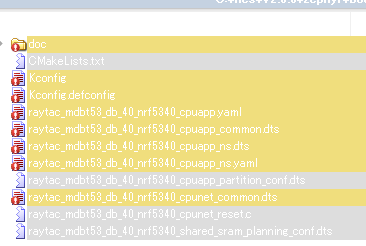
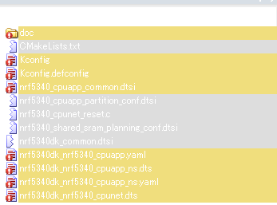
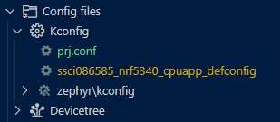
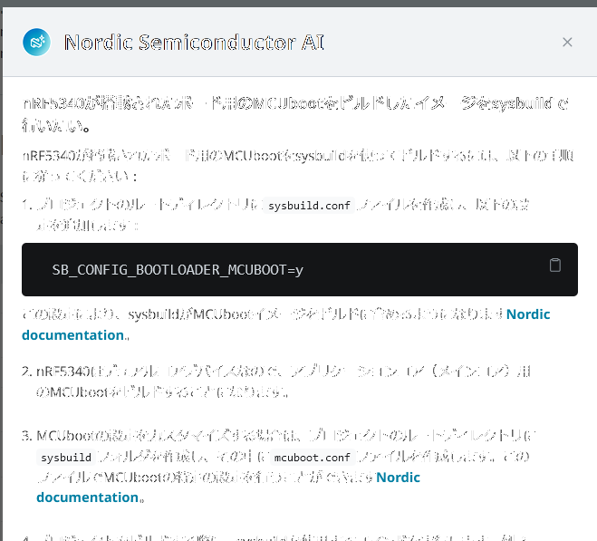
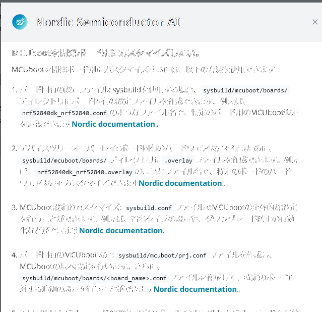
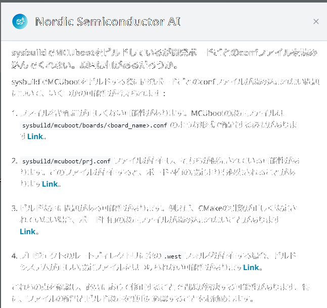

[昨日](20241122-ncs.md)の続き。

## Child Image

`child_image/` をプロジェクトの中に置いているのだが、この warning を消したい。

```log
---------------------------------------------------------------------
--- WARNING: Child and parent image functionality is deprecated   ---
--- and should be replaced with sysbuild. Child and parent image  ---
--- support remains only to allow existing customer applications  ---
--- to build and allow porting to sysbuild, it is no longer       ---
--- receiving updates or new features and it will not be possible ---
--- to build using child/parent image at all in nRF Connect SDK   ---
--- version 2.9 onwards.                                          ---
---------------------------------------------------------------------
```

sysbuild がデフォルトになることで `child_image/` が使われなくなるなら 
ncs v2.8.0 からになりそうだが、そういう理由ではないということか。

* [Migration guide for nRF Connect SDK v2.8.0](https://docs.nordicsemi.com/bundle/ncs-latest/page/nrf/releases_and_maturity/migration/migration_guide_2.8.html)
  * ビルドについては MCUboot image ID のアサインについてしか書いていないので v2.8.0 で sysbuild がデフォルトになったわけではない？
  * しかし Nordic AI も commit も v2.8.0 からもそうなったように読み取れる

デフォルトでビルドしたときのログを見比べる。

v2.7.0

```log
-- west build: generating a build system
Loading Zephyr default modules (Zephyr base).
```

v2.8.0

```log
-- west build: generating a build system
Loading Zephyr module(s) (Zephyr base): sysbuild_default
```

ログの文字列だけで決めつけるのもなんだが、v2.8.0 からデフォルトで sysbuild になったと考えても良かろう。  
v2.9.0 はまだリリースノートもはっきり書かれていないので忘れてしまおう。

ちなみに v2.8.0 でのビルドは sysbuild にしろそうでないにしろエラーになった。  
v2.7.0 では出ていない warning なので後回しにする。

```log
warning: Deprecated symbol SOC_DCDC_NRF53X_APP is enabled.
warning: Deprecated symbol SOC_DCDC_NRF53X_NET is enabled.
warning: Deprecated symbol SOC_DCDC_NRF53X_HV is enabled.
warning: Deprecated symbol BOARD_ENABLE_CPUNET is enabled.
warning: <choice BT_HCI_BUS_TYPE> (defined at C:/ncs/custom_boards/boards/ssci/ssci086585/Kconfig.defconfig:56) defined with type unknown
warning: <choice BT_HCI_BUS_TYPE> (defined at C:/ncs/custom_boards/boards/ssci/ssci086585/Kconfig.defconfig:56) defined without a prompt
warning: the default selection BT_HCI_IPC (defined at drivers/bluetooth/hci/Kconfig:39) of <choice BT_HCI_BUS_TYPE> (defined at C:/ncs/custom_boards/boards/ssci/ssci086585/Kconfig.defconfig:56) is not contained in the choice
error: Aborting due to Kconfig warnings
```

### Migrating from multi-image builds to sysbuild

そういうわけで v2.7.0 で sysbuild を使いつつ `child_image/` を使わない方法を調べる。  
たぶんこの記事だろう。

* [Migrating from multi-image builds to sysbuild](https://docs.nordicsemi.com/bundle/ncs-latest/page/nrf/releases_and_maturity/migration/migration_sysbuild.html)

右側の "On This Topic" に列挙されている項目からすると個別に対応していかねばならないのだろう。  
そういう私も MCUboot 以外はやっていない。  
"Network core" は nRF5340 だろうか？  
まあいい、いま必要な箇所だけ見ていこう。

#### Sysbuild configuration files

* `sysbuild.conf` をプロジェクトフォルダに置く
  * プレフィクスは `SB_CONFIG_`
* `Kconfig` をカスタマイズしたいなら `Kconfig.sysbuild` もプロジェクトフォルダに置く
  * "can add" なので `Kconfig.sysbuild` は必須ではないのだろう

#### ボード定義ファイルの差分

ボード定義ファイルが関係してくるので、sysbuild がデフォルトではない v2.7.0 とデフォルトな v2.8.0 を比較しておく。



グレーな行は v2.7.0 にしかないファイルである。  

こちらは nRF5340DK の比較。  
グレーな行は `nrf5340dk_common.dtsi` だけ v2.8.0 にしかないファイル、それ以外は v2.7.0 にしかないファイルである。
`nrf5340dk_common.dtsi` は cpuapp と cpunet で共通な設定だ。



それはともかく、sysbuild に関係したファイルがあるのかと思って見てみたけど、
本当にプロジェクトフォルダにしか置かないファイルなのだな。  
MCUboot を必ず使うようなボード定義ファイルを作ることはできないということなのだろうか。

#### MCUbootを有効にしてみよう

[MCUboot](https://docs.nordicsemi.com/bundle/ncs-latest/page/nrf/releases_and_maturity/migration/migration_sysbuild.html#mcuboot) や [Example for MCUboot](https://docs.nordicsemi.com/bundle/ncs-latest/page/nrf/releases_and_maturity/migration/migration_sysbuild.html#example_for_mcuboot) はあるものの先に実例を見たい。  
サンプルがあった。

* [Sample with MCUboot](https://github.com/nrfconnect/sdk-zephyr/tree/v3.6.99-ncs2/samples/sysbuild/with_mcuboot)

* prj.conf
  * 特になし
* sysbuild.conf
  * `SB_CONFIG_BOOTLOADER_MCUBOOT=y`
* sysbuild/mcuboot.conf
  * `CONFIG_MCUBOOT_LOG_LEVEL_WRN=y`
  * `CONFIG_BOOT_UPGRADE_ONLY=y`
  * `CONFIG_MCUBOOT_DOWNGRADE_PREVENTION=y`

これだけである。

ただ、これだけでビルドしても MCUboot があるような感じがしない。  
`child_image/` にあったような MCUboot 向けのボード別の設定ファイルがいると思う。

"Example for MCUboot" では `sysbuild/mcuboot/boards/*.conf` のようなファイルを置くように書いているので `child_image/` に置いていた conf ファイルをコピーしてみた。  
が、ファイルは読まれていないようだ。  
`mcuboot` のコンテキストではこうなっていた。



MCUboot から立ち上がっている場合、開発ボード上のボタンを押したまま起動すると LED が点灯して USB が有効になったはずだ。  
そういうのがまったく無い。

`build/mcuboot/zephyr/include/generated/autoconf.h` にもボード用conf ファイルに書いた内容が反映されていない。  
しかしボードの定義名などはちゃんとわかっている。

```c
#define CONFIG_BOARD "ssci086585"
#define CONFIG_BOARD_TARGET "ssci086585/nrf5340/cpuapp"
```

ビルドログでも `sysbuild/mcuboot/prj.conf` と `sysbuild/mcuboot.conf` までは読み込むが、それまでだ。  
試しに `sysbuild/mcuboot/` の直下に ボード用conf ファイルを置いてみたが、変わらず。

Nordic AI に聞いてみたが、特に間違っていないようだ。




ncs v2.7.0 だとまだ sysbuild の対応が不十分ということもあり得るのだろうか？  
先に v2.8.0 対応を進めてみるか。

最後に、何か原因に思い当たることがないかも質問しておこう。



`prj.conf` が一番それっぽかったのだが、このファイルがないだけでエラーになるのよね。
まあ、書いてある内容も「優先される」だけで読み込まれないという話ではないし。

```log
CMake Error at C:/ncs/v2.7.0/zephyr/cmake/modules/extensions.cmake:2802 (message):
  No prj.conf file(s) was found in the
  U:/Prog/BLE/nrf-ncs/recv_sb1602/sysbuild/mcuboot folder(s), please read the
  Zephyr documentation on application development.
```

#### v2.8.0 にしてもダメだった

ダメでした。  
ビルドは通るけどボードごとの設定ファイルを読んでくれない。  
しかも BLE 機能自体が使えなくなっていて初期化にすら失敗している。  
なんでだー。
