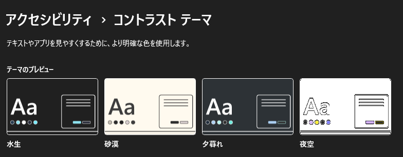
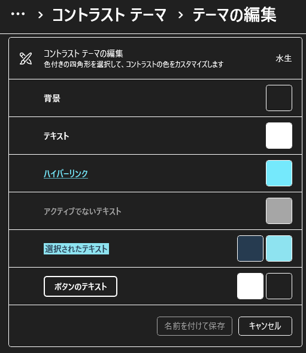
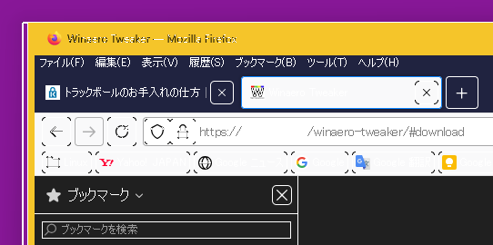
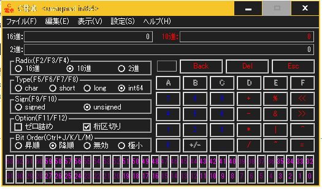

# windows: ハイコントラストモード

_2024/11/22_

いつまでできていたか記憶にないが、昔の Windows は配色やフォントの変更ができる設定項目がいろいろあった。  
最近はそれができない。  
ユーザが変更できるとテストが面倒だろうし、バグも生みやすかったのかもしれない。

事情はよくわからないが、とにかく配色などがパターン化された。  
1つ色を選ぶとそれ以外の色が決められてしまう。  
ライトかダークかくらいは選べるのだが、ちょっとその色は違うんだけどなー、という変更はしづらい。

私の場合は、背景と文字の色がはっきり違ってほしいと思っている。  
なので「コントラストテーマ」でハイコントラストモードにしてみることがある。  
そしてやるたびに「やっぱり違うな」と思って元に戻してしまう。

見え方なんていう個人的なものにあれこれいっても仕方ないので、単なる愚痴だ。

## カスタマイズアプリ

いくつかカスタマイズするアプリを使っているので、それが標準と違った挙動になっているところがあるかもしれない。  
どれが影響しているか分からないし、アプリを止める気もないので Windows だけが原因ではないかもしれないことは記しておこう。

* Open-Shell Menu
* Explorer Patcher
* Winaero Tweaker
* レジストリをどこかいじっているかも
* noMeiryoUI

## コントラストテーマ

ハイコントラストモードにするにはコントラストテーマのどれかを選択する必要がある。  
選択する前に現在のテーマ設定を変更しているなら保存しておいた方がよい(解除したときにたぶん忘れられる)。

他の配色設定と違い、選択するとあからさまに「あ、なんか別の設定になってる」と思わせるくらいに違いが出る。  
今回は「水生」を選択している。  
多少は変更できるのだが今回はいじっていない。

## タスクトレイとタスクバー

こんな感じでアイコンごとに囲みが付く。

タスクバーの高さを低くするように変更してウィンドウをまとめずタイトルを表示させるようにしているとこんな感じ。  
アクティブなアプリが水色になっているのは「水生」だからで、個人的には見づらい。  
色はともかく、フォントが変更できればもうちょっと違うのかもしれないが、
noMeiryoUI をもってしてもこの辺のフォントは変更できないようだった。

## アプリの見栄え

Windows 標準アプリはともかく、他のアプリにも影響が及ぶ。

Firefox は比較的ましだ。

よく使う C電卓 はちょっとつらい。

この、アプリにも影響が及ぶところがハイコントラストモードを選びづらいところだったりする。  
私にとっては Windows が見づらいだけで他のアプリはそこまでないのよね。

## エクスプローラが遅くなる？

ハイコントラストモードに切り替えた直後だからか、再起動していないせいか、そこら辺は分からないけど
動作が遅くなったような気がする。  
キャッシュしていたデータが使えなくなったからだろうか。

## ウィンドウの枠が出てくる

上の方に Firefox の画像を載せたが、あんな感じで太枠が出てくる。  
あれは私にとってありがたい。  
Explorer や Chrome、設定アプリなどにも表示されるが VSCode や Slack などには出てこなかった。  
Windows の再起動はやってないので、そこで変わるかもしれないけど。

## ハイコントラストモードの解除

解除すると変更前のテーマではなく標準のテーマが選ばれるようだ。  
なので、しばしばテーマは保存しておくと良いだろう。

## 終わりに

Windows 11 の見栄えを変更したいだけなのだが、なかなかそうはいかないようだ。  
いっそのこと Ubuntu などのようにウィンドウシステムを変更できればなあ。  
それだったら Linux 使えばいいやん、いやいやまだまだ・・・、といつも同じようなことを考えて終わってしまうのだった。
