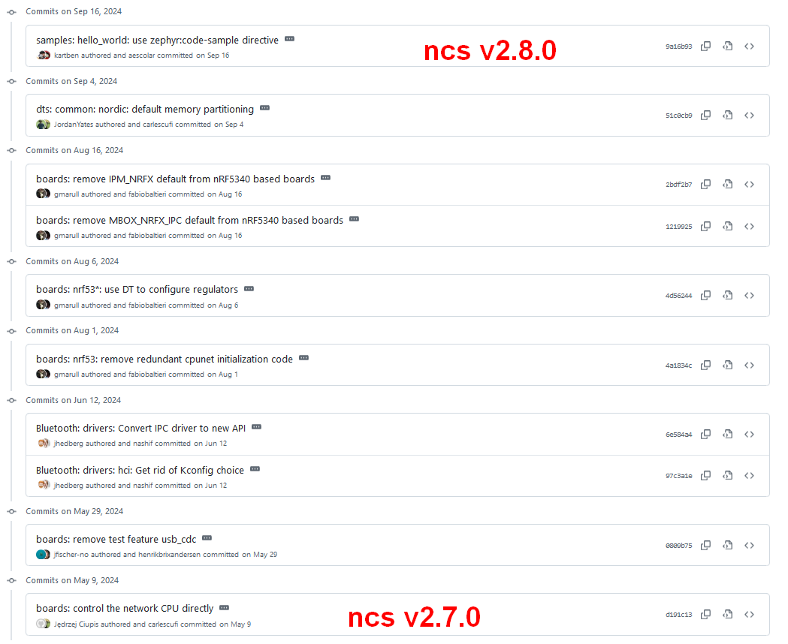
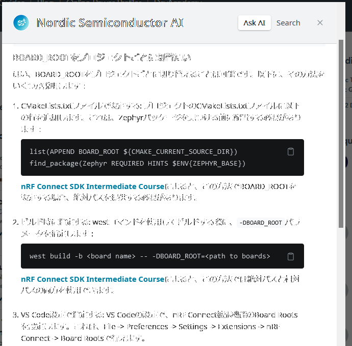

[前回](20241127-ncs.md)の続き。

## Raytac ボード定義ファイルとの差分確認

前回の最後でようやく ncs v2.7.0 での sysbuild が成功したが、お手本にした [Raytac のボード定義](https://docs.nordicsemi.com/bundle/ncs-latest/page/zephyr/boards/raytac/mdbt53_db_40/doc/index.html)をちゃんと手本にできていなかったせいだ。  
nRF5340DK のボード定義も参考にしたので、そっちに引っ張られたんだろう。

* [commit:board: Raytac参考](https://github.com/hirokuma/ncs-custom-board/commit/cddac895907cf2ecc0def3866751e1cdffd3efd0)

ボタン数とLED数に違いがあるのと、使っているポートが多少違うくらいだ。  
1 つ謎なのが、non-secure でサポートしている "counter" というものだ。  
他のボード定義ファイルでも見かけるのだが DTS ファイルにはなさそうだし、なんだろう？

* [boards/raytac/mdbt53_db_40/raytac_mdbt53_db_40_nrf5340_cpuapp_ns.yaml - counter](https://github.com/nrfconnect/sdk-zephyr/blob/v3.6.99-ncs2/boards/raytac/mdbt53_db_40/raytac_mdbt53_db_40_nrf5340_cpuapp_ns.yaml#L12)

### button0 --> sw0

button なのか sw なのかどうにもはっきりしない。  
ラベルは `button` だけど alias は `sw` ... だけど `mcuboot-button` は例外、みたいになっていて気持ちが悪い。

* [nRF5340DKはsw0](https://github.com/nrfconnect/sdk-zephyr/blob/v3.6.99-ncs2/boards/nordic/nrf5340dk/nrf5340_cpuapp_common.dtsi#L128)

自分のボード定義ファイルでは `button0` の alias も作ってアプリではそちらを使っていたのだが、
Raytac の定義ファイルと見比べたときに悩みそうなので `sw0` だけにした。  
長いものに巻かれるのだよ。

* [commit:app: button0 --> sw0](https://github.com/hirokuma/ncs-recv-sb1602/commit/3dd03aaa8e837a3fe7df001eb3e7da3a39a3e231)

### ボード定義ファイルから USB 用を削除

DTS ファイルに不要な定義があるとコードにも影響がありそうな気がした。  
使っている開発ボードは UART 専用のコネクタはないので USB にログを吐き出していたのだが、
使わない場合のことも考えてボード定義ファイルに USB 用を追加していた。

そのせいで ns ありとなしの USB用ファイルが追加になりメンテナンスが面倒だった。  
そして、雰囲気的にデバイスを有効にするという設定をしなかったら無効になるだけという気がしている。  
だったらもう削除してしまおう。

* [commit:board: USBオーバーレイ削除](https://github.com/hirokuma/ncs-custom-board/commit/a59e254364eecd973f0f44a6ff57919f102e8234)

VID=`0x2fe3`, PID=`0x0100` になっていたが、これは `Kconfig` のデフォルト値らしい。  
個人で USB の ID を持っていることはほとんど無いと思うので、

```log
CMake Warning at /home/ユーザ/ncs/v2.7.0/zephyr/subsys/usb/device/CMakeLists.txt:22 (message):
  CONFIG_USB_DEVICE_VID has default value 0x2FE3.

...

CMake Warning at /home/ユーザ/ncs/v2.7.0/zephyr/subsys/usb/device/CMakeLists.txt:28 (message):
  CONFIG_USB_DEVICE_PID has default value 0x100.
```

この VID は [Zephyr か Nordic](https://the-sz.com/products/usbid/index.php?v=0x2fe3&p=&n=) らしい。  
あれ、もしかして Zephyr って Nordic 主体なの？  
Linux Foundation だから提供している感じなのかもしれない。  
特にどこがどうだったからといって気にはしないがね。

## ncs v2.8.0 対応

アプリ側のプロジェクトは、使用する SDK や Toolchain を変更するだけである。

* [commit:app: v2.8.0](https://github.com/hirokuma/ncs-recv-sb1602/commit/b2f15c1f81932809c2d7b2145de9b3998e8c8957)

それだけでビルドが通るわけではなかった。  
残念ながらボード定義ファイルの変更が発生する。  
中身は見ていないが v2.7.0 から v2.8.0 までの間に Raytac に関係する変更はこれだけある。



なので、面倒だが v2.7.0 と v2.8.0 はボード定義ファイルを変えなくてはならない。

* [commit:board: v2.8.0](https://github.com/hirokuma/ncs-custom-board/commit/e315c6f098bf1d87442fa61b3da7e17a57e00266)

### BOARD_ROOT のプロジェクトごと変更はできるのか

可能とのこと。



nRF Connect for VS Code は `settings.json` の `"nrf-connect.boardRoots"` を参照するが、ここに各バージョンごとのボード定義ファイルディレクトリを列挙すると名前の解決に失敗してしまう。

```log
CMake Error at /home/ユーザ/ncs/v2.7.0/zephyr/cmake/modules/boards.cmake:218 (message):
  Multiple boards named 'ssci086585' found in:

  /home/ユーザ/ncs/custom_boards/v2.8/boards/ssci/ssci086585

  /home/ユーザ/ncs/custom_boards/v2.7/boards/ssci/ssci086585
```

バージョン違いならば `settings.json` には 1つだけディレクトリを書くのがよかろう。  
各プロジェクトの `.vscode/settings.json` に書いておけば `CMakeLists.txt` などは変更しなくて良い。  
"Add Build Configuration" のコンボボックスに反映されていなかったら vscode を Reload させるとよかろう。

* [hirokuma/ncs-custom-board add v2.6,v2.7,v2.8](https://github.com/hirokuma/ncs-custom-board/tree/defc4dbfe7e5ce7fd16f62f2335cc1cde34db195)

vscode では `${env:HOME}` でホームディレクトリを指すそうだ。  
なので `settings.json` はこんな感じで書くことができる。  

```json
{
    "nrf-connect.toolchain.path": "${nrf-connect.toolchain:2.8.0}",
    "nrf-connect.topdir": "${nrf-connect.sdk:2.8.0}",
    "nrf-connect.boardRoots": [
        "${env:HOME}/ncs/custom_boards/v2.8"
    ]
}
```

`2.8.0` のようなバージョンもどこかに書いて参照できると良いのだが。
