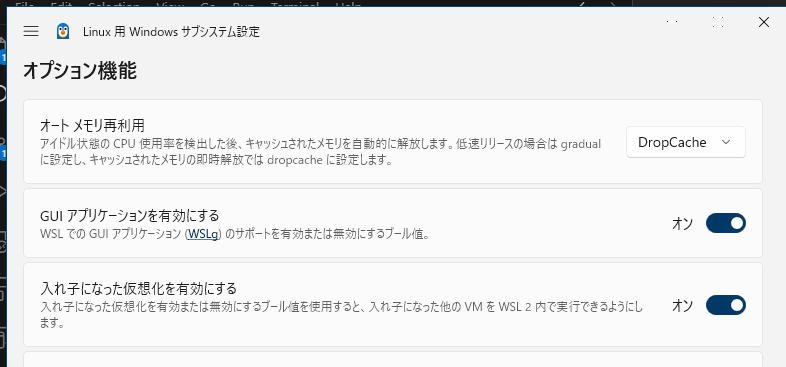

# wsl2: Firefoxでクリックできない？

_2024/11/28_

ncs 環境を WSL2 側に移動した。  
そのときにツール類をダウンロードする必要があったのだがチェックボックスなどを押さないとダウンロードできないので `wget` ではたぶんできない(どうなんだろう？)。  
それっぽい URL をコピーして `wget` で HTML がダウンロードされたときはかなり脱力してしまう。。。

WSL2 でも GUI は使えるので Firefox をインストールした。  
最近は WSL2 Settings という Windows 側での設定アプリもあって、そこで GUI が使えるか確認しておくと良いだろう。  
自分で設定したかどうか覚えていないがこうなっていた。

Firefox は Ubuntu などをインストールするとたぶんデフォルトでインストールされていたと思う。  
なのでここでも Firefox をインストールしたのだが、なんか動きが変？

* 日本語が化けてる
  * 言語設定で日本語を追加すればよいかと思ったが、そもそもそのページも化けているので選べない("Japanese"だったらよかったのに)
    * 
  * これはフォントをインストールすればよい
    * `sudo apt install fonts-noto`
  * Windows 側のフォントディレクトリを読めるようにする、というやり方を紹介しているところもあったが私は試していない
* 中途半端にクリックできない
  * メニューを表示するハンバーガーボタンはクリックできた
  * その中の Settings などをクリックするとメニューが閉じる
  * コンボボックスをクリックすると開くが、その中のどれかを選んでクリックするとコンボボックスが閉じる
  * キーボードのカーソルで上下してフォーカスさせて Enter すると選択できる
  * Nautilus などではできるので Firefox だけ？

2番目のでちょっと困っている。  
普段使うつもりが無いのでそこまで困りはしないけど、改善できるならしたい。  
たぶんこちらで紹介されているのが同じ現象なのだと思う。

* [最近WSL2 Ubutu Firefoxの様子がおかしい。(2024年1月) #Ubuntu22.04 - Qiita](https://qiita.com/mt08/items/625780063e75fefd882e)

Wayland を使わないならいけるそうだ。  
たしか X11 の次のやつとかだっけ。

上の記事から10ヶ月経っているので、ひとまず Firefox は本家サイトの手順でインストールする。

* [Install Firefox on Linux](https://support.mozilla.org/en-US/kb/install-firefox-linux)

これで `MOZ_ENABLE_WAYLAND=0` で起動すると、確かにクリック操作ができる。  
私は Windows 側のメニューから Firefox を立ち上げるような気がするので WSL2 のデフォルト状態で `MOZ_ENABLE_WAYLAND=0` になってないといけない気がする。  
`~/.bashrc` よりも前となると `/etc/profile.d/` にファイルを置けば良いか？  

取りあえずそれでできたので、しばらくそうしておこう。  
普通に`apt`でインストールしただけの firefox でもできたかもしれないが、もういいや。