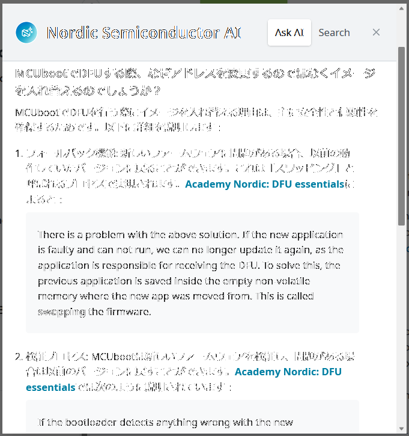

前回までにやったこと。

* ncs v2.8.0 対応
* sysbuild 対応
* warning はなるべく減らした

sysbuild で MCUboot を組み込んでみたものの、今のところボタンを押したまま起動させて bootloader モード? になったことしかわからない。  
DFU できるようにしておきたい。

* DFU: Device Firmware Update
* FOTA: Firmware update Over The Air

DFU はわからないが FOTA は一般用語で携帯電話や Wi-Fi 経由でアップデートする場合も FOTA と呼ばれていた。  
なのでたぶん DFU も一般用語だろう。

## DevAcademy

DevAcademy の Intermediate コースに DFU などのレッスンもある。

* [Lesson 8 – Bootloaders and DFU/FOTA](https://academy.nordicsemi.com/courses/nrf-connect-sdk-intermediate/lessons/lesson-8-bootloaders-and-dfu-fota/)

ただ、これを書いている時点ではまだ multi-image ビルド、つまり sysbuild ではないやり方になっている。  
関連するリンクは載っているのだが、初学者にはいささか厳しい。

* [Migrating from multi-image builds to sysbuild](https://docs.nordicsemi.com/bundle/ncs-latest/page/nrf/releases_and_maturity/migration/migration_sysbuild.html)
* [Enabling a bootloader chain using sysbuild](https://docs.nordicsemi.com/bundle/ncs-latest/page/nrf/app_dev/bootloaders_dfu/mcuboot_nsib/bootloader_adding_sysbuild.html)

が、違いは sysbuild くらいだから何とかなるんじゃなかろうか。  
DevAcademy 以上のとっかかりも思いつかないので

以前 MCUboot のせいで起動しなかったときに DevAcademy も含めてある程度は見たことがある。  
ただ、もう記憶に残っていないが。

* [MCUboot (7まとめ) - hiro99ma blog](https://blog.hirokuma.work/2024/07/20240716-boot2.html)

起動しなかった原因は、nRF5340DK や Thingy:53 には搭載されている QSPI の Flash メモリが私が使っている[開発ボード](https://www.switch-science.com/products/8620?_pos=1&_sid=6944ab6c4&_ss=r)には載っていなかったためである。  
ボード定義ファイルの QSPI 周りをそのまま使っていたため MCUboot の起動時にチェックされてエラーになっていた。  
ncs v2.5 まではエラーが起きてもスルーしていたので起動していたのだが、v2.6 からはエラーによって異常終了させるようになったため起動しなくなった。

開発ボード用のボード定義ファイルが Thingy:53 ベースだったものを Raytac社ベースに(QSPI未使用)にすることで対応できた。  
それだけなら Raytac社のボード定義ファイルをそのまま使えばよいのだが、LED やボタンなどが違うし、SSCI の開発ボードはそれ以外の専用ポートは USB しかないので変更できるようにしておかないと不便なのだ。
nRF Connect for VS Code に "Create a new board" という項目があるが、あれで一から作るのは難しいと思った。

DevAcademy に話を戻す。  
Lesson 8 が bootloader と DFU である。  
いきなり他のレッスンを飛ばすのはあまりよろしくないのだが、Intermediate コースはそれぞれが重たそうなので今回はスルーする。

以前やったとき([これ](https://blog.hirokuma.work/2024/07/20240714-boot.html), [これ](https://blog.hirokuma.work/2024/07/20240715-boot.html))もかなりすっ飛ばしている。  

* 初期SPアドレスは `0x0000_0000`、リセットベクタは `0x0000_0004` だが簡易的にまとめて `0x0000_0000` と呼ぶ
* "A bootloader is just a second application hex file running on the chip" とあるが、起動する順番としては first だと思う。ここの "second" はどういう意味だろう？
* bootloader はアップグレードできるタイプがある。
  * 取り得る構成
    * bootloader なし
    * NSIB + アプリ
    * MCUboot + アプリ
    * NSIB + MCUboot + アプリ
  * DevAcademy ではアップグレードできる方については説明しない
    * Second-stage と書いてあるのでそうではない構成は全部 Immutable なのか
    * そして Second-stage になるのは 4番目の構成だけ
* デジタル署名の検証をする
  * 公開鍵は bootloader にハードコーディングされる
  * デフォルトの公開鍵を使っているとビルド時に warning が出たような気がしたが、今は出てなかった。
* DFU over UART
  * DFU mode になってからアップグレードするデータを流し込む
  * MCUboot では Serial Recovery と呼ぶ
  * 処理の順番
    * イメージデータをダウンロードして空いた Flash に置く
      * これは bootloader でもアプリでも良い
      * "DFU over UART from the application" の GIF ではアプリがダウンロードしているようだ
    * bootloader が Flash に置いたイメージを今のアプリの場所に上書きする
      * 上にある「ON/OFF」は電源だろう。一度 OFFにしてアプリから bootloader に切り替えているのだと思う。
      * Flash の領域に歯車アイコンが出てくるが、これは今稼働しているプログラムを意味しているのだろう。
  * イメージはアプリ側で空き Flash にダウンロードする、と書いているな。
    * でも USB CDC-ACM を有効にした bootloader で DFU mode になると USB を認識しているぞ？
* アプリのイメージを上書きすると元に戻せなくなるので、古いイメージと新しいイメージを好感するらしい。
  * それだったら開始するアドレスを差し替えるだけでいいんじゃないのか？
    * 絶対アドレスが使われている箇所があるとダメだからデータごとの交換しかないのかもしれない。
    * でもレジスタ以外は相対アドレスでいいんじゃないのかとも思うが、事情が書かれていない。
    * YouTube の [MCUboot での swap-scratch 説明](https://www.youtube.com/watch?v=KFgK3TRDNR4) では 1イメージを複数に分割して後ろの方から入れ替えていくようだ
      * ちゃんと入れ替えるように表現していたので、入れ替えるのだろう
      * [swap-move 説明](https://www.youtube.com/watch?v=TNvUHJ_NSo8) もやり方は違うが動かしているので、動かすのだろう
  * Nordic AI に聞くと、安全性と信頼性の確保のためらしい
    * 
      * 1 番目の理由は、アドレスの切替であれば元に戻すことは可能だから違うんじゃないかな。
      * 2 番目も元に戻すことを言っているので同じだろう。
      * 3 番目は理由ではなくて単なる説明だ。
      * 4 番目の理由が一番それっぽいな。
    * 気になるようであれば自分で確認しよう！
* FOTA は無線部分をアプリでやる
  * UART もアプリでやるって言ってたよね・・・？
* Partition Manager
  * multi-image build はスキップしようとしていたが Partition Manager のことが書いてあった。
  * ncs v2.7 までは [partition_conf.dtsi](https://github.com/nrfconnect/sdk-zephyr/blob/v3.6.99-ncs2/boards/nordic/nrf5340dk/nrf5340_cpuapp_partition_conf.dtsi)  があったのだが [v2.8 からはボード定義ファイルからはなくなり](https://github.com/nrfconnect/sdk-zephyr/tree/v3.7.99-ncs1/boards/nordic/nrf5340dk)、その代わりに [共通の partition.dtsi](https://github.com/nrfconnect/sdk-zephyr/blob/v3.7.99-ncs1/boards/nordic/nrf5340dk/nrf5340_cpuapp_common.dtsi#L163) が使われるようになった。
    * [共通の partition.dtsi](https://github.com/nrfconnect/sdk-zephyr/blob/v3.7.99-ncs1/dts/common/nordic/nrf5340_cpuapp_partition.dtsi) は以前と書き方が変わったのかよくわからん。"mcuboot" があるなというくらい。
  * multi-image build では自動で有効になっていたそうだ(Nordic AI)
  * sysbuild でも[有効が普通](https://devzone.nordicsemi.com/f/nordic-q-a/106142/sysbuild-and-mcuboot-without-partition-manager)らしい
    * 自分のプロジェクト(`autoconf.h`)でも `SB_CONFIG_PARTITION_MANAGER=y` になっていた
  * `CONFIG_PM` は "Partition Manager" ではなく "Power Management" なので違う
    * が `pm.yml` は Partition Manager の方だ。
  * MCUboot の DFU を使うだけなので、ここは言われたとおりに使っておけばよいのかな？
* MCUboot を有効にしただけでは DFU は有効になっていない
  * `CONFIG_SINGLE_APPLICATION_SLOT=y`: Dual Slot でなくなる？ MCUboot の差し替え用パーティションが 1つになる？
  * Kconfig を "MCUMGR" で探せというが [247件](https://docs.nordicsemi.com/bundle/ncs-2.8.0/page/kconfig/index.html#!MCUMGR) もあった
    * [Exercise](https://academy.nordicsemi.com/courses/nrf-connect-sdk-intermediate/lessons/lesson-8-bootloaders-and-dfu-fota/topic/exercise-1-dfu-over-uart/) で実例を見れば良かろう
      * 直接 "MCUMGR" とついているのはこれら
        * `CONFIG_MCUMGR`
        * `CONFIG_MCUMGR_GRP_OS`
        * `CONFIG_MCUMGR_GRP_IMG`
        * `CONFIG_MCUMGR_TRANSPORT_UART`
      * あとはそれにひっついているようだ

nRF5340 特有のことと Exercise には至らんかった。  
また後日。
