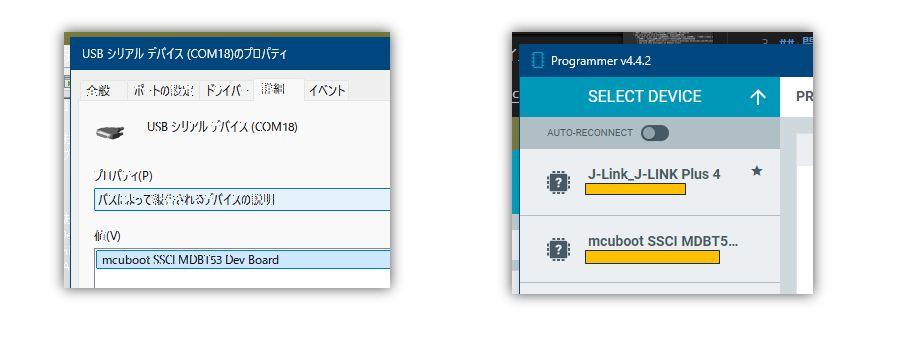
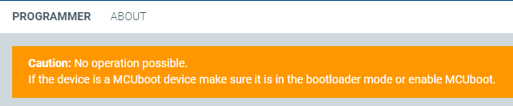

[昨日](20241202-ncs.md)の続き。

## DevAcademy

ここから再開。

* [DFU for the nRF5340 SoC](https://academy.nordicsemi.com/courses/nrf-connect-sdk-intermediate/lessons/lesson-8-bootloaders-and-dfu-fota/topic/dfu-for-the-nrf5340/)

前回と同じく気になったところだけ書いていく。

* [nRF5340のスペック](https://docs.nordicsemi.com/bundle/ps_nrf5340/page/keyfeatures_html5.html)
  * app core は Flash 1MB、RAM 512 kB
  * net core は Flash 256kB、RAM 64kB
* nRF5340 の network core(以下 net core) 側の bootloader は app core 側とは別で [b0n](https://docs.nordicsemi.com/bundle/ncs-latest/page/nrf/samples/nrf5340/netboot/README.html) とよばれる。
  * "B0n" と書いてあったりもするのだが、何の略だかわからん
  * app core は net core に直接書き込むことができない
    * app core は net core が新しいイメージを内蔵 Flash に書き込む前にイメージを net core に転送する必要がある
      * 書き込むことはできないが転送することはできるということか
      * 転送と書込みには [PCDライブラリ](https://developer.nordicsemi.com/nRF_Connect_SDK/doc/latest/nrf/libraries/dfu/pcd.html#subsys-pcd) というものを使う
      * app core 側の bootloader は MCUboot が必須
      * 設定しておけばうまいことやってくれるらしい
  * Non-simultaneous update と Simultaneous update があるが、今回は Non-simultaneous だけ見ることにする
    * Simultaneous update は外部 Flash が必要になるので、私の手持ちボードで今は試せないからである
    * Non-simultaneous update
      * 2回リセット動作が必要になる
      * app と net の両方を更新することを考えると Serial DFU がよいだろう
        * FOTA で片方だけしかアップグレードできなかったら、やり直したくても無線が使えなくなる
      * 手順からすると、成功すると app の古いイメージは net の古いイメージで破壊されると思う
    * Simultaneous update
      * Non-simultaneous update では内蔵 Flash を `mcuboot_primary` と `mcuboot_secondary` に分けていたが、Simultaneous update では内蔵 Flash は `mcuboot_primary` だけにして外部 Flash に `mcuboot_secondary` と `mcuboot_secondary_1` を作る
        * 分け方は自由にできるが、この分け方が一番余裕がある
        * "mcuboot_primary" で始まるのは稼働中イメージの場所、"mcuboot_secondary" で始まるのは更新イメージが置かれる場所
        * サフィックスで `_1` がつくのは net 側のイメージ、ついていないのは app 側のイメージ
      * `mcuboot_secondary` に新しい app イメージを、`mcuboot_secondary_1` に新しい net イメージを置いて更新する
      * こちらのやり方だと古い app イメージと net イメージがそれぞれ維持されるので元にも戻せるだろう
  * 処理の順番(Non-simultaneous update)
    * app 側のアップグレードを行う
      * 新しい app イメージを空いた Flash(`mcuboot_secondary`) に書き込む
      * リセット
      * swap して新しい app イメージが前の方に来る
    * net 側のアップグレードを行う
      * 新しい net イメージを空いた Flash(`mcuboot_secondary`) に書き込む
        * 古い app イメージは残されないということか？
      * リセット
      * PCDライブラリによって net 側のイメージと swap する

`sysbuild/mcuboot/` に置いた conf ファイルでの `CONFIG_USB_DEVICE_PRODUCT` はこんな感じで見えている。

Lesson 8 Exercise 2 を参考にしながら作ったプロジェクトを Programmer アプリで DFU してみようとしたが、デバイスを選択した時点で警告が出てきた。

Exercise 1 の USB ではない UART 経由を先にやるべきなのか？  
でも UART が USB CDC-ACM になるだけで基本は変わらんと思うんだよなあ。  
取りあえず Exercise 1 からやればいいやんと思われそうだが、元々が sysbuild のサンプルではないので参考にするのが難しいためだ。

まだまだ時間がかかりそうだ。

* Serial Recovery の悩みポイント
  * `CONFIG_SINGLE_APPLICATION_SLOT` は `y` か `n` か
    * [Exercise 1](https://academy.nordicsemi.com/courses/nrf-connect-sdk-intermediate/lessons/lesson-8-bootloaders-and-dfu-fota/topic/exercise-1-dfu-over-uart/)
      * 3.3節 で `y`
      * 5.1節 で `n`
      * 違いは、3章は "Add DFU over UART to MCUboot"、5章は Add DFU over UART to the application" というところ
        * つまり、DFU は MCUboot だけでなくアプリにも組み込むことができる
        * プロジェクトの `prj.conf` にいろいろ設定があるのはアプリに DFU を組み込んだ場合？
        * アプリに DFU を組み込むと、新しい app イメージは上書きしないようにしないといけないので `n` にするということだろう
        * MCUboot で DFU するとしてもアプリのサイズが範囲内であれば `n` で問題ないだろう。
  * `mcumgr image list` でタイムアウトする(NMP timeout)
    * これが `Programmer` アプリの警告メッセージと同じ意味になるのか？
    * `-l DEBUG`を付けるとログレベルが DEBUG になる
    * コマンドで送信はしているが何も返ってきていなさそう
