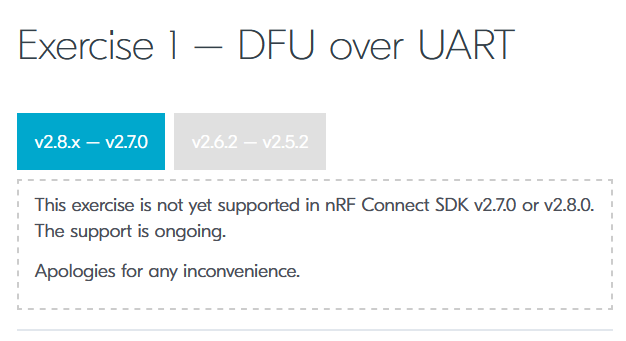
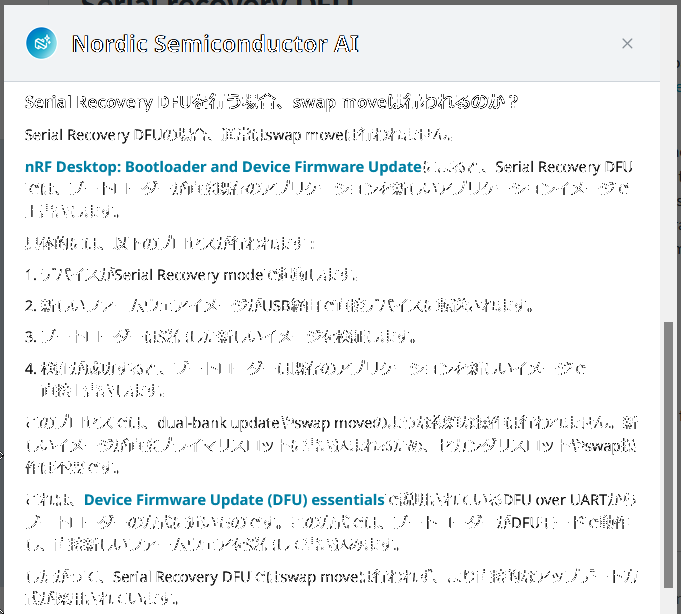
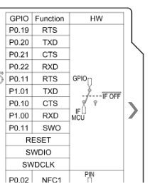
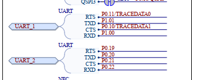
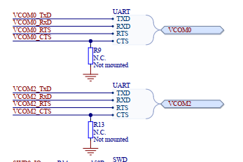
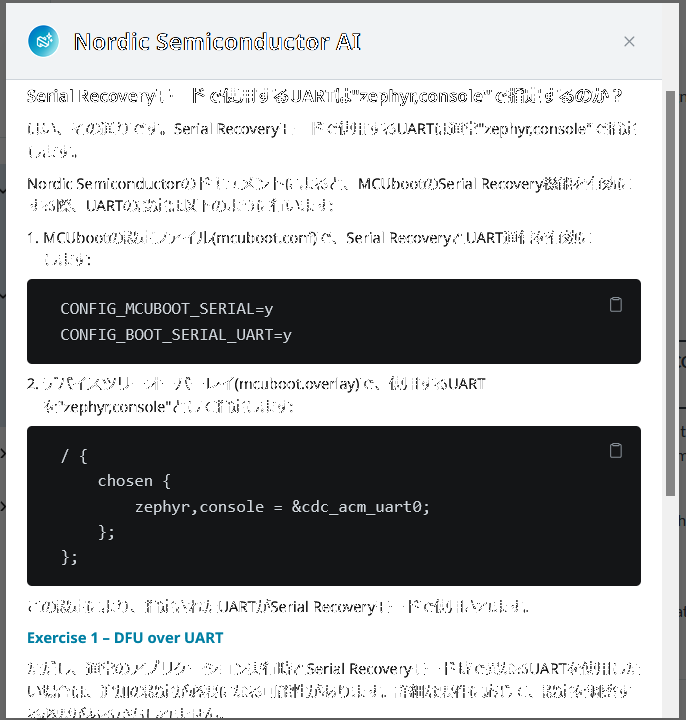
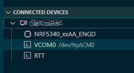

# ncs: USBでのDFU (5)

_2024/12/06_

引き続き DFU についての調査を行う。

* [ncs: USBでのDFU (1) - hiro99ma blog](https://blog.hirokuma.work/2024/12/20241202-ncs.html)
* [ncs: USBでのDFU (2) - hiro99ma blog](https://blog.hirokuma.work/2024/12/20241203-ncs.html)
* [ncs: USBでのDFU (3) - hiro99ma blog](https://blog.hirokuma.work/2024/12/20241204-ncs.html)
* [ncs: USBでのDFU (4) - hiro99ma blog](https://blog.hirokuma.work/2024/12/20241205-ncs.html)

## DevAcademy Intermediate の更新中

昨日の最後にも書いたが、DevAcademy の sysbuild 対応が進められているのか、リポジトリからいろいろ削除されている。  
今関係しているところでは Lesson 8 だ。

* [ncs-inter/v2.8.x-v2.7.0 at main · NordicDeveloperAcademy/ncs-inter](https://github.com/NordicDeveloperAcademy/ncs-inter/tree/67802599fccfe3ef2ae08566289316541fb88ca3/v2.8.x-v2.7.0)



ビルドの仕方が変わることで考え直すところはあるのかもしれないが、
DFU のしくみは sysbuild になったからといって変わらんだろう。

## アプリでの CONFIG 設定

`CONFIG_` の設定をできる箇所がいくつかあるので、これってどのファイルに書くんだっけ？となることがある。  
整理しよう。

CONFIG 関係のファイルはビルドログからするとこんな感じで読み込まれている。

* アプリ
  * `Kconfig`: 読み込んで解析
  * `<ボード定義>/<ボード定義>_cpuapp_defconfig`: ボード依存
  * `prj.conf`
  * `boards/*_cpuapp.conf`: ボード依存
  * `<build>/<プロジェクト>/zephyr/.config.sysbuild`: sysbuild関係?
* MCUboot
  * `<ncs>/v2.8.0/bootloader/mcuboot/boot/zephyr/Kconfig`: 読み込んで解析
  * `<ボード定義>/<ボード定義>_cpuapp_defconfig`: ボード依存
  * `sysbuild/mcuboot/prj.conf`: 必須でもない?
  * `sysbuild/mcuboot/boards/*_cpuapp.conf`: ボード依存
  * `sysbuild/mcuboot.conf`
  * `<build>/mcuboot/zephyr/.config.sysbuild`: sysbuild関係?

ついでに Devicetree の方も。

* アプリ
  * `<ボード定義>/<ボード定義>_cpuapp.dts`: ボード依存
  * `sysbuild/mcuboot/boards/*_cpuapp.overlay`: ボード依存
* MCUboot
  * `<ボード定義>/<ボード定義>_cpuapp.dts`: ボード依存
  * (`sysbuild/mcuboot.overlay`: 存在すればおそらく)
  * `sysbuild/mcuboot/boards/*_cpuapp.overlay`: ボード依存

CONFIG の設定値は `y`, `n`, `unset` の 3つがある。  
どこにも書かなければ `unset` なのだが、`Kconfig` でデフォルト値が決められることもある。  
そして `y`/`n` については後で読み込んだ設定に上書きされる。  
上書きによって `Kconfig` と違う設定にされた場合、おそらくビルドログに warning が出力される。  
例えば、MCUboot の conf ファイルにこう書いた場合、特にログは出力されない。

```conf
#CONFIG_CONSOLE=n
CONFIG_UART_CONSOLE=n
```

しかし依存関係にある設定だけ変更された場合には warning が出力される。

```conf
CONFIG_CONSOLE=n
#CONFIG_UART_CONSOLE=n
```

依存関係の上位に当たる `CONFIG_CONSOLE=n` が設定され、それによって `CONFIG_UART_CONSOLE` が `n` に変化することについての warning である。

```log
warning: UART_CONSOLE (defined at drivers/console/Kconfig:42) was assigned the value 'y' but got the
value 'n'. Check these unsatisfied dependencies: CONSOLE (=n). See
http://docs.zephyrproject.org/latest/kconfig.html#CONFIG_UART_CONSOLE and/or look up UART_CONSOLE in
the menuconfig/guiconfig interface. The Application Development Primer, Setting Configuration
Values, and Kconfig - Tips and Best Practices sections of the manual might be helpful too.
```

CONFIG にせよ Devicetree にせよ、大元になるのはボード定義ファイルである。  
[自作のボード定義ファイル](https://github.com/hirokuma/ncs-custom-board/tree/raytac-base-v2_8/v2.8/boards/ssci/ssci086585) は Raytac 社のファイルを流用しているので DTSファイルに設定がたくさんあるのだが、[SSCI開発ボード](https://www.switch-science.com/products/8658?_pos=3&_sid=0c8c07a88&_ss=r) に備わっているのは LED、スイッチ、USB-C だけである。  
なので関係ない設定は削除した方がよいのだが・・・オリジナルと比較するときに面倒なので残している。

## Serial Recovery DFU

DFU モード、あるいは Serial Recovery モードで起動し、`mcumgr-cli` などを使って DFU する場合、swap-move のようにスロットを 2面使うのだろうか？  
うまいことページを探せない。  
そう、そういうときは Nordic AI である。



Serial Recovery モードでは直接イメージを書き込むとのこと。  
理由を読めばなるほどである。

* [nRF Desktop: Bootloader and Device Firmware Update](https://docs.nordicsemi.com/bundle/ncs-latest/page/nrf/applications/nrf_desktop/bootloader_dfu.html)
* [Device Firmware Update (DFU) essentials - Nordic Developer Academy](https://academy.nordicsemi.com/courses/nrf-connect-sdk-intermediate/lessons/lesson-8-bootloaders-and-dfu-fota/topic/device-firmware-update-dfu-essentials/)
  * "DFU over UART from the bootloader" の動作がそれか
  * 直接 Flash に書き込んだ後に検証して、検証が成功したらアプリを立ち上げるとなっている
  * 元に戻すのは難しくないから直接書き込むのか

この疑問は `CONFIG_MCUBOOT_SERIAL_DIRECT_IMAGE_UPLOAD` の設定をどうしたらよいか考えていたからだ。  
Lesson 8 Exercise 1 では、MCUboot での DFU の際は `n`、アプリでの DFU の際は `y` になっている。

* DFU モード(Serial Recoveryモード)でしか DFU しない場合の confファイル
  * アプリ
    * 特になし
  * MCUboot
    * `CONFIG_MCUBOOT_SERIAL_DIRECT_IMAGE_UPLOAD=y`
      * アプリを直接上書きするようになる
    * `CONFIG_SINGLE_APPLICATION_SLOT=y`
      * アプリを直接上書きするので複数のスロットは不要
    * `CONFIG_UART_CONSOLE=n`
      * UART の邪魔をするため
    * `CONFIG_MCUBOOT_SERIAL=y`
    * `CONFIG_BOOT_SERIAL_UART=y`
      * CDC-ACM ではなく純粋な UART を使う場合
    * devicetree
      * `zephyr,console`


では、アプリでイメージを別スロットに書き込んで DFU する場合はどうなるだろう？  
Exercise 1 の Step 5 になるだろう。

* アプリでイメージを別スロットに読み込む場合の confファイル
  * アプリ
    * 

### DFU でログは出せるのか？

MCUboot に `CONFIG_LOG=y` はいるのだろうか？  
RTT ならログに出せるからあってもよいという判断だろうか。  
Lesson 8 Exercise ではそういうことはしていない。にも関わらず Step 2.3 では nRF Serial Terminal でログを出している。  
これはもしかして、DK シリーズなどにある J-Link OB のポートだろうか？  
nRF5340DK の設定を見てみよう。

* [zephyr,console は uart0](https://github.com/nrfconnect/sdk-zephyr/blob/v3.7.99-ncs1/boards/nordic/nrf5340dk/nrf5340_cpuapp_common.dtsi#L13)
  * [uart0 は P0.20 と P0.22](https://github.com/nrfconnect/sdk-zephyr/blob/v3.7.99-ncs1/boards/nordic/nrf5340dk/nrf5340_cpuapp_common-pinctrl.dtsi#L22-L32)
* [Hardware drawing](https://docs.nordicsemi.com/bundle/ug_nrf5340_dk/page/UG/dk/hw_drawings.html)
  * 
* 回路図
  * `UART_2` が P0.20 と P0.22 を使っている。
    * 
  * UART とは別に VCOM が 2つある(`0` と `2`)
    * 
  * `VCOM0` は P0.29 と P1.04、`VCOM2` は P1.06 と P1.08
    * 

などなど調べていたが [Virtual serial ports](https://docs.nordicsemi.com/bundle/ug_nrf5340_dk/page/UG/dk/vir_com_port.html) に表があった。  
ラベルの方が間違ってるんだって。

> Note: The serial ports on the nRF5340 DK PCB might be incorrectly labeled.

どちらも VCOM だから USB 接続するとどっちがどっちかわからない気がするが、まあよかろう。  
Lesson 8 Exercise 1 では特に overlay ファイルも無かったので使われているのはボード定義ファイルの設定のはず。  

Serial Recovery モードで使用する UART は DTSファイルの `zephyr,console` で指定するので
上にも書いたように [uart0](https://github.com/nrfconnect/sdk-zephyr/blob/v3.7.99-ncs1/boards/nordic/nrf5340dk/nrf5340_cpuapp_common.dtsi#L13) である。



* nRF5340DK では Serial Recovery モードで使う UART は `uart0` である
* `uart0` は P0.20 / P0.22 を使っている
* P0.20 / P0.22 は回路図上の `UART_2`、[Virtual serial ports](https://docs.nordicsemi.com/bundle/ug_nrf5340_dk/page/UG/dk/vir_com_port.html) の表現では "nRF5340 UART_1 - Serial Port 1" になる
* よって nRF5340DK の USB に接続された UART は 2つあり、1つは Serial Recovery で使用していて、もう片方の "nRF5340 UART_0 - Serial Port 0" は空いている
* "nRF5340 UART_0 - Serial Port 0" は P1.00 / P1.01 を使っている
* P1.00 / P1.01 は [uart1](https://github.com/nrfconnect/sdk-zephyr/blob/v3.7.99-ncs1/boards/nordic/nrf5340dk/nrf5340_cpuapp_common-pinctrl.dtsi#L85-L95) である
* ならばログを出力するのにどこかで `uart1` を指定してるんじゃないの？？
  * あるいはログ出力も `uart0` を使っているか

自分の開発ボードで `uart0` からログを出しつつ DFU もできるのか確認したいのだが、ここで問題になるのが開発ボードに USBシリアルの TX ピンが HI だと電源が入ってしまうことだ。  
UART の出力を見ながら再起動することができないのである(USB シリアルをつなげているので電源が入ったまま)。

だいたい Exercise 1 では「nRF Serial Terminal を使う」くらいしか書いていないが、
どのポートを使うのかわかってるのだろうか？  
私の環境では J-Link 上のシリアルポートが選ばれるようだった。



USB で Mass Storage が有効になっていたりすることも考えると、J-Link OB しかできないことなのだろうか？

ゴニョゴニョ考えたが、Exercise 1 で最初の方にログを出したのはあのときだけで、`UART_CONSOLE=n` にしたらそれ以降はログはどこにも出力されないんじゃなかろうか。  
DFU を有効にした状態で `UART_CONSOLE=y` にするとエラーになったし。

```log
error: #error Zephyr UART console must be disabled if serial_adapter module is used.
```

もういい。  
Serial Recovery を有効にしたら MCUboot ではログを出さないことにする。  
出しても RTT とかにしよう。

ちなみに [CONFIG_xxx_CONSOLE](https://docs.nordicsemi.com/bundle/ncs-2.8.0/page/kconfig/index.html#!%5ECONFIG_.*_CONSOLE$) は 15個ある(v2.8.0)。  
使いそうなのは `EARLY`, `RTT`, `UART` くらいだろうか。  
CDC-ACM はたぶん `UART` 扱いなんだろう。

## 自作のプロジェクトで DFU が動作しなかった理由

DevAcademy Intermediate Lesson 8 Exercise 1 の DFU over UART to MCUboot は動作した。  
それまで動作しなかったのは、nRF5340 の UART-RX と PC 側の UART-TX が接続されていなかったためという単純な理由だった。

では自作のプロジェクトで配線を戻せば動いたかというと、そうはいかなかった。  
こちらも理由は単純で、ボード定義ファイルで `zephyr,console=&uart0` を使っていたので MCUboot で特に何も設定していなかったためだ。  
先ほど書いたように、私が作ったボード定義ファイルは Raytac 社の設定そのままになっていたため、`uart0` も私が使っているポートとは違っていたのだった。  
それを解消するには MCUboot での overlay ファイルで `uart0` を有効にして `zephyr,console` の設定をするだけだ。  
`zephyr,console` はボード定義側で設定しそうな気もするが、USB をデフォルトにすることも考えられるので明示的にしておこう。

* [commit - overlay](https://github.com/hirokuma/ncs-recv-sb1602/commit/b284c02f942492ad44fe9c2796e6b52584408675#diff-727343eee37a9d9f87604c4928aa964a7129ad19dd70b1ebb5366abb1e3dc71b)

## おわりに

今回は DFU over UART to MCUboot の振り返りを行った。  
いろいろなパターンを作っておいて、忘れたときに参照できるようにしておきたいものだ。  
`Kconfig` は他のファイルを読み込んだりできるけど、conf ファイルはそういうのがないからなあ。  
Nordic AI様に質問するとこちらのご提案をいただいた(敬語)。

* include 的なものは無い
* サフィックス機能で読み込むファイルを変更
* ボード固有の設定とマージされるのを利用
* `west` のパラメータに `-DEXTRA_CONF_FILE=<ファイル名>` を入れて追加できる
* `CMakeLists.txt` に `CONF_FILE` を追加する

ボード固有の設定とは目的が違うので、それ以外だ。  
今のところ設定したいのは「DFU over UART to MCUboot のみ」「DFU over UART アプリからも可」、それぞれの CDC-ACM版、それと「DFU over BLE」というところか。  
メンテナンスが面倒なので個別のファイルよりは必要な設定ファイルを include するように考えていたのだが、実際そこまでやるかっていうとねぇ。  
UART は面倒なので CDC-ACM だけでよいかもしれん。

というわけで、次はようやくタイトル通り USB CDC-ACM 版に取りかかる。
