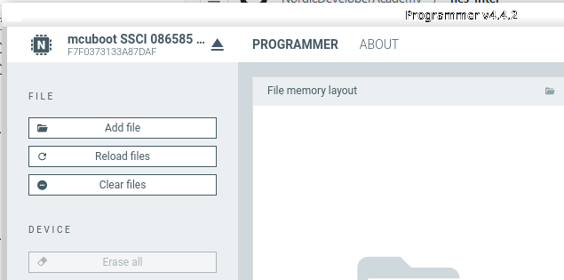
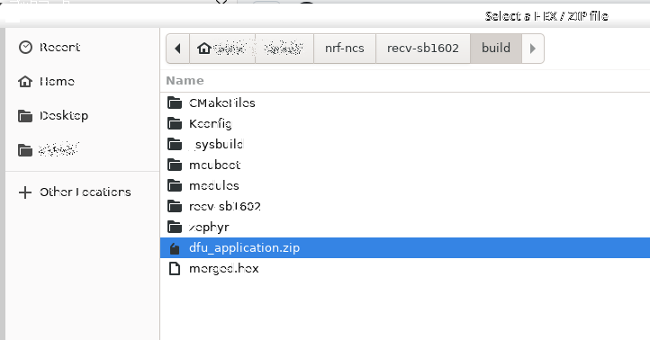
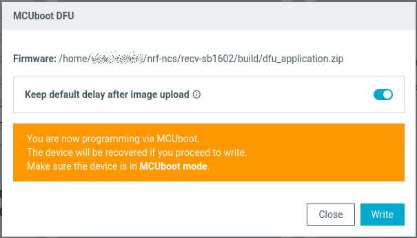
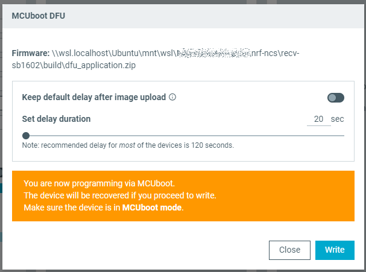

# ncs: USBでのDFU (6)

_2024/12/06_

引き続き DFU についての調査を行う。  
ようやく USB CDC-ACM での DFU を行う。

* [ncs: USBでのDFU (1) - hiro99ma blog](https://blog.hirokuma.work/2024/12/20241202-ncs.html)
* [ncs: USBでのDFU (2) - hiro99ma blog](https://blog.hirokuma.work/2024/12/20241203-ncs.html)
* [ncs: USBでのDFU (3) - hiro99ma blog](https://blog.hirokuma.work/2024/12/20241204-ncs.html)
* [ncs: USBでのDFU (4) - hiro99ma blog](https://blog.hirokuma.work/2024/12/20241205-ncs.html)
* [ncs: USBでのDFU (5) - hiro99ma blog](https://blog.hirokuma.work/2024/12/20241206-ncs.html)

## DFU over CDC-ACM

そんなに大変じゃなかった。  
あっさり動いてよかった。

* [commit: DFU over CDC-ACM](https://github.com/hirokuma/ncs-recv-sb1602/commit/551b6471d7b0d4380f4f47cf6f224de78de8fa8c)

DTSファイルの `chosen` は `zephyr,console` でよいようだ。  
MCUboot のサイトに書いてあったのと違ったので昨日の記載を修正した。

今回は Programmer アプリを使った。  
DFUモードで起動すると CDC-ACM になっているので SELECT DEVICE で選択できる。

ファイルの選択は `build/dfu_application.zip`

delay どうこうは、たぶん DFUモードになるためのボタン操作などができずに一定時間待ってからアプリを起動するタイプの場合に「DFU後はさっさと立ち上げたいのでは？」という意味で聞いているのだと思う。

## おまけ

WSL2 で MCUboot 時に CDC-ACM になる場合、デバイスがデタッチしているので毎回 USBIPD でアタッチしないといけないのがちょっと面倒だ。  
今みたいに MCUboot 自体を書き換えるとそのたびにデタッチするのだ。  
たぶん DFUモードになるときはいつもデタッチしているだろう。

ならば Windows で Programmer アプリを立ち上げればいいじゃないの。  
Windows の Programmer アプリはディレイがオフになっていたが、これはデフォルトなのか自分で変更したのか覚えてない。

