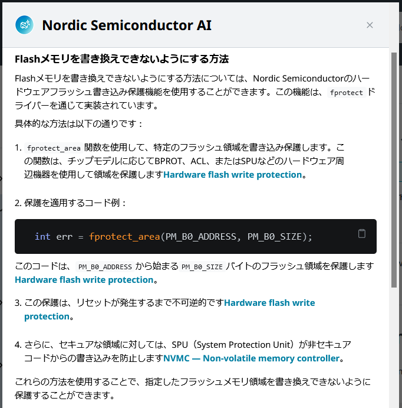

# ncs: USBでのDFU (7)

_2024/12/07_

引き続き DFU についての調査を行う。

* [ncs: USBでのDFU (1) - hiro99ma blog](https://blog.hirokuma.work/2024/12/20241202-ncs.html)
* [ncs: USBでのDFU (2) - hiro99ma blog](https://blog.hirokuma.work/2024/12/20241203-ncs.html)
* [ncs: USBでのDFU (3) - hiro99ma blog](https://blog.hirokuma.work/2024/12/20241204-ncs.html)
* [ncs: USBでのDFU (4) - hiro99ma blog](https://blog.hirokuma.work/2024/12/20241205-ncs.html)
* [ncs: USBでのDFU (5) - hiro99ma blog](https://blog.hirokuma.work/2024/12/20241206-ncs.html)
* [ncs: USBでのDFU (6) - hiro99ma blog](https://blog.hirokuma.work/2024/12/20241206-ncs2.html)

## DFU したいのかどうか

DFU したいのかどうかを整理しておこう。

* 開発中
  * J-Link があるならどちらでもよい
  * J-Link がなかったり、複数人で開発していて台数が足りないなら DFU があると便利かもしれない
* 製品
  * バグが見つかったときのために DFU を用意したい
    * DFU するのが開発者かユーザーか
      * 開発者しか DFU しないなら最悪 J-Link でもよいと思う
      * ユーザーにやってもらうなら FOTA だろう
        * 開発用の製品だったら CDC-ACM での DFU もありか
  * DFU するルートがあると提供していないイメージを書き込まれる可能性がある
    * JTAG デバッガを接続されたらなんでもできてしまうので、Flash を更新できないようにすることも視野に入れると良いだろう
      * `fprotect`ドライバーや SPU(System Protection Unit) というものを使うそうだ
      * 
    * 署名での検証ができるので、鍵管理をちゃんとやっておけば DFU で自作イメージを使うことはできないだろう
      * 署名の検証がどんな感じなのかはそのうち調べよう

BLE 機器を作って、それと対になるスマホアプリを作るなら、DFU も BLE での FOTA しか使わないだろう。  
USB での更新をするなら何か PC 向けのアプリを作らないといけない。
`mcumgr-cli` や Programmer アプリを使ってもらうのもありだろうが、そういうのは開発者だけだろう。
それなら FOTA でやってスマホアプリ(Android と iOS)を作る方が楽である。

そういうわけで DFU over UART は開発中以外に需要がないように思う。  
DFU over USB はありかもしれないが、これも開発者向けだろう。
Mbed みたいに USB につなぐだけで使えるならありだろうが、別途ツールがいるとなるとちょっと悩む。  
J-Link も安いものじゃないので、持っていない人向けによいかもしれない。  
購入するなら J-Link よりも nRF5340DK みたいな [J-Link OB](https://www.segger.com/products/debug-probes/j-link/models/j-link-ob/) が載った開発ボードの方が安上がりになりそうだ。  
(J-Link はハードウェアバージョンによって対応できる CPU が違うのでよく確認しよう！)

載せるなら FOTA over BLE だけでよいかな。
USB の方が FOTA よりも通信が安定していそうなところがメリットかな？

## 用語の整理

適当に用語を使っていたので、Nordic で使っている用語を調べ直した。  
用語というか DevAcademy で使われている言葉だ。  
"from MCUboot" は載ってないのだが "from the application" 

* DFU over XXX from YYY
  * XXX
    * UART
    * USB
  * YYY
    * MCUboot
    * the application
* FOTA over Bluetooth Low Energy

the application は app、Bluetooth Low Energy は BLE と略していく。

## DFU over USB from the app

いきなり FOTA over BLE は大変そうなので、アプリ機能でイメージをダウンロードして MCUboot でアップデートする DFU over USB from app を実装する。  
[DevAcademy Intermediate Lesson 8 Exercise 1](https://academy.nordicsemi.com/courses/nrf-connect-sdk-intermediate/lessons/lesson-8-bootloaders-and-dfu-fota/topic/exercise-1-dfu-over-uart/) の Step 5 が参考になる。

* [commit: DFU over USB from app](https://github.com/hirokuma/ncs-recv-sb1602/commit/2d55167319622280e5c95a47cc0a2dcf1e46c4a2)

DFUモードにならずに `mcumgr-cli` が使えるようになる。  
なるのだが、起動に時間がかかるのか初回の `mcumgr -c XXX image list` ではタイムアウトしてしまう。
以降は成功するようになる。  
コマンドを実行して、すぐ Ctrl+C で止めてコマンドを実行しても動作するので、時間がかかるというよりは 1回目のコマンドを受け付けたら起き上がるみたいな感じか。

J-Link で Flashing した後に `mcumgr image list` を確認すると Images が 1つだけ出てくる。  
これは DFU over USB from MCUboot と同じだ。

```console
$ mcumgr -c ssciacm image list
Images:
 image=0 slot=0
    version: 0.0.0
    bootable: true
    flags: active confirmed
    hash: 51313bcb36a2d3bba7c8ae8830e978f3976915ad979afb52e27d2ad93dcbfdd8
Split status: N/A (0)
```

`mcumgr image upload` した後は slot=1 が増えている。  
勝手にリスタートなどはしていないと思うし、リスタートさせても自動でイメージが更新されない。

```console
$ mcumgr -c ssciacm image list
Images:
 image=0 slot=0
    version: 0.0.0
    bootable: true
    flags: active confirmed
    hash: 51313bcb36a2d3bba7c8ae8830e978f3976915ad979afb52e27d2ad93dcbfdd8
 image=0 slot=1
    version: 0.0.0
    bootable: true
    flags:
    hash: 12f3717c56660de5e287cdabca80419735a89ba84d74bb625a8d3356f8e685b7
Split status: N/A (0)
```

Exercise 1 Step 5.4 の通りにやると更新された。  
`mcumgr image test` は確認だけかと思ったが `flags` が "pending" になったので意味があるようだ。  
([Verifying and testing the image](https://docs.nordicsemi.com/bundle/ncs-latest/page/nrf/app_dev/bootloaders_dfu/dfu_tools_mcumgr_cli.html#verifying_and_testing_the_image))

```console
$ mcumgr -c ssciacm image test 12f3717c56660de5e287cdabca80419735a89ba84d74bb625a8d3356f8e685b7
Images:
 image=0 slot=0
    version: 0.0.0
    bootable: true
    flags: active confirmed
    hash: 51313bcb36a2d3bba7c8ae8830e978f3976915ad979afb52e27d2ad93dcbfdd8
 image=0 slot=1
    version: 0.0.0
    bootable: true
    flags: pending
    hash: 12f3717c56660de5e287cdabca80419735a89ba84d74bb625a8d3356f8e685b7
Split status: N/A (0)
$ mcumgr -c ssciacm reset
Done
```

更新された後で `mcumgr image list` を見るとハッシュ値が入れ替わっていることが分かる。

```console
$ mcumgr -c ssciacm image list
Images:
 image=0 slot=0
    version: 0.0.0
    bootable: true
    flags: active
    hash: 12f3717c56660de5e287cdabca80419735a89ba84d74bb625a8d3356f8e685b7
 image=0 slot=1
    version: 0.0.0
    bootable: true
    flags: confirmed
    hash: 51313bcb36a2d3bba7c8ae8830e978f3976915ad979afb52e27d2ad93dcbfdd8
Split status: N/A (0)
```

ちゃんと置き換わった。

### DFU over UART/USB from MCUbootの削除

アプリから DFU できるなら MCUboot はいるにしても Serial Recovery 機能はいらないのではなかろうか？  
いや、そこは製品をどうするかになるから一概には言えないだろう。  
削除できるのかどうかは確認したい。

削除しても DFU over USB from app は機能した。

* [commit: remove Serial Recovery mode](https://github.com/hirokuma/ncs-recv-sb1602/commit/0b5e6fe6ebfde3cead860b7efee192fed373d794)

## おわりに

DFU over USB from app が動かせた。  
次はようやく FOTA over BLE か。

## おまけ

MCUboot で USB CDC-ACM を有効にして WSL2 の USBIPD でアタッチすると ttyUSB0 だったのだが
アプリで CDC-ACM を有効にしてアタッチすると ttyACM1 だった(ttyACM0 は J-Link が使っているので)。  
同じドライバを使っていそうだけど違うのかな？
