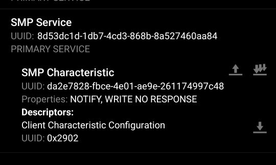
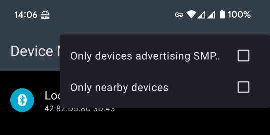
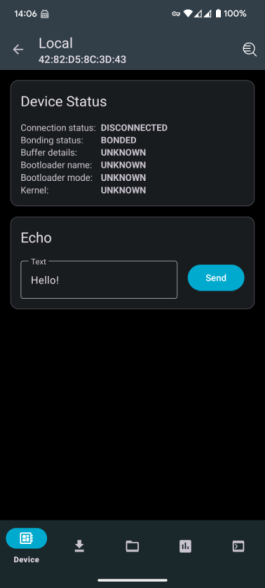
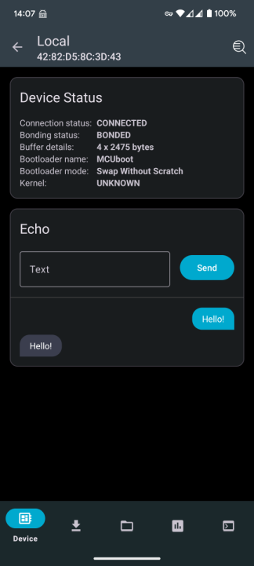
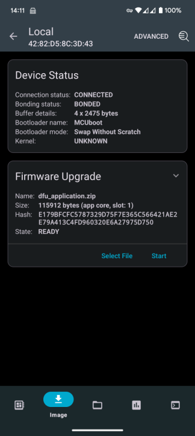
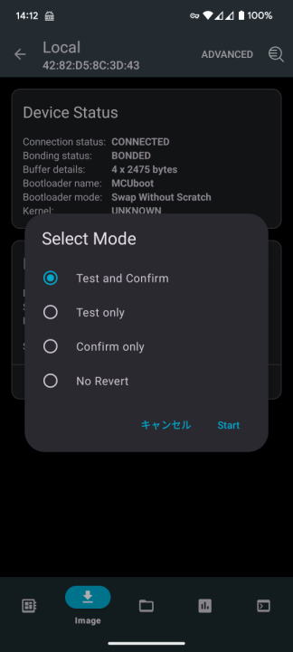
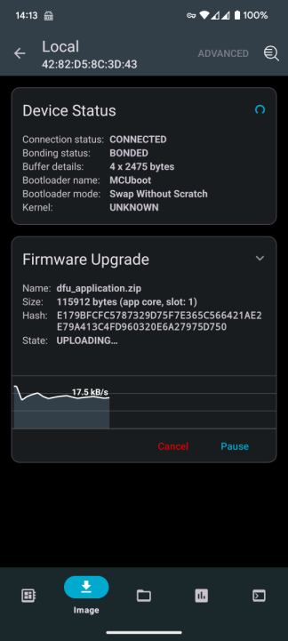
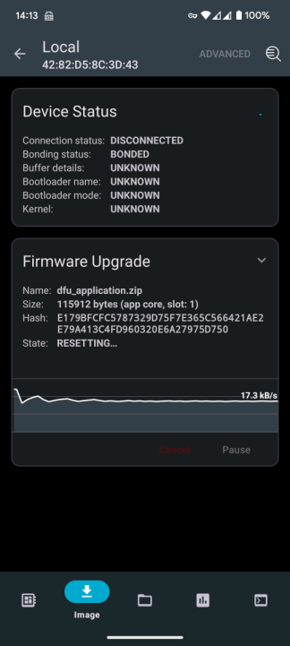
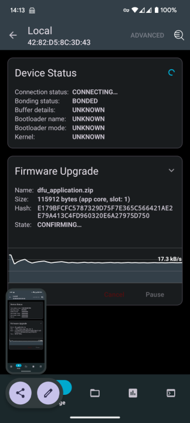
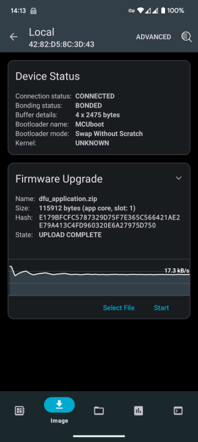

引き続き DFU についての調査を行う。

* [ncs: USBでのDFU (1) - hiro99ma blog](https://blog.hirokuma.work/2024/12/20241202-ncs.html)
* [ncs: USBでのDFU (2) - hiro99ma blog](https://blog.hirokuma.work/2024/12/20241203-ncs.html)
* [ncs: USBでのDFU (3) - hiro99ma blog](https://blog.hirokuma.work/2024/12/20241204-ncs.html)
* [ncs: USBでのDFU (4) - hiro99ma blog](https://blog.hirokuma.work/2024/12/20241205-ncs.html)
* [ncs: USBでのDFU (5) - hiro99ma blog](https://blog.hirokuma.work/2024/12/20241206-ncs.html)
* [ncs: USBでのDFU (6) - hiro99ma blog](https://blog.hirokuma.work/2024/12/20241206-ncs2.html)
* [ncs: USBでのDFU (7) - hiro99ma blog](https://blog.hirokuma.work/2024/12/20241207-ncs.html)

## FOTA over BLE

イメージのダウンロードが BLE 経由になるだけのはずである。  
自作するのは大変だが ncs にしくみがあるので使わせてもらおう。

* [Exercise 3 - FOTA over Bluetooth Low Energy - Nordic Developer Academy](https://academy.nordicsemi.com/courses/nrf-connect-sdk-intermediate/lessons/lesson-8-bootloaders-and-dfu-fota/topic/exercise-3-fota-over-bluetooth-low-energy/)

章のタイトルが "FOTA over Bluetooth Low Energy" なのに最初の行に "DFU over Bluetooth Low Energy" と書いてあるのは気にしないことにした。  
ncs には [CONFIG_NCS_SAMPLE_MCUMGR_BT_OTA_DFU](https://docs.nordicsemi.com/bundle/ncs-2.8.0/page/kconfig/index.html#CONFIG_NCS_SAMPLE_MCUMGR_BT_OTA_DFU) があるので楽よ、ということらしい。  
"SAMPLE" とあるので自作したければするがよい、というところか。  
SMP server という言葉も出てくるので Apache Mynewt のしくみなのだろう。

設定は `prj.con` に `CONFIG_NCS_SAMPLE_MCUMGR_BT_OTA_DFU=y` を足すだけ！ 簡単！！  
DFU over USB のために追加した MCUMGR の設定などもいらなさそう。

* [commit: FOTA over BLE](https://github.com/hirokuma/ncs-recv-sb1602/commit/1718ee14339b5ca94bdc7a93b6745eff3c2ecf3b)

nRF5340 を立ち上げるとサービスが増えていた。

FOTA を実行するアプリはモバイル側の [nRF Connect Device Manager](https://www.nordicsemi.com/Products/Development-tools/nrf-connect-device-manager) というアプリだそうだ。  
Exercise 3 Step 5.2 に "Uncheck" と書いてあって画像があるが、これはこのチェックを外せという意味であってこの画像のように設定せよという意味ではなさそうだ。  
"Only nearby devices" にチェックしたがそっちは特に変わらなかった。

出てきたデバイスをタップするとこうなった。

せっかく Echo があるので疎通テストしてみた。  
同じ文字列が返ってきた。

下のタブからイメージをアップしそうなアイコンをタップ。  
"Select File" で DFU するファイルを選択する。  
Step 5.4 では `build/zephyr/app_update.bin` と書いてあるが ncs v2.8.0(sysbuild) にはそういうファイルは無い。  
これは [アプリ名/zephyr/なんとか.signed.bin](https://docs.nordicsemi.com/bundle/ncs-latest/page/nrf/releases_and_maturity/migration/migration_sysbuild.html#filename_changes) というファイルになったそうだ。  
ncs だと `zephyr.signed.bin` だろう。これしかないし。  
が、`mcumgr-cli` は `dfu_application.zip` が使えたんでこっちもできるよね？

この選択は `mcumgr-cli` のときに "test" して "reset" したのと同じイメージで "Test and Confirm" だそうだ。

始まった！

アップロードが終わると Device Status のところがクルクルし始める。

少し経つと State が Confirming になる。  
左下はスクリーンショットを撮っていたときの名残だから気にしないでおくれ。

おしまい。

端末の再起動は自分でやらないといけないのかもしれない。  
再起動すると Advertising までに時間がかかっていたので、何かやってるのかも。  
感覚的なものなのでちょっと自信がない。

LED の点滅を変えたアプリをアップロードして変わっていたので、おそらく FOTA は成功している。
あっさり動いてしまった。

## モバイル側

nRF アプリに FOTA を組み込んで nRF Connect for Mobile(Device Managerではなく)を起動して connect すると、右上に DFU アイコンが表示されていることに気付くだろう。

つまり FOTA するアプリは他のアプリに組み込むことができるということだ。  
やり方も書いてある。

* [Android版](https://github.com/NordicSemiconductor/Android-nRF-Connect-Device-Manager)
* [iOS版](https://github.com/NordicSemiconductor/IOS-nRF-Connect-Device-Manager)

私は試してないけどね！

## おわりに

nRF5340 でアプリ側の更新だけだが FOTA over BLE を動かすことができた。  
ぜいたくを言えば、いつでも FOTA できるようになっているよりも指定したときだけしか FOTA できないようにしたいところだ。  
アプリにまったく手を加えずにサービスを追加できたし、そういう制御だってやれそうではないか。  
まあ、これは気が向いたら調べよう。

アプリ経由で DFU/FOTA する場合、アップロードしたアプリにうっかり DFU 機能を組み込み忘れるとそれ以降は J-Link を使わないとアップデートできなくなる。  
まあ、製品リリースだったらテストするだろうし心配しなくてよいとは思うが気をつけよう。
