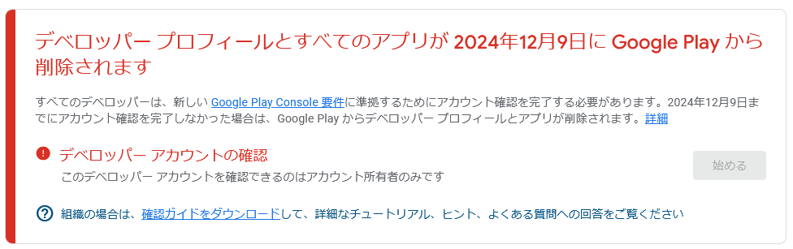
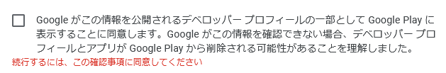
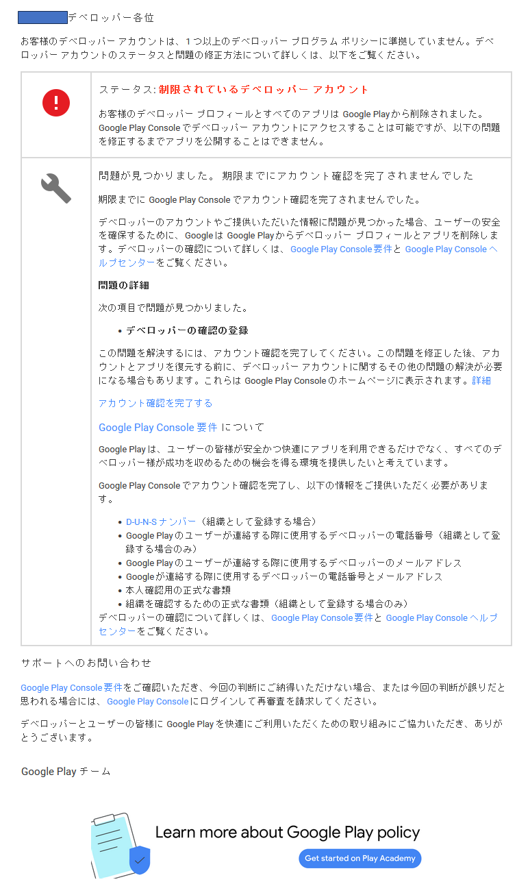
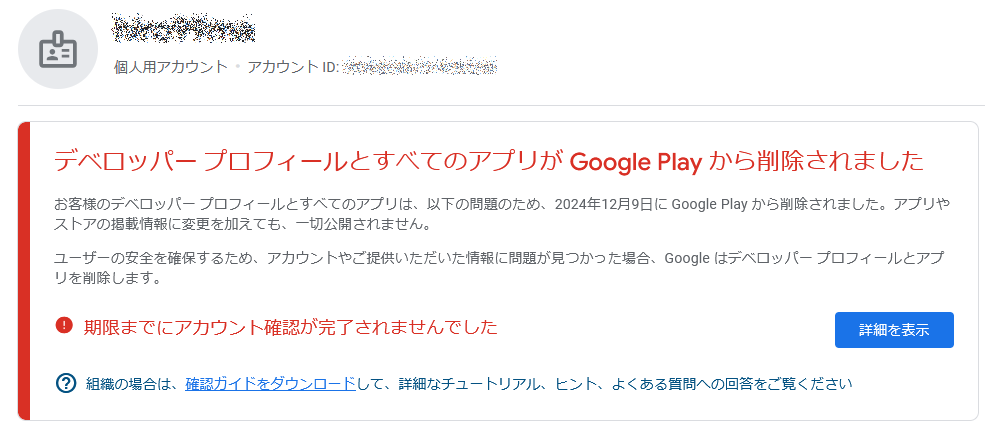
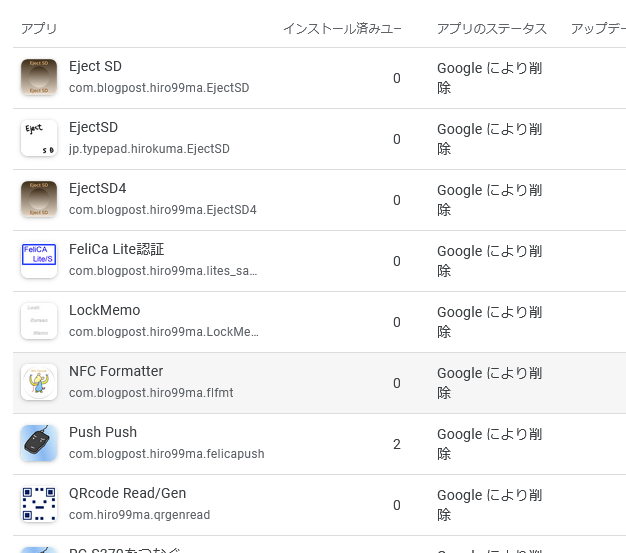
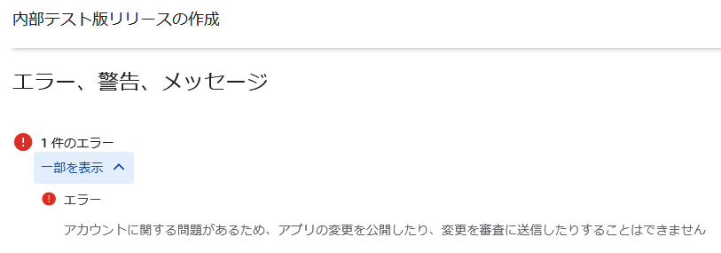

日本時間 16:50。

今日が期限である私のアカウントはまだ生きていた。  
いやあ、すっかり忘れていましたよ。

やっぱりネックとなるのは本名と住所の表示なのよねぇ。  
同意しないとダメだし。

無料アプリだと表示されないという情報はあったのだけど、表示されてしまってからでは遅いしなあ。  
「Google Play で収益化することを選択したため」というのが納得できない。  
選択したくないんだけど！！

・・・わかってるんだよ、そういうことを言っているわけではないということは。  
個人情報をさらす可能性に対する拒否感だよ。

もういい。  
このまま明日の朝に確認してアカウントの有無を見てみよう。

## 追記

17:45 くらいにメールが来た。  
(注意：違うアカウントには朝9時過ぎにメールが来たのでまちまちなようだ)

おお、見事に削除されている。

Google Play からは削除されたが Google Play Console から削除されたわけではない。

インストール済みのアプリは動くし、Google Play には出てきた。  
ただこれは内部アプリとしてインストールしていたからだろう。

開発者として登録しているアカウントで Google Play を開くと見えるがプライベートモードにすると表示されない。

* [QRCode Read/Gen](https://play.google.com/store/apps/details?id=com.hiro99ma.qrgenread)

内部テスト版が動かせるなら特に問題ないのだが、aab ファイルはアップロードできるものの保存して公開はできなかった。

